# 3.2. PHÂN TÍCH VÀ THIẾT KẾ HỆ THỐNG

## 3.2.1. Các chức năng chính của hệ thống

Hệ thống Creature Chess là một nền tảng game multiplayer auto-battler tích hợp AI, bao gồm các chức năng chính sau:

### A. Quản lý người dùng và xác thực
- **Đăng ký và đăng nhập**: Hỗ trợ đăng ký tài khoản local (email/password) và OAuth thông qua Auth0
- **Quản lý phiên làm việc**: Quản lý session token với thời gian hết hạn
- **Tài khoản khách**: Cho phép người chơi thử nghiệm game mà không cần đăng ký
- **Quản lý hồ sơ**: Cập nhật nickname, ảnh đại diện, thông tin cá nhân

### B. Tính năng xã hội
- **Hệ thống bạn bè**: Gửi, chấp nhận, từ chối lời mời kết bạn
- **Tìm kiếm người chơi**: Tìm kiếm người dùng theo nickname
- **Chặn người dùng**: Chặn người chơi không mong muốn
- **Trạng thái trực tuyến**: Hiển thị trạng thái online/offline/in_game/in_room
- **Phòng chơi riêng tư**: Tạo phòng với mã code, mời bạn bè tham gia
- **Chat nhanh**: Gửi tin nhắn nhanh trong game (GG, GL, emoji)

### C. Matchmaking và chế độ chơi
- **Xếp hàng công khai**: Tự động ghép 8 người chơi vào một trận đấu
- **Phòng tùy chỉnh**: Tạo phòng riêng với bạn bè
- **Hệ thống lobby**: Phòng chờ 6 giây trước khi bắt đầu trận đấu
- **Điền bot tự động**: Tự động thêm bot AI nếu không đủ người chơi
- **Chế độ xem**: Xem trận đấu của người chơi khác trong cùng game

### D. Cơ chế game cốt lõi
- **Hệ thống cửa hàng**: Mua sinh vật từ cửa hàng (5 lá bài mỗi vòng)
- **Làm mới cửa hàng**: Reroll để thay đổi sinh vật trong shop (tốn 2 vàng)
- **Mua kinh nghiệm**: Mua XP để tăng cấp độ (tốn 4 vàng)
- **Bán sinh vật**: Bán sinh vật để lấy lại vàng
- **Khóa cửa hàng**: Giữ nguyên các lá bài trong shop cho vòng sau
- **Xếp đội hình**: Kéo thả sinh vật lên bàn cờ hoặc ghế dự bị
- **Tiến hóa sinh vật**: Tự động nâng cấp khi có 3 sinh vật cùng loại (1★ → 2★ → 3★)
- **Hệ thống trang bị**: Trang bị vật phẩm cho sinh vật để tăng sức mạnh
- **Chế tạo vật phẩm**: Kết hợp các thành phần để tạo vật phẩm mạnh hơn

### E. Hệ thống chiến đấu
- **Chiến đấu tự động**: Sinh vật tự động di chuyển và tấn công
- **Tìm đường thông minh**: Thuật toán A* để tìm đường tối ưu
- **Hệ thống nhắm mục tiêu**: Nhắm mục tiêu dựa trên khoảng cách và loại
- **Tính toán sát thương**: Sát thương dựa trên stats và lợi thế về loại
- **Hệ thống kỹ năng**: Kỹ năng được kích hoạt khi đủ mana
- **Hiệu ứng trạng thái**: Slow, stun, revive, và các hiệu ứng khác
- **Tính điểm chiến đấu**: Xác định thắng/thua và sát thương gây ra

### F. Hệ thống đặc tính và tổ hợp
- **Đặc tính nguyên tố**: Fire, Water, Earth, Air, Light, Dark
- **Đặc tính nghề nghiệp**: Arcane, Valiant, Cunning, Primal
- **Bonus tổ hợp**: HP, Attack, Mana, và các bonus khác khi kích hoạt tổ hợp
- **Hiển thị tổ hợp**: Hiển thị các tổ hợp đang kích hoạt và cần thêm bao nhiêu để kích hoạt

### G. Tính năng AI nâng cao
- **Bot AI với Reinforcement Learning**: Bot học cách chơi game thông qua thuật toán PPO
- **Trợ lý chiến thuật (Tactical AI)**: Gợi ý xếp quân dựa trên RL Agent và mô phỏng trận đấu
- **Coach AI với RAG**: Chatbot trả lời câu hỏi về gameplay sử dụng RAG và LLM
- **Phân tích sau trận đấu**: Tự động phát hiện lỗi và đưa ra khuyến nghị cải thiện
- **Gợi ý đội hình**: Gợi ý đội hình tối ưu dựa trên tổ hợp và meta game
- **Phân tích đối thủ**: Phân tích điểm mạnh/yếu của đối thủ và cách counter

### H. Lịch sử và thống kê
- **Lịch sử trận đấu**: Lưu trữ và hiển thị lịch sử các trận đã chơi
- **Thống kê cá nhân**: Số trận chơi, tỷ lệ thắng, xếp hạng trung bình
- **Bảng xếp hạng**: Xếp hạng người chơi theo điểm số và thành tích
- **Replay trận đấu**: Xem lại các trận đấu đã chơi (tính năng mở rộng)

### I. Quản trị hệ thống (Admin)
- **Quản lý người dùng**: Xem, chỉnh sửa, khóa/mở khóa tài khoản người dùng
- **Quản lý báo cáo**: Xem và xử lý báo cáo từ người chơi
- **Thống kê hệ thống**: Xem số liệu về người chơi, trận đấu, hiệu suất server
- **Quản lý bot**: Cấu hình và điều chỉnh độ khó của bot AI
- **Giám sát server**: Theo dõi tình trạng server, tải, lỗi
- **Quản lý sự kiện**: Tạo và quản lý các sự kiện đặc biệt trong game

### J. Tính năng bảo mật và báo cáo
- **Báo cáo người chơi**: Báo cáo hành vi xấu (spam, cheat, tên phản cảm)
- **Lọc từ ngữ**: Tự động lọc từ ngữ không phù hợp trong nickname
- **Xác thực token**: Bảo mật API với JWT token
- **Rate limiting**: Giới hạn số lượng request để chống spam
- **Mã hóa mật khẩu**: Sử dụng bcrypt để mã hóa mật khẩu

---

## 3.2.2. Biểu đồ Use Case

### 3.2.2.1. Xác định các tác nhân (Actors)

Hệ thống Creature Chess có 4 tác nhân chính:

1. **Người chơi (Player)**: Người dùng đã đăng ký tài khoản, có thể sử dụng đầy đủ các tính năng của hệ thống
2. **Khách (Guest)**: Người dùng chưa đăng ký, chỉ có thể chơi game cơ bản mà không có tính năng xã hội
3. **Quản trị viên (Admin)**: Người quản lý hệ thống, có quyền quản lý người dùng, xử lý báo cáo, xem thống kê và giám sát trạng thái vận hành hệ thống
4. **Hệ thống AI (AI System)**: Các bot AI và hệ thống trợ lý thông minh tự động

### 3.2.2.2. Biểu đồ Use Case tổng quan

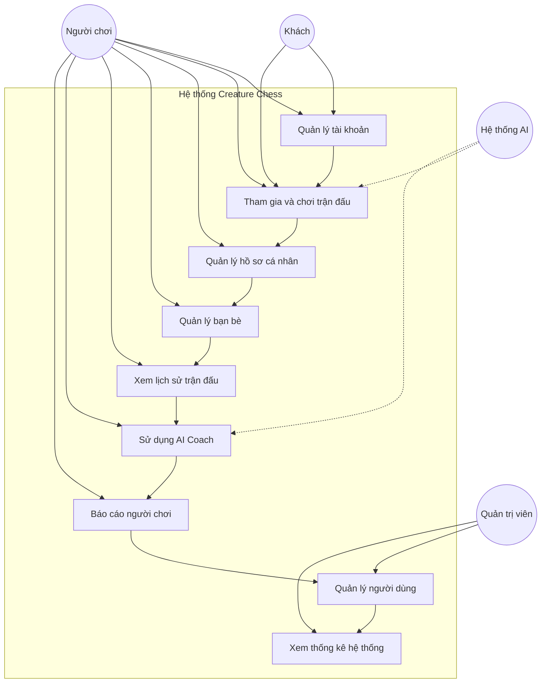
```mermaid
graph TB
    %% Actors
    Guest((Khách))
    Player((Người chơi))
    Admin((Quản trị viên))
    AI((Hệ thống AI))

    %% Hệ thống
    subgraph System["Hệ thống Creature Chess"]
        direction TB

        UC1[Quản lý tài khoản]
        UC2[Tham gia và chơi trận đấu]
        UC3[Quản lý hồ sơ cá nhân]
        UC4[Quản lý bạn bè]
        UC5[Xem lịch sử trận đấu]
        UC6[Sử dụng AI Coach]
        UC7[Báo cáo người chơi]
        UC8[Quản lý người dùng]
        UC9[Xem thống kê hệ thống]

        %% Ép sơ đồ dài theo chiều dọc
        UC1 --> UC2
        UC2 --> UC3
        UC3 --> UC4
        UC4 --> UC5
        UC5 --> UC6
        UC6 --> UC7
        UC7 --> UC8
        UC8 --> UC9
    end

    %% Khách
    Guest --> UC1
    Guest --> UC2

    %% Người chơi
    Player --> UC1
    Player --> UC2
    Player --> UC3
    Player --> UC4
    Player --> UC5
    Player --> UC6
    Player --> UC7

    %% Quản trị viên
    Admin --> UC8
    Admin --> UC9

    %% Hệ thống AI
    AI -.-> UC2
    AI -.-> UC6
```

### 3.2.2.3. Biểu đồ Use Case chi tiết - Quản lý người dùng

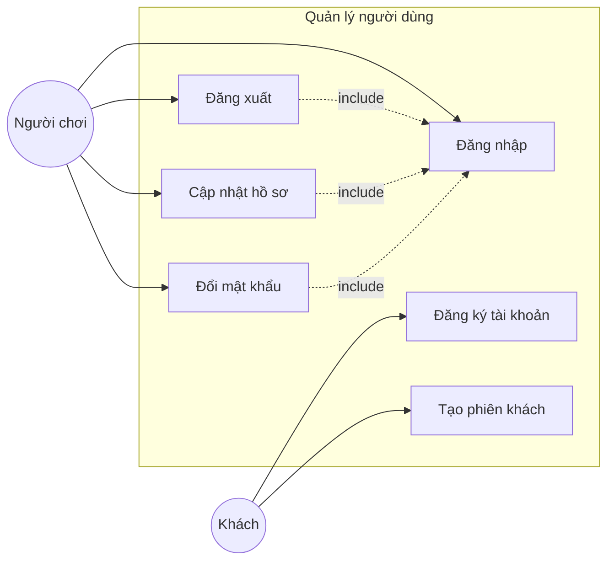
```mermaid
graph LR
    Player((Người chơi))
    Guest((Khách))

    subgraph "Quản lý người dùng"
        UC1[Đăng ký tài khoản]
        UC2[Đăng nhập]
        UC3[Đăng xuất]
        UC4[Cập nhật hồ sơ]
        UC5[Đổi mật khẩu]
        UC6[Tạo phiên khách]
    end

    Guest --> UC1
    Guest --> UC6
    Player --> UC2
    Player --> UC3
    Player --> UC4
    Player --> UC5

    UC4 -.include.-> UC2
    UC5 -.include.-> UC2
    UC3 -.include.-> UC2
```

### 3.2.2.4. Biểu đồ Use Case chi tiết - Tính năng xã hội

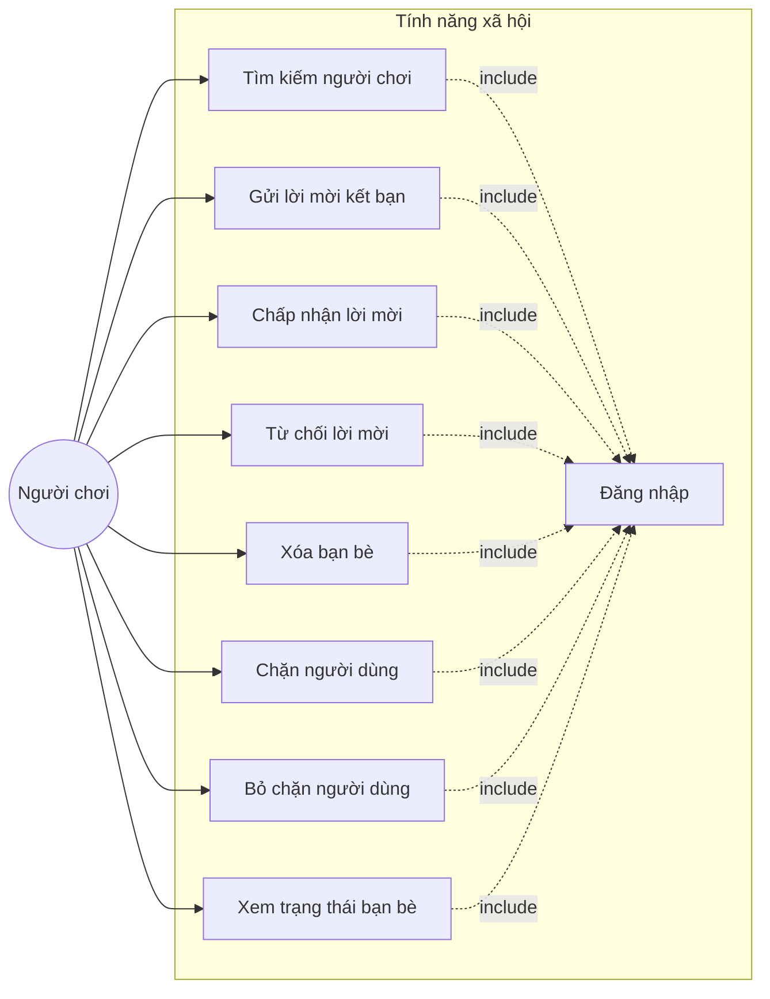
```mermaid
graph LR
    Player((Người chơi))

    subgraph "Tính năng xã hội"
        UC1[Tìm kiếm người chơi]
        UC2[Gửi lời mời kết bạn]
        UC3[Chấp nhận lời mời]
        UC4[Từ chối lời mời]
        UC5[Xóa bạn bè]
        UC6[Chặn người dùng]
        UC7[Bỏ chặn người dùng]
        UC8[Xem trạng thái bạn bè]
        UC9[Đăng nhập]
    end

    Player --> UC1
    Player --> UC2
    Player --> UC3
    Player --> UC4
    Player --> UC5
    Player --> UC6
    Player --> UC7
    Player --> UC8

    UC1 -.include.-> UC9
    UC2 -.include.-> UC9
    UC3 -.include.-> UC9
    UC4 -.include.-> UC9
    UC5 -.include.-> UC9
    UC6 -.include.-> UC9
    UC7 -.include.-> UC9
    UC8 -.include.-> UC9
```

### 3.2.2.5. Biểu đồ Use Case chi tiết - Matchmaking và phòng chơi

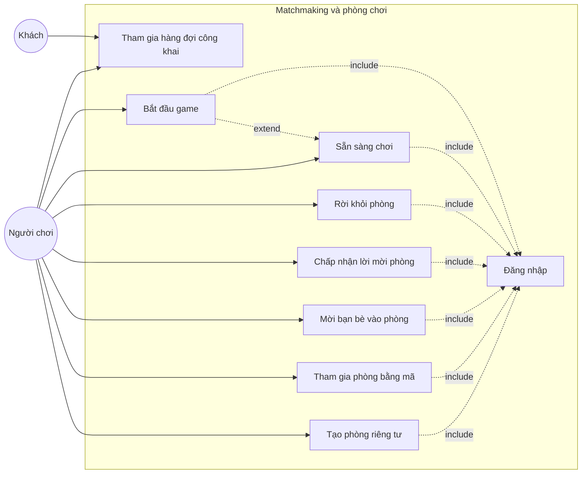
```mermaid
graph LR
    Player((Người chơi))
    Guest((Khách))

    subgraph "Matchmaking và phòng chơi"
        UC1[Tham gia hàng đợi công khai]
        UC2[Tạo phòng riêng tư]
        UC3[Tham gia phòng bằng mã]
        UC4[Mời bạn bè vào phòng]
        UC5[Chấp nhận lời mời phòng]
        UC6[Rời khỏi phòng]
        UC7[Sẵn sàng chơi]
        UC8[Bắt đầu game]
        UC9[Đăng nhập]
    end

    Player --> UC1
    Player --> UC2
    Player --> UC3
    Player --> UC4
    Player --> UC5
    Player --> UC6
    Player --> UC7
    Player --> UC8

    Guest --> UC1

    UC2 -.include.-> UC9
    UC3 -.include.-> UC9
    UC4 -.include.-> UC9
    UC5 -.include.-> UC9
    UC6 -.include.-> UC9
    UC7 -.include.-> UC9
    UC8 -.include.-> UC9

    UC8 -.extend.-> UC7
```

### 3.2.2.6. Biểu đồ Use Case chi tiết - Gameplay

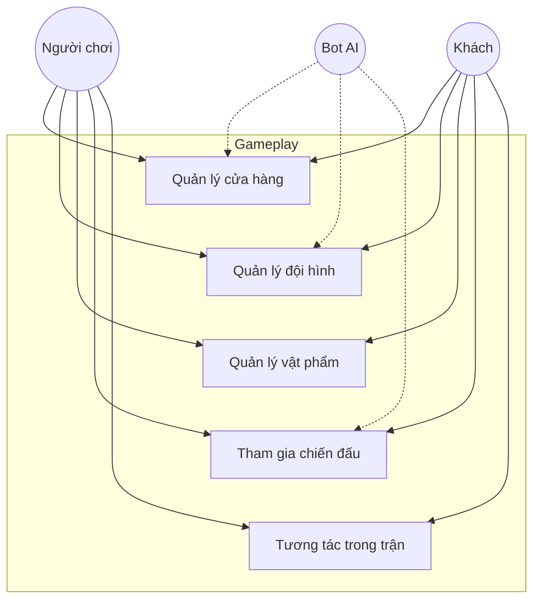
```mermaid
graph TB
    %% Actor
    Player((Người chơi))
    Guest((Khách))
    AI((Bot AI))

    %% Hệ thống Gameplay
    subgraph Gameplay["Gameplay"]
        direction TB

        Shop[Quản lý cửa hàng]
        Team[Quản lý đội hình]
        Item[Quản lý vật phẩm]
        Battle[Tham gia chiến đấu]
        Social[Tương tác trong trận]

        Shop ~~~ Team
        Team ~~~ Item
        Item ~~~ Battle
        Battle ~~~ Social
    end

    %% Người chơi và khách đều có thể chơi gameplay
    Player --> Shop
    Player --> Team
    Player --> Item
    Player --> Battle
    Player --> Social

    Guest --> Shop
    Guest --> Team
    Guest --> Item
    Guest --> Battle
    Guest --> Social

    %% Bot AI tham gia vào gameplay chính
    AI -.-> Shop
    AI -.-> Team
    AI -.-> Battle
```

### 3.2.2.7. Biểu đồ Use Case chi tiết - AI và trợ lý thông minh

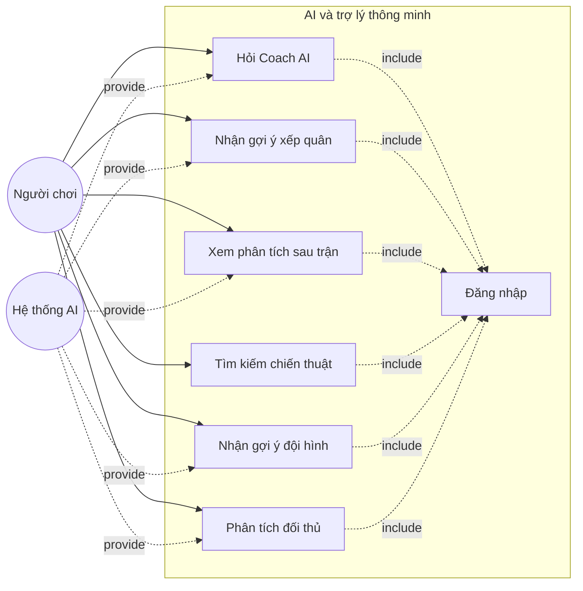
```mermaid
graph LR
    Player((Người chơi))
    AISystem((Hệ thống AI))

    subgraph "AI và trợ lý thông minh"
        UC1[Hỏi Coach AI]
        UC2[Nhận gợi ý xếp quân]
        UC3[Xem phân tích sau trận]
        UC4[Tìm kiếm chiến thuật]
        UC5[Nhận gợi ý đội hình]
        UC6[Phân tích đối thủ]
        UC7[Đăng nhập]
    end

    Player --> UC1
    Player --> UC2
    Player --> UC3
    Player --> UC4
    Player --> UC5
    Player --> UC6

    AISystem -.provide.-> UC1
    AISystem -.provide.-> UC2
    AISystem -.provide.-> UC3
    AISystem -.provide.-> UC5
    AISystem -.provide.-> UC6

    UC1 -.include.-> UC7
    UC2 -.include.-> UC7
    UC3 -.include.-> UC7
    UC4 -.include.-> UC7
    UC5 -.include.-> UC7
    UC6 -.include.-> UC7
```

### 3.2.2.8. Biểu đồ Use Case chi tiết - Lịch sử và thống kê

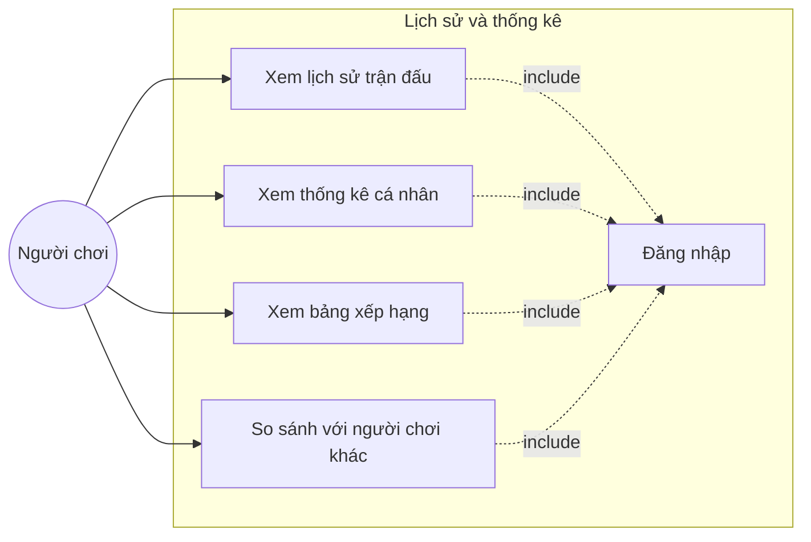
```mermaid
graph LR
    Player((Người chơi))

    subgraph "Lịch sử và thống kê"
        UC1[Xem lịch sử trận đấu]
        UC2[Xem thống kê cá nhân]
        UC3[Xem bảng xếp hạng]
        UC4[So sánh với người chơi khác]
        UC5[Đăng nhập]
    end

    Player --> UC1
    Player --> UC2
    Player --> UC3
    Player --> UC4

    UC1 -.include.-> UC5
    UC2 -.include.-> UC5
    UC3 -.include.-> UC5
    UC4 -.include.-> UC5
```

### 3.2.2.9. Biểu đồ Use Case chi tiết - Quản trị hệ thống (Admin)

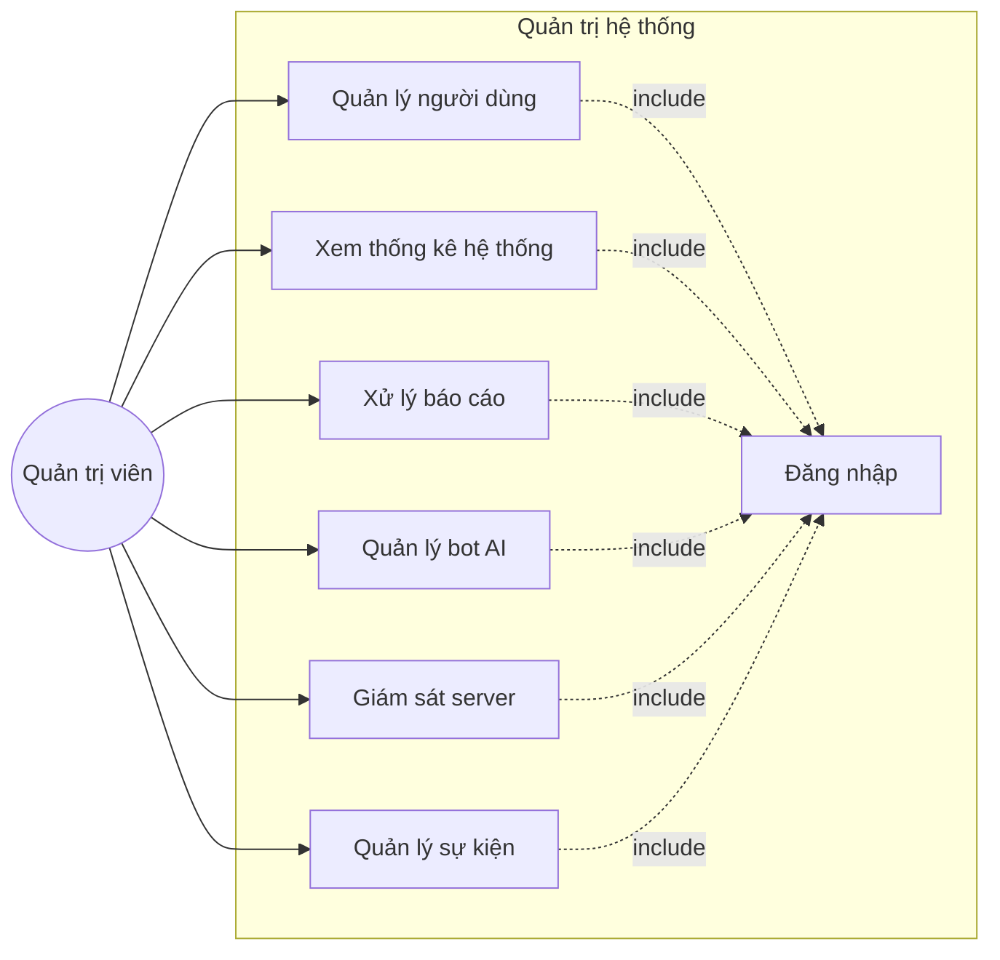
```mermaid
graph LR
    Admin((Quản trị viên))

    subgraph "Quản trị hệ thống"
        UC1[Quản lý người dùng]
        UC2[Xem thống kê hệ thống]
        UC3[Xử lý báo cáo]
        UC4[Quản lý bot AI]
        UC5[Giám sát server]
        UC6[Quản lý sự kiện]
        UC7[Đăng nhập]
    end

    Admin --> UC1
    Admin --> UC2
    Admin --> UC3
    Admin --> UC4
    Admin --> UC5
    Admin --> UC6

    UC1 -.include.-> UC7
    UC2 -.include.-> UC7
    UC3 -.include.-> UC7
    UC4 -.include.-> UC7
    UC5 -.include.-> UC7
    UC6 -.include.-> UC7
```

### 3.2.2.10. Biểu đồ Use Case chi tiết - Báo cáo và bảo mật

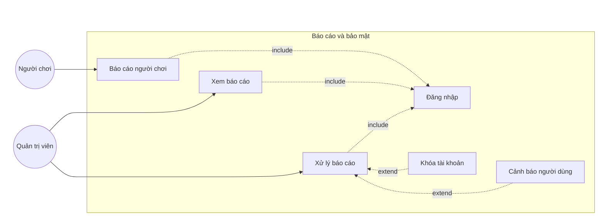
```mermaid
graph LR
    subgraph Actors[" "]
        direction TB
        PTop[" "]
        Player((Người chơi))
        Admin((Quản trị viên))
        PBottom[" "]
    end

    subgraph ReportSecurity["Báo cáo và bảo mật"]
        direction TB

        UC6[Đăng nhập]
        UC1[Báo cáo người chơi]
        UC2[Xem báo cáo]
        UC3[Xử lý báo cáo]
        UC4[Khóa tài khoản]
        UC5[Cảnh báo người dùng]

        UC6 ~~~ UC1
        UC1 ~~~ UC2
        UC2 ~~~ UC3
        UC3 ~~~ UC4
        UC4 ~~~ UC5
    end

    Player --> UC1
    Admin --> UC2
    Admin --> UC3

    UC1 -.->|include| UC6
    UC2 -.->|include| UC6
    UC3 -.->|include| UC6

    UC4 -.->|extend| UC3
    UC5 -.->|extend| UC3

    style Actors fill:transparent,stroke:transparent
    style PTop fill:transparent,stroke:transparent,color:transparent
    style PBottom fill:transparent,stroke:transparent,color:transparent
```

---

## 3.2.3. Đặc tả Use Case chi tiết

### UC-001: Đăng ký tài khoản

| **Thuộc tính** | **Mô tả** |
|----------------|-----------|
| **Mã Use Case** | UC-001 |
| **Tên Use Case** | Đăng ký tài khoản |
| **Tác nhân** | Khách (Guest) |
| **Mô tả** | Người dùng tạo tài khoản mới để sử dụng đầy đủ các tính năng của hệ thống |
| **Điều kiện tiên quyết** | - Người dùng chưa có tài khoản - Kết nối internet ổn định |
| **Điều kiện sau** | - Tài khoản mới được tạo trong cơ sở dữ liệu - Người dùng có thể đăng nhập - Session token được tạo |
| **Tần suất sử dụng** | Thấp (mỗi người dùng chỉ đăng ký 1 lần) |
| **Độ ưu tiên** | Cao |
| **Luồng chính** | 1. Người dùng truy cập trang đăng ký 2. Hệ thống hiển thị form đăng ký 3. Người dùng nhập email và mật khẩu 4. Người dùng nhập nickname 5. Người dùng chọn ảnh đại diện 6. Người dùng nhấn nút "Đăng ký" 7. Hệ thống kiểm tra tính hợp lệ của dữ liệu 8. Hệ thống mã hóa mật khẩu bằng bcrypt 9. Hệ thống lưu thông tin vào database 10. Hệ thống tạo session token 11. Hệ thống tự động đăng nhập cho người dùng 12. Hệ thống chuyển hướng đến trang chủ |
| **Luồng thay thế** | **7a. Email đã tồn tại:** &nbsp;&nbsp;1. Hệ thống hiển thị thông báo "Email đã được sử dụng" &nbsp;&nbsp;2. Quay lại bước 3  **7b. Nickname đã tồn tại:** &nbsp;&nbsp;1. Hệ thống hiển thị thông báo "Nickname đã được sử dụng" &nbsp;&nbsp;2. Quay lại bước 4  **7c. Nickname chứa từ ngữ không phù hợp:** &nbsp;&nbsp;1. Hệ thống hiển thị thông báo "Nickname không hợp lệ" &nbsp;&nbsp;2. Quay lại bước 4  **7d. Mật khẩu không đủ mạnh:** &nbsp;&nbsp;1. Hệ thống hiển thị yêu cầu về mật khẩu &nbsp;&nbsp;2. Quay lại bước 3  **7e. Email không đúng định dạng:** &nbsp;&nbsp;1. Hệ thống hiển thị "Email không hợp lệ" &nbsp;&nbsp;2. Quay lại bước 3 |
| **Ngoại lệ** | - Mất kết nối internet: Hiển thị thông báo lỗi - Lỗi server: Hiển thị thông báo "Vui lòng thử lại sau" - Database không khả dụng: Hiển thị lỗi hệ thống |
| **Yêu cầu đặc biệt** | - Mật khẩu phải có ít nhất 8 ký tự - Nickname từ 3-20 ký tự - Lọc từ ngữ không phù hợp |

### UC-002: Đăng nhập

| **Thuộc tính** | **Mô tả** |
|----------------|-----------|
| **Mã Use Case** | UC-002 |
| **Tên Use Case** | Đăng nhập |
| **Tác nhân** | Người chơi (Player), Quản trị viên (Admin) |
| **Mô tả** | Người dùng đăng nhập vào hệ thống để sử dụng các tính năng |
| **Điều kiện tiên quyết** | - Người dùng đã có tài khoản - Kết nối internet ổn định - Tài khoản chưa bị khóa |
| **Điều kiện sau** | - Người dùng được xác thực - Session token được tạo và lưu - Người dùng có thể truy cập các tính năng - Trạng thái online được cập nhật |
| **Tần suất sử dụng** | Cao (mỗi lần người dùng truy cập) |
| **Độ ưu tiên** | Cao |
| **Luồng chính** | 1. Người dùng truy cập trang đăng nhập 2. Hệ thống hiển thị form đăng nhập 3. Người dùng nhập email và mật khẩu 4. Người dùng nhấn nút "Đăng nhập" 5. Hệ thống xác thực thông tin với database 6. Hệ thống verify mật khẩu bằng bcrypt 7. Hệ thống tạo session token với thời gian hết hạn 8. Hệ thống lưu token vào cookie 9. Hệ thống cập nhật trạng thái online 10. Hệ thống chuyển hướng đến trang chủ |
| **Luồng thay thế** | **5a. Email không tồn tại:** &nbsp;&nbsp;1. Hệ thống hiển thị "Email hoặc mật khẩu không đúng" &nbsp;&nbsp;2. Quay lại bước 3  **6a. Mật khẩu không đúng:** &nbsp;&nbsp;1. Hệ thống hiển thị "Email hoặc mật khẩu không đúng" &nbsp;&nbsp;2. Ghi log thất bại &nbsp;&nbsp;3. Quay lại bước 3  **5b. Tài khoản bị khóa:** &nbsp;&nbsp;1. Hệ thống hiển thị "Tài khoản đã bị khóa. Vui lòng liên hệ admin" &nbsp;&nbsp;2. Kết thúc  **4a. Người dùng chọn "Đăng nhập bằng OAuth":** &nbsp;&nbsp;1. Hệ thống chuyển hướng đến Auth0 &nbsp;&nbsp;2. Người dùng xác thực với OAuth provider &nbsp;&nbsp;3. Tiếp tục bước 7 |
| **Ngoại lệ** | - Mất kết nối: Hiển thị thông báo lỗi - Lỗi server: Hiển thị "Vui lòng thử lại sau" - Database không khả dụng: Hiển thị lỗi hệ thống - Session token không tạo được: Hiển thị lỗi |
| **Yêu cầu đặc biệt** | - Session token hết hạn sau 7 ngày - Ghi log mỗi lần đăng nhập - Bảo mật: không hiển thị thông tin cụ thể về lỗi |

### UC-003: Tham gia hàng đợi công khai

| **Thuộc tính** | **Mô tả** |
|----------------|-----------|
| **Mã Use Case** | UC-003 |
| **Tên Use Case** | Tham gia hàng đợi công khai |
| **Tác nhân** | Người chơi (Player), Khách (Guest) |
| **Mô tả** | Người dùng tham gia hàng đợi để được ghép vào trận đấu với người chơi khác |
| **Điều kiện tiên quyết** | - Người dùng đã đăng nhập hoặc là khách - Người dùng không đang trong trận đấu khác - Người dùng không đang trong phòng riêng tư |
| **Điều kiện sau** | - Người dùng được thêm vào lobby - Khi đủ người hoặc hết thời gian chờ, trận đấu bắt đầu - Trạng thái người dùng chuyển sang "in_game" |
| **Tần suất sử dụng** | Rất cao (mỗi lần chơi game) |
| **Độ ưu tiên** | Cao |
| **Luồng chính** | 1. Người dùng nhấn nút "Chơi ngay" 2. Hệ thống kiểm tra trạng thái người dùng 3. Hệ thống tìm lobby phù hợp (có chỗ trống) 4. Hệ thống thêm người dùng vào lobby 5. Hệ thống cập nhật trạng thái "in_game" 6. Hệ thống hiển thị màn hình chờ với danh sách người chơi 7. Hệ thống đếm ngược 6 giây 8. Hệ thống kiểm tra số lượng người chơi 9. Hệ thống thêm bot nếu thiếu người (< 8 người) 10. Hệ thống khởi tạo game state 11. Hệ thống bắt đầu trận đấu 12. Hệ thống gửi game state cho tất cả người chơi |
| **Luồng thay thế** | **3a. Tìm thấy lobby đang chờ:** &nbsp;&nbsp;1. Hệ thống thêm người dùng vào lobby hiện có &nbsp;&nbsp;2. Tiếp tục bước 5  **3b. Không có lobby phù hợp:** &nbsp;&nbsp;1. Hệ thống tạo lobby mới (max 8 người) &nbsp;&nbsp;2. Hệ thống đặt người dùng làm người đầu tiên &nbsp;&nbsp;3. Tiếp tục bước 4  **6a. Người dùng hủy tham gia:** &nbsp;&nbsp;1. Hệ thống xóa người dùng khỏi lobby &nbsp;&nbsp;2. Hệ thống cập nhật trạng thái "online" &nbsp;&nbsp;3. Kết thúc  **9a. Đủ 8 người trước khi hết thời gian:** &nbsp;&nbsp;1. Hệ thống bỏ qua việc thêm bot &nbsp;&nbsp;2. Tiếp tục bước 10 |
| **Ngoại lệ** | - Mất kết nối: Xóa khỏi lobby, cập nhật trạng thái - Server đầy: Hiển thị "Server đang quá tải, vui lòng thử lại" - Lỗi khởi tạo game: Hiển thị lỗi, trả người chơi về lobby |
| **Yêu cầu đặc biệt** | - Thời gian chờ tối đa: 6 giây - Số người chơi: 2-8 người - Bot được thêm tự động nếu < 8 người - Cập nhật real-time danh sách người chơi |

### UC-004: Mua sinh vật

| **Thuộc tính** | **Mô tả** |
|----------------|-----------|
| **Mã Use Case** | UC-004 |
| **Tên Use Case** | Mua sinh vật |
| **Tác nhân** | Người chơi (Player), Khách (Guest) |
| **Mô tả** | Người chơi mua sinh vật từ cửa hàng để xây dựng đội hình |
| **Điều kiện tiên quyết** | - Đang trong pha chuẩn bị (PREPARING phase) - Có đủ vàng để mua (mỗi sinh vật có giá khác nhau) - Cửa hàng có sinh vật (không phải slot trống) |
| **Điều kiện sau** | - Sinh vật được thêm vào bàn cờ hoặc ghế dự bị - Số vàng giảm theo giá sinh vật - Sinh vật biến mất khỏi cửa hàng (slot trở thành null) - Kiểm tra và thực hiện merge nếu có 3 sinh vật cùng loại |
| **Tần suất sử dụng** | Rất cao (nhiều lần mỗi vòng) |
| **Độ ưu tiên** | Cao |
| **Luồng chính** | 1. Người chơi xem các sinh vật trong cửa hàng (5 slots) 2. Người chơi click vào sinh vật muốn mua 3. Hệ thống kiểm tra số vàng hiện tại 4. Hệ thống kiểm tra vị trí trống trên bàn cờ 5. Hệ thống trừ vàng theo giá sinh vật 6. Hệ thống tạo piece mới từ card definition 7. Hệ thống đặt sinh vật vào vị trí trống trên bàn cờ 8. Hệ thống xóa sinh vật khỏi cửa hàng (set null) 9. Hệ thống kiểm tra điều kiện tiến hóa (3 cùng loại) 10. Hệ thống cập nhật giao diện 11. Hệ thống đồng bộ state với server |
| **Luồng thay thế** | **3a. Không đủ vàng:** &nbsp;&nbsp;1. Hệ thống hiển thị thông báo "Không đủ vàng" &nbsp;&nbsp;2. Hệ thống làm nổi bật số vàng hiện tại &nbsp;&nbsp;3. Hệ thống phát âm thanh cảnh báo &nbsp;&nbsp;4. Kết thúc  **4a. Không có vị trí trống trên bàn cờ:** &nbsp;&nbsp;1. Hệ thống tìm vị trí trống trên ghế dự bị &nbsp;&nbsp;2. Nếu có, tiếp tục bước 5 &nbsp;&nbsp;3. Nếu không, chuyển sang 4b  **4b. Không có vị trí trống (bàn cờ và ghế dự bị đều đầy):** &nbsp;&nbsp;1. Hệ thống hiển thị "Không còn chỗ trống" &nbsp;&nbsp;2. Hệ thống gợi ý bán sinh vật &nbsp;&nbsp;3. Kết thúc  **9a. Có 3 sinh vật cùng loại và cùng cấp:** &nbsp;&nbsp;1. Hệ thống tự động gộp 3 sinh vật &nbsp;&nbsp;2. Hệ thống tạo sinh vật cấp cao hơn (1★ → 2★ hoặc 2★ → 3★) &nbsp;&nbsp;3. Hệ thống cập nhật stats (HP, Attack, Mana) &nbsp;&nbsp;4. Hệ thống giữ nguyên items đã trang bị &nbsp;&nbsp;5. Hệ thống phát hiệu ứng merge &nbsp;&nbsp;6. Tiếp tục bước 10 |
| **Ngoại lệ** | - Mất kết nối: Rollback giao dịch, hoàn lại vàng - Lỗi đồng bộ: Refresh trạng thái từ server - Lỗi tạo piece: Hiển thị lỗi, hoàn lại vàng |
| **Yêu cầu đặc biệt** | - Giá sinh vật phụ thuộc vào cost trong definition - Merge tự động khi có 3 sinh vật cùng loại - Animation mượt mà khi mua và merge - Cập nhật real-time cho tất cả người chơi |

### UC-005: Xếp đội hình

| **Thuộc tính** | **Mô tả** |
|----------------|-----------|
| **Mã Use Case** | UC-005 |
| **Tên Use Case** | Xếp đội hình |
| **Tác nhân** | Người chơi (Player), Khách (Guest) |
| **Mô tả** | Người chơi sắp xếp vị trí các sinh vật trên bàn cờ để tối ưu hóa chiến thuật |
| **Điều kiện tiên quyết** | - Đang trong pha chuẩn bị (PREPARING phase) - Có ít nhất 1 sinh vật trên bàn cờ hoặc ghế dự bị - Bàn cờ kích thước 8x4 (32 ô) |
| **Điều kiện sau** | - Sinh vật được di chuyển đến vị trí mới - Đội hình được cập nhật - Tổ hợp (synergies) được tính toán lại - Bonus từ tổ hợp được áp dụng |
| **Tần suất sử dụng** | Rất cao (nhiều lần mỗi vòng) |
| **Độ ưu tiên** | Cao |
| **Luồng chính** | 1. Người chơi kéo sinh vật từ vị trí cũ (drag) 2. Hệ thống highlight các vị trí có thể đặt (valid slots) 3. Hệ thống hiển thị preview vị trí mới 4. Người chơi thả sinh vật vào vị trí mới (drop) 5. Hệ thống kiểm tra vị trí hợp lệ (trong bàn cờ hoặc ghế dự bị) 6. Hệ thống di chuyển sinh vật đến vị trí mới 7. Hệ thống cập nhật piecePositions trong state 8. Hệ thống tính toán lại tổ hợp (traits) 9. Hệ thống hiển thị bonus tổ hợp (HP, Attack, Mana, etc.) 10. Hệ thống phát animation di chuyển 11. Hệ thống đồng bộ với server qua Socket.IO |
| **Luồng thay thế** | **4a. Thả vào vị trí đã có sinh vật khác:** &nbsp;&nbsp;1. Hệ thống hoán đổi vị trí 2 sinh vật &nbsp;&nbsp;2. Hệ thống cập nhật cả 2 vị trí &nbsp;&nbsp;3. Tiếp tục bước 7  **4b. Thả vào vị trí không hợp lệ (ngoài bàn cờ):** &nbsp;&nbsp;1. Hệ thống phát animation bounce back &nbsp;&nbsp;2. Hệ thống trả sinh vật về vị trí cũ &nbsp;&nbsp;3. Kết thúc  **4c. Thả vào ghế dự bị:** &nbsp;&nbsp;1. Hệ thống di chuyển sinh vật ra khỏi bàn cờ &nbsp;&nbsp;2. Hệ thống đặt vào ghế dự bị &nbsp;&nbsp;3. Hệ thống giảm số lượng sinh vật trên bàn &nbsp;&nbsp;4. Tiếp tục bước 7  **4d. Kéo từ ghế dự bị lên bàn cờ:** &nbsp;&nbsp;1. Hệ thống kiểm tra giới hạn sinh vật trên bàn &nbsp;&nbsp;2. Nếu đã đầy, hiển thị thông báo &nbsp;&nbsp;3. Nếu còn chỗ, tiếp tục bước 6 |
| **Ngoại lệ** | - Mất kết nối: Rollback về trạng thái cũ, đồng bộ lại từ server - Lỗi validation: Hiển thị lỗi, trả về vị trí cũ - Conflict state: Refresh toàn bộ board từ server |
| **Yêu cầu đặc biệt** | - Drag & drop mượt mà với React DnD - Hiển thị real-time synergies khi di chuyển - Giới hạn số sinh vật trên bàn theo level - Animation feedback rõ ràng |

### UC-006: Gửi lời mời kết bạn

| **Thuộc tính** | **Mô tả** |
|----------------|-----------|
| **Mã Use Case** | UC-006 |
| **Tên Use Case** | Gửi lời mời kết bạn |
| **Tác nhân** | Người chơi (Player) |
| **Mô tả** | Người chơi gửi lời mời kết bạn đến người chơi khác để có thể chơi cùng và chat |
| **Điều kiện tiên quyết** | - Người dùng đã đăng nhập (không phải guest) - Chưa là bạn bè với người được mời - Chưa gửi lời mời trước đó cho người này - Người được mời chưa chặn người gửi |
| **Điều kiện sau** | - Lời mời được lưu vào database với status='pending' - Người nhận thấy thông báo lời mời real-time - Người gửi thấy trạng thái "Đã gửi lời mời" |
| **Tần suất sử dụng** | Trung bình |
| **Độ ưu tiên** | Trung bình |
| **Luồng chính** | 1. Người chơi mở trang tìm kiếm bạn bè 2. Người chơi nhập nickname cần tìm 3. Hệ thống tìm kiếm trong database (LIKE query) 4. Hệ thống hiển thị kết quả tìm kiếm 5. Người chơi click vào người dùng muốn kết bạn 6. Người chơi nhấn nút "Kết bạn" 7. Hệ thống kiểm tra điều kiện (chưa là bạn, chưa gửi lời mời) 8. Hệ thống tạo record trong bảng friend_requests 9. Hệ thống lưu vào database với status='pending' 10. Hệ thống gửi thông báo real-time qua Socket.IO 11. Hệ thống tìm socket của người nhận qua PresenceManager 12. Hệ thống emit event 'friendRequestReceived' 13. Hệ thống hiển thị "Đã gửi lời mời" cho người gửi 14. Người nhận thấy notification badge và popup |
| **Luồng thay thế** | **7a. Đã là bạn bè:** &nbsp;&nbsp;1. Hệ thống hiển thị "Đã là bạn bè" &nbsp;&nbsp;2. Hiển thị nút "Nhắn tin" thay vì "Kết bạn" &nbsp;&nbsp;3. Kết thúc  **7b. Đã gửi lời mời trước đó:** &nbsp;&nbsp;1. Hệ thống hiển thị "Đã gửi lời mời" &nbsp;&nbsp;2. Hiển thị nút "Hủy lời mời" &nbsp;&nbsp;3. Kết thúc  **7c. Người dùng đã chặn người gửi:** &nbsp;&nbsp;1. Hệ thống hiển thị "Không thể gửi lời mời" &nbsp;&nbsp;2. Không tiết lộ lý do cụ thể (bảo mật) &nbsp;&nbsp;3. Kết thúc  **7d. Người nhận đã gửi lời mời cho người gửi:** &nbsp;&nbsp;1. Hệ thống tự động chấp nhận lời mời &nbsp;&nbsp;2. Hệ thống tạo friendship &nbsp;&nbsp;3. Hệ thống thông báo cho cả 2 người &nbsp;&nbsp;4. Kết thúc  **11a. Người nhận không online:** &nbsp;&nbsp;1. Hệ thống bỏ qua việc gửi real-time &nbsp;&nbsp;2. Người nhận sẽ thấy khi đăng nhập lại &nbsp;&nbsp;3. Tiếp tục bước 13 |
| **Ngoại lệ** | - Mất kết nối: Hiển thị lỗi, không lưu vào database - Người nhận không tồn tại: Hiển thị "Người dùng không tồn tại" - Lỗi database: Hiển thị "Không thể gửi lời mời, vui lòng thử lại" - Timeout: Hiển thị lỗi timeout |
| **Yêu cầu đặc biệt** | - Tìm kiếm không phân biệt hoa thường - Giới hạn 50 lời mời pending mỗi người - Real-time notification với Socket.IO - Lưu timestamp để tự động hủy sau 30 ngày |

### UC-007: Xem lịch sử trận đấu

| **Thuộc tính** | **Mô tả** |
|----------------|-----------|
| **Mã Use Case** | UC-007 |
| **Tên Use Case** | Xem lịch sử trận đấu |
| **Tác nhân** | Người chơi (Player) |
| **Mô tả** | Người chơi xem lại các trận đấu đã chơi với thông tin chi tiết |
| **Điều kiện tiên quyết** | - Người dùng đã đăng nhập (không phải guest) - Đã chơi ít nhất 1 trận đấu - Trận đấu có persisted=true |
| **Điều kiện sau** | - Hiển thị danh sách các trận đã chơi - Hiển thị thống kê tổng quan |
| **Tần suất sử dụng** | Trung bình |
| **Độ ưu tiên** | Trung bình |
| **Luồng chính** | 1. Người chơi click vào menu "Lịch sử" 2. Hệ thống gửi request GET /matches/history 3. Hệ thống query database với userId 4. Hệ thống join bảng matches và match_participants 5. Hệ thống sắp xếp theo thời gian (mới nhất trước) 6. Hệ thống trả về danh sách trận đấu 7. Hệ thống hiển thị mỗi trận với: &nbsp;&nbsp;&nbsp;- Thời gian (startedAt, endedAt) &nbsp;&nbsp;&nbsp;- Xếp hạng (placement: 1-8) &nbsp;&nbsp;&nbsp;- Kết quả (win/top4/loss) &nbsp;&nbsp;&nbsp;- Số người chơi &nbsp;&nbsp;&nbsp;- Thời lượng trận đấu 8. Hệ thống hiển thị thống kê tổng: &nbsp;&nbsp;&nbsp;- Tổng số trận &nbsp;&nbsp;&nbsp;- Số trận thắng &nbsp;&nbsp;&nbsp;- Tỷ lệ thắng &nbsp;&nbsp;&nbsp;- Xếp hạng trung bình |
| **Luồng thay thế** | **3a. Chưa có trận đấu nào:** &nbsp;&nbsp;1. Hệ thống hiển thị "Chưa có lịch sử trận đấu" &nbsp;&nbsp;2. Hệ thống hiển thị nút "Chơi ngay" &nbsp;&nbsp;3. Kết thúc  **7a. Người chơi lọc theo khoảng thời gian:** &nbsp;&nbsp;1. Người chơi chọn "7 ngày qua" / "30 ngày qua" / "Tất cả" &nbsp;&nbsp;2. Hệ thống gửi request với filter &nbsp;&nbsp;3. Hệ thống query với WHERE created_at >= date &nbsp;&nbsp;4. Tiếp tục bước 6  **7b. Người chơi sắp xếp:** &nbsp;&nbsp;1. Người chơi chọn sắp xếp theo "Thời gian" / "Xếp hạng" &nbsp;&nbsp;2. Hệ thống sắp xếp danh sách &nbsp;&nbsp;3. Hiển thị lại  **7c. Người chơi click vào trận đấu:** &nbsp;&nbsp;1. Hệ thống mở modal chi tiết &nbsp;&nbsp;2. Hệ thống hiển thị: &nbsp;&nbsp;&nbsp;&nbsp;- Danh sách tất cả người chơi &nbsp;&nbsp;&nbsp;&nbsp;- Xếp hạng của từng người &nbsp;&nbsp;&nbsp;&nbsp;- Đội hình cuối cùng (nếu có) &nbsp;&nbsp;&nbsp;&nbsp;- Thống kê chi tiết &nbsp;&nbsp;3. Người chơi có thể đóng modal  **7d. Phân trang:** &nbsp;&nbsp;1. Hiển thị 20 trận mỗi trang &nbsp;&nbsp;2. Người chơi click "Trang tiếp" &nbsp;&nbsp;3. Hệ thống load thêm 20 trận &nbsp;&nbsp;4. Append vào danh sách |
| **Ngoại lệ** | - Lỗi database: Hiển thị "Không thể tải dữ liệu" - Timeout: Hiển thị "Vui lòng thử lại" - Mất kết nối: Hiển thị lỗi kết nối |
| **Yêu cầu đặc biệt** | - Pagination: 20 trận/trang - Cache kết quả 5 phút - Hiển thị loading skeleton khi đang tải - Infinite scroll hoặc pagination |

### UC-008: Hỏi Coach AI

| **Thuộc tính** | **Mô tả** |
|----------------|-----------|
| **Mã Use Case** | UC-008 |
| **Tên Use Case** | Hỏi Coach AI |
| **Tác nhân** | Người chơi (Player) |
| **Mô tả** | Người chơi hỏi Coach AI về chiến thuật, đội hình, và cách chơi thông qua RAG system |
| **Điều kiện tiên quyết** | - Người dùng đã đăng nhập - Dịch vụ RAG đang hoạt động - LLM API khả dụng (OpenRouter) |
| **Điều kiện sau** | - Nhận được câu trả lời từ AI với nguồn tham khảo - Câu hỏi và trả lời được lưu cache (TTL 1h) - Lịch sử chat được lưu trong session |
| **Tần suất sử dụng** | Trung bình đến cao |
| **Độ ưu tiên** | Trung bình |
| **Luồng chính** | 1. Người chơi mở panel Tactical AI 2. Người chơi chuyển sang tab "Hỏi Coach" 3. Người chơi nhập câu hỏi vào text input 4. Người chơi nhấn Enter hoặc nút "Gửi" 5. Hệ thống tạo cache key từ query + context 6. Hệ thống kiểm tra cache (Redis) 7. Hệ thống gửi request đến RAG service (FastAPI) 8. RAG service nhận query và game context 9. RAG service tìm kiếm tài liệu liên quan: &nbsp;&nbsp;&nbsp;- BM25 sparse search &nbsp;&nbsp;&nbsp;- Semantic similarity search &nbsp;&nbsp;&nbsp;- Hybrid ranking 10. RAG service lấy top-k chunks (k=5) 11. RAG service build prompt với context 12. RAG service gọi LLM API (streaming mode) 13. Hệ thống nhận response dạng SSE (Server-Sent Events) 14. Hệ thống hiển thị câu trả lời từng token (streaming) 15. Hệ thống auto-scroll xuống cuối 16. Khi hoàn thành, hệ thống lưu vào cache 17. Hệ thống hiển thị nguồn tham khảo (sources) 18. Người chơi có thể click vào source để xem chi tiết |
| **Luồng thay thế** | **6a. Tìm thấy trong cache:** &nbsp;&nbsp;1. Hệ thống trả về kết quả từ cache &nbsp;&nbsp;2. Bỏ qua bước 7-16 &nbsp;&nbsp;3. Tiếp tục bước 17  **3a. Sử dụng lệnh đặc biệt /build:** &nbsp;&nbsp;1. Hệ thống parse command &nbsp;&nbsp;2. Hệ thống thêm context về pieces hiện tại &nbsp;&nbsp;3. Hệ thống gửi đến endpoint /build-advice &nbsp;&nbsp;4. Tiếp tục bước 8  **3b. Sử dụng lệnh /item:** &nbsp;&nbsp;1. Hệ thống parse command &nbsp;&nbsp;2. Hệ thống thêm context về piece đang chọn &nbsp;&nbsp;3. Hệ thống gửi đến endpoint /item-advice &nbsp;&nbsp;4. Tiếp tục bước 8  **3c. Sử dụng lệnh /counter:** &nbsp;&nbsp;1. Hệ thống parse command &nbsp;&nbsp;2. Hệ thống thêm context về enemy board &nbsp;&nbsp;3. Hệ thống gửi đến endpoint /counter-advice &nbsp;&nbsp;4. Tiếp tục bước 8  **3d. Sử dụng lệnh /scout:** &nbsp;&nbsp;1. Hệ thống lấy dữ liệu local về đối thủ &nbsp;&nbsp;2. Hệ thống hiển thị thông tin đối thủ &nbsp;&nbsp;3. Không cần gọi RAG service &nbsp;&nbsp;4. Kết thúc  **3e. Sử dụng lệnh /help:** &nbsp;&nbsp;1. Hệ thống hiển thị danh sách lệnh (hardcoded) &nbsp;&nbsp;2. Kết thúc |
| **Ngoại lệ** | - RAG service không khả dụng: Hiển thị "Dịch vụ tạm thời không khả dụng" - LLM timeout (>30s): Hiển thị "Vui lòng thử lại" - Lỗi streaming: Hiển thị phần đã nhận được + "Kết nối bị gián đoạn" - Rate limit: Hiển thị "Vui lòng chờ một chút" - Empty response: Hiển thị "Không tìm thấy thông tin phù hợp" |
| **Yêu cầu đặc biệt** | - Streaming response với SSE - Cache TTL: 1 giờ - Timeout: 30 giây - Max query length: 500 ký tự - Hiển thị typing indicator khi đang xử lý - Markdown rendering cho câu trả lời |

### UC-009: Quản lý người dùng (Admin)

| **Thuộc tính** | **Mô tả** |
|----------------|-----------|
| **Mã Use Case** | UC-009 |
| **Tên Use Case** | Quản lý người dùng |
| **Tác nhân** | Quản trị viên (Admin) |
| **Mô tả** | Admin quản lý tài khoản người dùng trong hệ thống (xem, sửa, khóa/mở khóa) |
| **Điều kiện tiên quyết** | - Admin đã đăng nhập - Có quyền quản trị (role='admin') - Có permission 'user_management' |
| **Điều kiện sau** | - Thông tin người dùng được cập nhật - Thay đổi được ghi vào audit_log - Người dùng bị ảnh hưởng nhận thông báo (nếu cần) |
| **Tần suất sử dụng** | Thấp đến trung bình |
| **Độ ưu tiên** | Cao |
| **Luồng chính** | 1. Admin đăng nhập vào admin panel 2. Hệ thống verify quyền admin 3. Admin truy cập trang "Quản lý người dùng" 4. Hệ thống hiển thị danh sách người dùng (paginated) 5. Hệ thống hiển thị filters: nickname, email, status 6. Admin có thể tìm kiếm người dùng 7. Admin click vào người dùng cần quản lý 8. Hệ thống hiển thị thông tin chi tiết: &nbsp;&nbsp;&nbsp;- Thông tin cơ bản (email, nickname, profile) &nbsp;&nbsp;&nbsp;- Thống kê (games_played, wins, win_rate) &nbsp;&nbsp;&nbsp;- Trạng thái tài khoản (active/locked) &nbsp;&nbsp;&nbsp;- Lịch sử hoạt động &nbsp;&nbsp;&nbsp;- Báo cáo liên quan 9. Admin chọn hành động (xem, sửa, khóa, mở khóa) 10. Hệ thống thực hiện hành động 11. Hệ thống ghi log vào audit_log 12. Hệ thống hiển thị thông báo thành công |
| **Luồng thay thế** | **9a. Admin chọn "Khóa tài khoản":** &nbsp;&nbsp;1. Hệ thống hiển thị dialog xác nhận &nbsp;&nbsp;2. Admin nhập lý do khóa (required) &nbsp;&nbsp;3. Admin chọn thời gian khóa (vĩnh viễn/tạm thời) &nbsp;&nbsp;4. Admin xác nhận &nbsp;&nbsp;5. Hệ thống cập nhật status='locked' &nbsp;&nbsp;6. Hệ thống đăng xuất tất cả session của user &nbsp;&nbsp;7. Hệ thống gửi email thông báo cho user &nbsp;&nbsp;8. Hệ thống ghi log với reason &nbsp;&nbsp;9. Tiếp tục bước 12  **9b. Admin chọn "Chỉnh sửa thông tin":** &nbsp;&nbsp;1. Hệ thống hiển thị form edit &nbsp;&nbsp;2. Admin sửa nickname, email, profile_picture &nbsp;&nbsp;3. Admin nhấn "Lưu" &nbsp;&nbsp;4. Hệ thống validate dữ liệu &nbsp;&nbsp;5. Hệ thống kiểm tra unique constraints &nbsp;&nbsp;6. Hệ thống cập nhật database &nbsp;&nbsp;7. Hệ thống ghi log changes (old_value, new_value) &nbsp;&nbsp;8. Tiếp tục bước 12  **9c. Admin chọn "Mở khóa tài khoản":** &nbsp;&nbsp;1. Hệ thống hiển thị dialog xác nhận &nbsp;&nbsp;2. Admin xác nhận &nbsp;&nbsp;3. Hệ thống cập nhật status='active' &nbsp;&nbsp;4. Hệ thống gửi email thông báo &nbsp;&nbsp;5. Hệ thống ghi log &nbsp;&nbsp;6. Tiếp tục bước 12  **9d. Admin chọn "Xem lịch sử hoạt động":** &nbsp;&nbsp;1. Hệ thống query audit_log WHERE target_id=userId &nbsp;&nbsp;2. Hệ thống hiển thị timeline: &nbsp;&nbsp;&nbsp;&nbsp;- Đăng nhập/đăng xuất &nbsp;&nbsp;&nbsp;&nbsp;- Thay đổi thông tin &nbsp;&nbsp;&nbsp;&nbsp;- Trận đấu &nbsp;&nbsp;&nbsp;&nbsp;- Báo cáo &nbsp;&nbsp;3. Admin có thể filter theo loại hoạt động  **9e. Admin chọn "Xem báo cáo liên quan":** &nbsp;&nbsp;1. Hệ thống query reports WHERE target_user_id=userId &nbsp;&nbsp;2. Hệ thống hiển thị danh sách báo cáo &nbsp;&nbsp;3. Admin có thể click vào báo cáo để xem chi tiết |
| **Ngoại lệ** | - Không có quyền: Redirect về trang chủ, hiển thị "Không có quyền truy cập" - Lỗi database: Hiển thị "Không thể cập nhật" - User không tồn tại: Hiển thị "Người dùng không tồn tại" - Validation error: Hiển thị lỗi cụ thể |
| **Yêu cầu đặc biệt** | - Audit log cho mọi thay đổi - Email notification khi khóa/mở khóa - Không thể khóa admin khác - Pagination: 50 users/trang - Export danh sách users (CSV) |

### UC-010: Báo cáo người chơi

| **Thuộc tính** | **Mô tả** |
|----------------|-----------|
| **Mã Use Case** | UC-010 |
| **Tên Use Case** | Báo cáo người chơi |
| **Tác nhân** | Người chơi (Player) |
| **Mô tả** | Người chơi báo cáo hành vi vi phạm của người chơi khác để admin xử lý |
| **Điều kiện tiên quyết** | - Người dùng đã đăng nhập (không phải guest) - Đã từng chơi với người bị báo cáo (trong cùng match) - Chưa báo cáo người này trong 24h gần đây |
| **Điều kiện sau** | - Báo cáo được lưu vào database với status='pending' - Admin nhận được thông báo - Người báo cáo nhận confirmation |
| **Tần suất sử dụng** | Thấp |
| **Độ ưu tiên** | Trung bình |
| **Luồng chính** | 1. Người chơi click vào avatar người chơi khác 2. Hệ thống hiển thị menu context 3. Người chơi chọn "Báo cáo" 4. Hệ thống kiểm tra điều kiện báo cáo 5. Hệ thống hiển thị form báo cáo với: &nbsp;&nbsp;&nbsp;- Tên người bị báo cáo &nbsp;&nbsp;- Match ID (tự động điền) &nbsp;&nbsp;- Dropdown lý do &nbsp;&nbsp;- Text area mô tả (optional) 6. Người chơi chọn lý do báo cáo: &nbsp;&nbsp;&nbsp;- Lạm dụng (abuse) &nbsp;&nbsp;&nbsp;- Spam &nbsp;&nbsp;&nbsp;- Tên phản cảm (offensive_name) &nbsp;&nbsp;&nbsp;- Gian lận (cheating) &nbsp;&nbsp;&nbsp;- Khác (other) 7. Người chơi nhập mô tả chi tiết (optional, max 500 chars) 8. Người chơi nhấn "Gửi báo cáo" 9. Hệ thống validate form 10. Hệ thống tạo record trong bảng reports 11. Hệ thống lưu vào database với: &nbsp;&nbsp;&nbsp;- reporter_user_id &nbsp;&nbsp;&nbsp;- target_user_id &nbsp;&nbsp;&nbsp;- match_id &nbsp;&nbsp;&nbsp;- reason &nbsp;&nbsp;&nbsp;- description &nbsp;&nbsp;&nbsp;- status='pending' &nbsp;&nbsp;&nbsp;- created_at 12. Hệ thống gửi notification cho admin 13. Hệ thống hiển thị "Đã gửi báo cáo. Cảm ơn bạn!" 14. Hệ thống đóng form |
| **Luồng thay thế** | **4a. Đã báo cáo người này trong 24h:** &nbsp;&nbsp;1. Hệ thống hiển thị "Bạn đã báo cáo người này gần đây" &nbsp;&nbsp;2. Hiển thị thời gian có thể báo cáo lại &nbsp;&nbsp;3. Kết thúc  **4b. Chưa từng chơi với người này:** &nbsp;&nbsp;1. Hệ thống hiển thị "Bạn chưa từng chơi với người này" &nbsp;&nbsp;2. Kết thúc  **4c. Người bị báo cáo là chính mình:** &nbsp;&nbsp;1. Hệ thống hiển thị "Không thể báo cáo chính mình" &nbsp;&nbsp;2. Kết thúc  **9a. Chưa chọn lý do:** &nbsp;&nbsp;1. Hệ thống highlight dropdown lý do &nbsp;&nbsp;2. Hiển thị "Vui lòng chọn lý do" &nbsp;&nbsp;3. Quay lại bước 6  **9b. Mô tả quá dài (>500 chars):** &nbsp;&nbsp;1. Hệ thống hiển thị "Mô tả tối đa 500 ký tự" &nbsp;&nbsp;2. Hiển thị số ký tự hiện tại &nbsp;&nbsp;3. Quay lại bước 7  **6a. Chọn lý do "Khác":** &nbsp;&nbsp;1. Hệ thống require mô tả chi tiết &nbsp;&nbsp;2. Nếu không nhập, hiển thị lỗi &nbsp;&nbsp;3. Quay lại bước 7 |
| **Ngoại lệ** | - Lỗi database: Hiển thị "Không thể gửi báo cáo, vui lòng thử lại" - Mất kết nối: Hiển thị lỗi kết nối - Target user không tồn tại: Hiển thị "Người dùng không tồn tại" - Rate limit exceeded: Hiển thị "Vui lòng chờ một chút" |
| **Yêu cầu đặc biệt** | - Rate limit: 1 báo cáo/người/24h - Max 10 báo cáo pending/người - Auto-dismiss báo cáo sau 30 ngày nếu không xử lý - Ghi log IP address của người báo cáo - Notification real-time cho admin |

---

## 3.2.3. Bổ sung các Use Case quan trọng khác

### UC-011: Làm mới cửa hàng (Reroll Shop)

| **Thuộc tính** | **Mô tả** |
|----------------|-----------|
| **Mã Use Case** | UC-011 |
| **Tên Use Case** | Làm mới cửa hàng |
| **Tác nhân** | Người chơi (Player), Khách (Guest) |
| **Mô tả** | Người chơi trả vàng để làm mới các sinh vật trong cửa hàng |
| **Điều kiện tiên quyết** | - Đang trong pha chuẩn bị - Có đủ vàng (2 gold) - Shop chưa bị khóa |
| **Điều kiện sau** | - 5 sinh vật mới được tạo - Số vàng giảm 2 - Shop được cập nhật |
| **Tần suất sử dụng** | Rất cao |
| **Độ ưu tiên** | Cao |
| **Luồng chính** | 1. Người chơi nhấn nút "Làm mới" (icon refresh) 2. Hệ thống kiểm tra số vàng >= 2 3. Hệ thống kiểm tra shop không bị lock 4. Hệ thống trừ 2 vàng 5. Hệ thống xóa 5 sinh vật cũ 6. Hệ thống random 5 sinh vật mới từ pool 7. Hệ thống cập nhật shop state 8. Hệ thống phát animation refresh 9. Hệ thống đồng bộ với server |
| **Luồng thay thế** | **2a. Không đủ vàng:** &nbsp;&nbsp;1. Hiển thị "Không đủ vàng (cần 2)" &nbsp;&nbsp;2. Kết thúc  **3a. Shop đang bị khóa:** &nbsp;&nbsp;1. Hiển thị "Shop đang bị khóa" &nbsp;&nbsp;2. Kết thúc |
| **Ngoại lệ** | - Lỗi random: Retry 3 lần - Mất kết nối: Rollback |
| **Yêu cầu đặc biệt** | - Cost: 2 gold - Animation mượt mà - Hotkey: R |

---

### UC-012: Mua kinh nghiệm (Buy XP)

| **Thuộc tính** | **Mô tả** |
|----------------|-----------|
| **Mã Use Case** | UC-012 |
| **Tên Use Case** | Mua kinh nghiệm |
| **Tác nhân** | Người chơi (Player), Khách (Guest) |
| **Mô tả** | Người chơi trả vàng để mua XP và tăng level, mở khóa thêm slot trên bàn cờ |
| **Điều kiện tiên quyết** | - Đang trong pha chuẩn bị - Có đủ vàng (4 gold) - Chưa đạt level tối đa (level 9) - Người chơi còn sống (HP > 0) |
| **Điều kiện sau** | - XP tăng 4 điểm - Số vàng giảm 4 - Có thể level up nếu đủ XP - Giới hạn sinh vật trên bàn tăng nếu level up |
| **Tần suất sử dụng** | Cao (nhiều lần mỗi game) |
| **Độ ưu tiên** | Cao |
| **Luồng chính** | 1. Người chơi nhấn nút "Mua XP" (icon với +4 XP) 2. Hệ thống kiểm tra level hiện tại < 9 3. Hệ thống kiểm tra số vàng >= 4 4. Hệ thống trừ 4 vàng 5. Hệ thống cộng 4 XP vào XP hiện tại 6. Hệ thống kiểm tra XP có đủ để level up 7. Hệ thống cập nhật progress bar XP 8. Hệ thống cập nhật UI (vàng, XP, level) 9. Hệ thống đồng bộ với server qua Socket.IO |
| **Luồng thay thế** | **2a. Đã đạt level max (9):** &nbsp;&nbsp;1. Hệ thống disable nút "Mua XP" &nbsp;&nbsp;2. Hiển thị tooltip "Đã đạt level tối đa" &nbsp;&nbsp;3. Kết thúc  **3a. Không đủ vàng:** &nbsp;&nbsp;1. Hiển thị thông báo "Không đủ vàng (cần 4)" &nbsp;&nbsp;2. Làm nổi bật số vàng hiện tại &nbsp;&nbsp;3. Kết thúc  **6a. Đủ XP để level up:** &nbsp;&nbsp;1. Hệ thống tăng level lên 1 &nbsp;&nbsp;2. Hệ thống reset XP về 0 &nbsp;&nbsp;3. Hệ thống tăng giới hạn sinh vật trên bàn: &nbsp;&nbsp;&nbsp;&nbsp;- Level 1: 1 sinh vật &nbsp;&nbsp;&nbsp;&nbsp;- Level 2: 2 sinh vật &nbsp;&nbsp;&nbsp;&nbsp;- ... &nbsp;&nbsp;&nbsp;&nbsp;- Level 9: 9 sinh vật &nbsp;&nbsp;4. Hệ thống phát animation level up (vàng sáng) &nbsp;&nbsp;5. Hệ thống phát sound effect &nbsp;&nbsp;6. Tiếp tục bước 7 |
| **Ngoại lệ** | - Mất kết nối: Rollback giao dịch, hoàn lại vàng - Lỗi đồng bộ: Refresh state từ server |
| **Yêu cầu đặc biệt** | - Cost: 4 gold - XP gain: 4 points - Max level: 9 - Hotkey: F - XP cần để level up tăng theo level |

### UC-013: Trang bị vật phẩm

| **Thuộc tính** | **Mô tả** |
|----------------|-----------|
| **Mã Use Case** | UC-013 |
| **Tên Use Case** | Trang bị vật phẩm |
| **Tác nhân** | Người chơi (Player), Khách (Guest) |
| **Mô tả** | Người chơi trang bị item cho sinh vật để tăng stats và thêm passive abilities |
| **Điều kiện tiên quyết** | - Đang trong pha chuẩn bị - Có ít nhất 1 item trong inventory - Có sinh vật trên bàn cờ hoặc ghế dự bị |
| **Điều kiện sau** | - Item được gắn vào sinh vật - Stats sinh vật tăng (HP, Attack, Mana, etc.) - Passive abilities được kích hoạt - Item biến mất khỏi inventory |
| **Tần suất sử dụng** | Trung bình đến cao |
| **Độ ưu tiên** | Cao |
| **Luồng chính** | 1. Người chơi kéo item từ inventory (drag) 2. Hệ thống highlight các sinh vật có thể nhận item 3. Người chơi thả item lên sinh vật (drop) 4. Hệ thống kiểm tra sinh vật có thể nhận item 5. Hệ thống kiểm tra số lượng item trên sinh vật < 3 6. Hệ thống gắn item vào sinh vật 7. Hệ thống cập nhật stats: &nbsp;&nbsp;&nbsp;- HP bonus &nbsp;&nbsp;&nbsp;- Attack bonus &nbsp;&nbsp;&nbsp;- Mana bonus &nbsp;&nbsp;&nbsp;- Starting mana 8. Hệ thống kích hoạt passive abilities 9. Hệ thống xóa item khỏi inventory 10. Hệ thống kiểm tra item combination (2 items giống nhau) 11. Hệ thống phát animation glow 12. Hệ thống đồng bộ với server |
| **Luồng thay thế** | **5a. Sinh vật đã có 3 items:** &nbsp;&nbsp;1. Hiển thị thông báo "Sinh vật đã đầy item (max 3)" &nbsp;&nbsp;2. Trả item về inventory &nbsp;&nbsp;3. Kết thúc  **10a. Có 2 items giống nhau trên sinh vật:** &nbsp;&nbsp;1. Hệ thống tự động combine 2 items &nbsp;&nbsp;2. Hệ thống tạo item cấp cao hơn (tier 2) &nbsp;&nbsp;3. Hệ thống xóa 2 items cũ &nbsp;&nbsp;4. Hệ thống gắn item mới vào sinh vật &nbsp;&nbsp;5. Hệ thống phát animation combine (sparkle) &nbsp;&nbsp;6. Tiếp tục bước 11  **3a. Thả item lên sinh vật đã có item cùng loại:** &nbsp;&nbsp;1. Hệ thống tự động combine &nbsp;&nbsp;2. Tiếp tục như 10a  **3b. Kéo item từ sinh vật này sang sinh vật khác:** &nbsp;&nbsp;1. Hệ thống xóa item khỏi sinh vật cũ &nbsp;&nbsp;2. Hệ thống gắn vào sinh vật mới &nbsp;&nbsp;3. Tiếp tục bước 7 |
| **Ngoại lệ** | - Mất kết nối: Rollback, trả item về inventory - Lỗi validation: Hiển thị lỗi, trả item về - Item không tồn tại: Refresh inventory |
| **Yêu cầu đặc biệt** | - Max 3 items/sinh vật - Auto-combine 2 items giống nhau - Drag & drop mượt mà - Hiển thị stats preview khi hover |

### UC-014: Chiến đấu tự động

| **Thuộc tính** | **Mô tả** |
|----------------|-----------|
| **Mã Use Case** | UC-014 |
| **Tên Use Case** | Chiến đấu tự động |
| **Tác nhân** | Người chơi (Player), Khách (Guest), Bot AI |
| **Mô tả** | Hệ thống tự động mô phỏng trận chiến đấu giữa 2 đội hình cho đến khi có người thắng |
| **Điều kiện tiên quyết** | - Pha chuẩn bị đã kết thúc - Tất cả người chơi đã sẵn sàng hoặc hết thời gian - Có ít nhất 2 người chơi còn sống - Đối thủ đã được ghép (matchmaking) |
| **Điều kiện sau** | - Trận đấu kết thúc với người thắng/thua rõ ràng - HP người thua giảm - Người thắng nhận gold và XP - Battle stats được ghi nhận - Chuyển sang vòng tiếp theo |
| **Tần suất sử dụng** | Rất cao (mỗi vòng chơi) |
| **Độ ưu tiên** | Cao |
| **Luồng chính** | 1. Hệ thống chuyển sang PLAYING phase 2. Hệ thống ghép đối thủ (round-robin hoặc random) 3. Hệ thống merge 2 boards (home vs away) 4. Hệ thống apply synergies và battle modifiers 5. Hệ thống initialize combat states cho tất cả pieces 6. Hệ thống bắt đầu battle loop (max 100 turns): &nbsp;&nbsp;&nbsp;**Mỗi turn:** &nbsp;&nbsp;&nbsp;a. Tăng turn counter &nbsp;&nbsp;&nbsp;b. Với mỗi piece còn sống: &nbsp;&nbsp;&nbsp;&nbsp;&nbsp;&nbsp;- Tìm target gần nhất (A* pathfinding) &nbsp;&nbsp;&nbsp;&nbsp;&nbsp;&nbsp;- Nếu đủ range: tấn công &nbsp;&nbsp;&nbsp;&nbsp;&nbsp;&nbsp;- Nếu chưa đủ: di chuyển về phía target &nbsp;&nbsp;&nbsp;&nbsp;&nbsp;&nbsp;- Tính damage dựa trên stats và type advantage &nbsp;&nbsp;&nbsp;&nbsp;&nbsp;&nbsp;- Apply damage, tăng mana &nbsp;&nbsp;&nbsp;&nbsp;&nbsp;&nbsp;- Nếu mana đầy: cast skill &nbsp;&nbsp;&nbsp;&nbsp;&nbsp;&nbsp;- Nếu target chết: check revive &nbsp;&nbsp;&nbsp;c. Kiểm tra điều kiện kết thúc &nbsp;&nbsp;&nbsp;d. Gửi battleTurnEvent cho clients &nbsp;&nbsp;&nbsp;e. Delay theo settings.battleTurnDuration 7. Hệ thống kiểm tra điều kiện kết thúc: &nbsp;&nbsp;&nbsp;- Một team bị tiêu diệt hoàn toàn &nbsp;&nbsp;&nbsp;- Đạt max turns (100) 8. Hệ thống tính toán kết quả: &nbsp;&nbsp;&nbsp;- Xác định winner/loser &nbsp;&nbsp;&nbsp;- Tính damage = số pieces còn sống + stage bonus &nbsp;&nbsp;&nbsp;- Tính survivor margin 9. Hệ thống gửi battleFinishEvent 10. Hệ thống trừ HP người thua 11. Hệ thống thưởng gold và XP cho người thắng 12. Hệ thống cập nhật battle stats (damageDealt, damageTaken) 13. Hệ thống kiểm tra người chơi bị loại (HP <= 0) 14. Hệ thống kiểm tra game end (còn 1 người) 15. Nếu chưa end: chuyển sang vòng tiếp theo |
| **Luồng thay thế** | **7a. Đạt max turns mà chưa có team nào thua:** &nbsp;&nbsp;1. Hệ thống tính điểm dựa trên: &nbsp;&nbsp;&nbsp;&nbsp;- Số pieces còn sống &nbsp;&nbsp;&nbsp;&nbsp;- Tổng HP còn lại &nbsp;&nbsp;&nbsp;&nbsp;- Total damage dealt &nbsp;&nbsp;2. Team có điểm cao hơn thắng &nbsp;&nbsp;3. Nếu hòa: cả 2 mất ít HP &nbsp;&nbsp;4. Tiếp tục bước 8  **6b. Piece cast skill:** &nbsp;&nbsp;1. Hệ thống kiểm tra skill type (damage/heal/buff/debuff) &nbsp;&nbsp;2. Hệ thống tìm targets theo skill targeting &nbsp;&nbsp;3. Hệ thống apply skill effects &nbsp;&nbsp;4. Hệ thống reset mana về 0 &nbsp;&nbsp;5. Hệ thống phát skill animation  **6c. Piece chết và có revive item:** &nbsp;&nbsp;1. Hệ thống check revive flag (chỉ 1 lần) &nbsp;&nbsp;2. Hệ thống restore HP (50% max HP) &nbsp;&nbsp;3. Hệ thống set reviveUsed = true &nbsp;&nbsp;4. Hệ thống phát revive animation  **13a. Người chơi bị loại:** &nbsp;&nbsp;1. Hệ thống set player.alive = false &nbsp;&nbsp;2. Hệ thống ghi placement (vị trí cuối) &nbsp;&nbsp;3. Hệ thống gửi notification "Bạn đã bị loại" &nbsp;&nbsp;4. Hệ thống cho phép spectate  **14a. Chỉ còn 1 người sống:** &nbsp;&nbsp;1. Hệ thống set placement = 1 (winner) &nbsp;&nbsp;2. Hệ thống gửi gameFinishEvent &nbsp;&nbsp;3. Hệ thống lưu match history &nbsp;&nbsp;4. Hệ thống cập nhật wins/games_played &nbsp;&nbsp;5. Hệ thống hiển thị victory screen &nbsp;&nbsp;6. Kết thúc game |
| **Ngoại lệ** | - Lỗi pathfinding: Piece đứng yên turn đó - Lỗi skill cast: Skip skill, log error - Infinite loop detection: Force end battle - Server crash: Restore từ last valid state |
| **Yêu cầu đặc biệt** | - Max turns: 100 - Turn duration: 1000ms (có thể overtime: 333ms) - Deep clone pieces để tránh mutate state - Battle simulation phải deterministic - Animation sync với server events |

### UC-015: Nhận gợi ý xếp quân (Positioning Advisor)

| **Thuộc tính** | **Mô tả** |
|----------------|-----------|
| **Mã Use Case** | UC-015 |
| **Tên Use Case** | Nhận gợi ý xếp quân |
| **Tác nhân** | Người chơi (Player) |
| **Mô tả** | Người chơi nhận gợi ý về cách xếp đội hình tối ưu từ AI dựa trên RL Agent và battle simulation |
| **Điều kiện tiên quyết** | - Người dùng đã đăng nhập - Đang trong pha chuẩn bị - Có ít nhất 1 sinh vật trên bàn cờ - Tactical AI service đang hoạt động - RL model đã được load |
| **Điều kiện sau** | - Nhận được gợi ý đội hình với win rate dự đoán - Có thể apply gợi ý tự động hoặc thủ công - Kết quả được cache (TTL 5 phút) |
| **Tần suất sử dụng** | Trung bình |
| **Độ ưu tiên** | Thấp (tính năng nâng cao) |
| **Luồng chính** | 1. Người chơi mở panel Tactical AI 2. Người chơi chuyển sang tab "Xếp Quân" 3. Người chơi nhấn nút "Xin gợi ý" hoặc gõ `/pos` 4. Hệ thống thu thập game context: &nbsp;&nbsp;&nbsp;- Current board state &nbsp;&nbsp;&nbsp;- Enemy boards (top 3 threats) &nbsp;&nbsp;&nbsp;- Synergies hiện tại &nbsp;&nbsp;&nbsp;- Level, gold, HP 5. Hệ thống tạo cache key từ board hash 6. Hệ thống kiểm tra cache 7. Hệ thống gửi request đến Positioning Advisor 8. Positioning Advisor encode state: &nbsp;&nbsp;&nbsp;- Board layout (8x8 grid) &nbsp;&nbsp;&nbsp;- Piece data (creatureId, level, range, role) &nbsp;&nbsp;&nbsp;- Unit classes distribution &nbsp;&nbsp;&nbsp;- Synergies &nbsp;&nbsp;&nbsp;- Enemy threats &nbsp;&nbsp;&nbsp;- Matchup classification 9. Positioning Advisor generate enemy scenarios (N variants) 10. Với mỗi scenario: &nbsp;&nbsp;&nbsp;a. PPO Agent suggest formation archetype &nbsp;&nbsp;&nbsp;b. Action Decoder decode thành piece moves &nbsp;&nbsp;&nbsp;c. Apply formation lên board copy &nbsp;&nbsp;&nbsp;d. Run battle simulation (offline) &nbsp;&nbsp;&nbsp;e. Calculate win rate và survivor margin 11. Positioning Advisor pick best strategy: &nbsp;&nbsp;&nbsp;- Highest win rate &nbsp;&nbsp;&nbsp;- Lowest variance &nbsp;&nbsp;&nbsp;- Best average outcome 12. Hệ thống nhận PositioningAdvice: &nbsp;&nbsp;&nbsp;- Formation name (e.g., "Tank Front") &nbsp;&nbsp;&nbsp;- Piece moves (from → to) &nbsp;&nbsp;&nbsp;- Predicted win rate (%) &nbsp;&nbsp;&nbsp;- Reasoning (why this formation) 13. Hệ thống lưu vào cache (TTL 5 phút) 14. Hệ thống hiển thị gợi ý với: &nbsp;&nbsp;&nbsp;- Visual preview (arrows showing moves) &nbsp;&nbsp;&nbsp;- Win rate prediction &nbsp;&nbsp;&nbsp;- Explanation text 15. Người chơi có thể: &nbsp;&nbsp;&nbsp;- "Áp dụng" (auto-move pieces) &nbsp;&nbsp;&nbsp;- "Xem chi tiết" &nbsp;&nbsp;&nbsp;- "Bỏ qua" |
| **Luồng thay thế** | **6a. Tìm thấy trong cache:** &nbsp;&nbsp;1. Hệ thống trả về kết quả từ cache &nbsp;&nbsp;2. Bỏ qua bước 7-13 &nbsp;&nbsp;3. Tiếp tục bước 14  **15a. Người chơi chọn "Áp dụng":** &nbsp;&nbsp;1. Hệ thống tự động di chuyển pieces theo gợi ý &nbsp;&nbsp;2. Hệ thống phát animation smooth transitions &nbsp;&nbsp;3. Hệ thống cập nhật synergies &nbsp;&nbsp;4. Hệ thống đồng bộ với server &nbsp;&nbsp;5. Kết thúc  **15b. Người chọn "Xem chi tiết":** &nbsp;&nbsp;1. Hệ thống hiển thị modal với: &nbsp;&nbsp;&nbsp;&nbsp;- Detailed reasoning &nbsp;&nbsp;&nbsp;&nbsp;- Simulation results &nbsp;&nbsp;&nbsp;&nbsp;- Alternative formations &nbsp;&nbsp;2. Người chơi có thể chọn formation khác  **10a. Battle simulation timeout:** &nbsp;&nbsp;1. Bỏ qua scenario đó &nbsp;&nbsp;2. Tiếp tục với scenarios khác &nbsp;&nbsp;3. Nếu không đủ data: trả về best effort advice  **7a. Không có enemy data:** &nbsp;&nbsp;1. Positioning Advisor dùng generic enemy &nbsp;&nbsp;2. Gợi ý dựa trên balanced formation &nbsp;&nbsp;3. Tiếp tục bước 12 |
| **Ngoại lệ** | - RL model không load được: Hiển thị "Tính năng tạm thời không khả dụng" - Tactical AI service down: Hiển thị lỗi, suggest manual positioning - Timeout (>10s): Hiển thị "Đang xử lý lâu hơn bình thường" - Invalid board state: Hiển thị "Không thể phân tích đội hình hiện tại" - Simulation error: Log error, trả về fallback advice |
| **Yêu cầu đặc biệt** | - Cache TTL: 5 phút - Max processing time: 10 giây - Min scenarios: 3 - Max scenarios: 10 - Battle simulation: deep clone pieces - Win rate confidence threshold: 60% |

### UC-016: Mua/Nâng cấp gói AI Coach (Monetization)

| **Thuộc tính** | **Mô tả** |
|----------------|-----------|
| **Mã Use Case** | UC-016 |
| **Tên Use Case** | Mua/Nâng cấp gói AI Coach |
| **Tác nhân** | Người chơi (Player) |
| **Mô tả** | Người chơi mua hoặc nâng cấp gói sử dụng AI Coach để có thêm lượt hỏi và tính năng nâng cao |
| **Điều kiện tiên quyết** | - Người dùng đã đăng nhập (không phải guest) - Có phương thức thanh toán hợp lệ - Hệ thống payment gateway hoạt động |
| **Điều kiện sau** | - Gói AI Coach được kích hoạt/nâng cấp - Số lượt sử dụng được cập nhật - Thanh toán được ghi nhận - Người dùng nhận email xác nhận |
| **Tần suất sử dụng** | Thấp (1 lần/tháng hoặc ít hơn) |
| **Độ ưu tiên** | Thấp (tính năng monetization) |
| **Luồng chính** | 1. Người chơi mở panel Tactical AI 2. Hệ thống hiển thị usage quota: &nbsp;&nbsp;&nbsp;- Số lượt hỏi Coach AI còn lại &nbsp;&nbsp;&nbsp;- Số lượt Positioning Advisor còn lại &nbsp;&nbsp;&nbsp;- Gói hiện tại (Free/Basic/Pro/Premium) 3. Người chơi nhấn "Nâng cấp" hoặc "Mua thêm lượt" 4. Hệ thống hiển thị pricing page với các gói: &nbsp;&nbsp;&nbsp;**Free Tier:** &nbsp;&nbsp;&nbsp;- 10 câu hỏi Coach AI/ngày &nbsp;&nbsp;&nbsp;- 5 lượt Positioning Advisor/ngày &nbsp;&nbsp;&nbsp;- Không có Post-Battle Analysis &nbsp;&nbsp;&nbsp; &nbsp;&nbsp;&nbsp;**Basic (\$4.99/tháng):** &nbsp;&nbsp;&nbsp;- 50 câu hỏi Coach AI/ngày &nbsp;&nbsp;&nbsp;- 20 lượt Positioning Advisor/ngày &nbsp;&nbsp;&nbsp;- Post-Battle Analysis (5/ngày) &nbsp;&nbsp;&nbsp;- Priority support &nbsp;&nbsp;&nbsp; &nbsp;&nbsp;&nbsp;**Pro (\$9.99/tháng):** &nbsp;&nbsp;&nbsp;- Unlimited Coach AI &nbsp;&nbsp;&nbsp;- Unlimited Positioning Advisor &nbsp;&nbsp;&nbsp;- Unlimited Post-Battle Analysis &nbsp;&nbsp;&nbsp;- Advanced analytics &nbsp;&nbsp;&nbsp;- No ads &nbsp;&nbsp;&nbsp; &nbsp;&nbsp;&nbsp;**Premium (\$19.99/tháng):** &nbsp;&nbsp;&nbsp;- Tất cả tính năng Pro &nbsp;&nbsp;&nbsp;- Custom AI training &nbsp;&nbsp;&nbsp;- 1-on-1 coaching session &nbsp;&nbsp;&nbsp;- Early access features 5. Người chơi chọn gói muốn mua 6. Hệ thống hiển thị payment form 7. Người chơi chọn phương thức thanh toán: &nbsp;&nbsp;&nbsp;- Credit/Debit Card &nbsp;&nbsp;&nbsp;- PayPal &nbsp;&nbsp;&nbsp;- Google Pay / Apple Pay &nbsp;&nbsp;&nbsp;- Cryptocurrency (optional) 8. Người chơi nhập thông tin thanh toán 9. Người chơi xác nhận mua hàng 10. Hệ thống gửi request đến payment gateway 11. Payment gateway xử lý thanh toán 12. Payment gateway trả về kết quả 13. Hệ thống verify payment signature 14. Hệ thống cập nhật subscription trong database: &nbsp;&nbsp;&nbsp;- user_id &nbsp;&nbsp;&nbsp;- plan_type &nbsp;&nbsp;&nbsp;- start_date &nbsp;&nbsp;&nbsp;- end_date (monthly renewal) &nbsp;&nbsp;&nbsp;- payment_id &nbsp;&nbsp;&nbsp;- amount 15. Hệ thống reset usage quota theo gói mới 16. Hệ thống gửi email xác nhận với: &nbsp;&nbsp;&nbsp;- Invoice &nbsp;&nbsp;&nbsp;- Receipt &nbsp;&nbsp;&nbsp;- Subscription details 17. Hệ thống hiển thị "Thanh toán thành công!" 18. Hệ thống cập nhật UI với gói mới 19. Người chơi có thể sử dụng ngay |
| **Luồng thay thế** | **12a. Thanh toán thất bại:** &nbsp;&nbsp;1. Payment gateway trả về error code &nbsp;&nbsp;2. Hệ thống parse error: &nbsp;&nbsp;&nbsp;&nbsp;- Insufficient funds &nbsp;&nbsp;&nbsp;&nbsp;- Invalid card &nbsp;&nbsp;&nbsp;&nbsp;- Declined by bank &nbsp;&nbsp;&nbsp;&nbsp;- Network error &nbsp;&nbsp;3. Hệ thống hiển thị lỗi cụ thể &nbsp;&nbsp;4. Hệ thống suggest retry hoặc đổi phương thức &nbsp;&nbsp;5. Quay lại bước 6  **5a. Người chơi đã có subscription:** &nbsp;&nbsp;1. Hệ thống hiển thị gói hiện tại &nbsp;&nbsp;2. Hệ thống cho phép: &nbsp;&nbsp;&nbsp;&nbsp;- Upgrade lên gói cao hơn (pro-rated) &nbsp;&nbsp;&nbsp;&nbsp;- Downgrade (áp dụng kỳ tiếp theo) &nbsp;&nbsp;&nbsp;&nbsp;- Cancel subscription &nbsp;&nbsp;3. Nếu upgrade: tính phí pro-rated &nbsp;&nbsp;4. Tiếp tục bước 6  **5b. Người chơi chọn "Mua thêm lượt" (one-time):** &nbsp;&nbsp;1. Hệ thống hiển thị gói add-on: &nbsp;&nbsp;&nbsp;&nbsp;- 50 lượt Coach: \$1.99 &nbsp;&nbsp;&nbsp;&nbsp;- 100 lượt Coach: \$2.99 &nbsp;&nbsp;&nbsp;&nbsp;- 20 lượt Positioning: \$1.99 &nbsp;&nbsp;2. Người chọn gói add-on &nbsp;&nbsp;3. Tiếp tục bước 6  **9a. Người chọn "Áp dụng mã giảm giá":** &nbsp;&nbsp;1. Hệ thống hiển thị input coupon code &nbsp;&nbsp;2. Người nhập mã &nbsp;&nbsp;3. Hệ thống validate coupon &nbsp;&nbsp;4. Nếu hợp lệ: apply discount &nbsp;&nbsp;5. Hệ thống cập nhật giá &nbsp;&nbsp;6. Tiếp tục bước 10  **19a. Người chọn "Hủy subscription":** &nbsp;&nbsp;1. Hệ thống hiển thị confirmation dialog &nbsp;&nbsp;2. Hệ thống giải thích: &nbsp;&nbsp;&nbsp;&nbsp;- Subscription sẽ hết hạn vào end_date &nbsp;&nbsp;&nbsp;&nbsp;- Không tự động renew &nbsp;&nbsp;&nbsp;&nbsp;- Vẫn dùng được đến hết kỳ &nbsp;&nbsp;3. Người xác nhận hủy &nbsp;&nbsp;4. Hệ thống set auto_renew = false &nbsp;&nbsp;5. Hệ thống gửi email xác nhận &nbsp;&nbsp;6. Kết thúc |
| **Ngoại lệ** | - Payment gateway down: Hiển thị "Hệ thống thanh toán tạm thời không khả dụng" - Network timeout: Hiển thị "Vui lòng kiểm tra kết nối" - Invalid payment info: Hiển thị lỗi validation - Fraud detection: Block transaction, yêu cầu verify - Double payment: Detect và refund tự động |
| **Yêu cầu đặc biệt** | - PCI DSS compliance cho card data - Secure payment gateway (Stripe/PayPal) - Auto-renewal với email reminder (7 ngày trước) - Refund policy: 7 ngày - Invoice generation tự động - Usage tracking real-time - Soft limit: warning khi gần hết quota - Hard limit: block khi hết quota |

---

### UC-017: Xử lý báo cáo người chơi (Admin)

| **Thuộc tính** | **Mô tả** |
|----------------|-----------|
| **Mã Use Case** | UC-017 |
| **Tên Use Case** | Xử lý báo cáo người chơi |
| **Tác nhân** | Quản trị viên (Admin) |
| **Mô tả** | Admin xem xét và xử lý các báo cáo vi phạm từ người chơi, đưa ra quyết định cảnh báo hoặc khóa tài khoản |
| **Điều kiện tiên quyết** | - Admin đã đăng nhập - Có quyền xử lý báo cáo (permission: 'report_management') - Có ít nhất 1 báo cáo pending trong hệ thống |
| **Điều kiện sau** | - Báo cáo được xử lý (status thay đổi) - Hành động được thực hiện (nếu có) - Người bị báo cáo nhận thông báo (nếu cần) - Audit log được ghi nhận - Người báo cáo nhận feedback |
| **Tần suất sử dụng** | Trung bình (tùy số lượng báo cáo) |
| **Độ ưu tiên** | Cao |
| **Luồng chính** | 1. Admin truy cập trang "Quản lý báo cáo" 2. Hệ thống query database: SELECT * FROM reports WHERE status='pending' 3. Hệ thống hiển thị danh sách báo cáo với: &nbsp;&nbsp;&nbsp;- ID báo cáo &nbsp;&nbsp;&nbsp;- Người báo cáo (reporter) &nbsp;&nbsp;&nbsp;- Người bị báo cáo (target) &nbsp;&nbsp;&nbsp;- Lý do (reason) &nbsp;&nbsp;&nbsp;- Thời gian tạo &nbsp;&nbsp;&nbsp;- Trạng thái (pending/reviewed/dismissed/actioned) &nbsp;&nbsp;&nbsp;- Độ ưu tiên (dựa trên số lượng báo cáo cùng target) 4. Admin có thể filter theo: &nbsp;&nbsp;&nbsp;- Lý do (abuse/spam/offensive_name/cheating/other) &nbsp;&nbsp;&nbsp;- Thời gian (hôm nay/7 ngày/30 ngày) &nbsp;&nbsp;&nbsp;- Trạng thái 5. Admin có thể sort theo: &nbsp;&nbsp;&nbsp;- Thời gian (mới nhất/cũ nhất) &nbsp;&nbsp;&nbsp;- Độ ưu tiên (cao nhất trước) 6. Admin click vào báo cáo cần xử lý 7. Hệ thống hiển thị chi tiết báo cáo: &nbsp;&nbsp;&nbsp;- Thông tin người báo cáo (nickname, profile, history) &nbsp;&nbsp;&nbsp;- Thông tin người bị báo cáo (nickname, profile, games_played) &nbsp;&nbsp;&nbsp;- Match ID (nếu có) &nbsp;&nbsp;&nbsp;- Lý do chi tiết &nbsp;&nbsp;&nbsp;- Mô tả từ người báo cáo &nbsp;&nbsp;&nbsp;- Lịch sử báo cáo của target (số lần bị báo cáo) &nbsp;&nbsp;&nbsp;- Lịch sử vi phạm trước đó (warnings, bans) 8. Admin xem xét thông tin 9. Admin chọn hành động: &nbsp;&nbsp;&nbsp;- Bỏ qua (Dismiss) &nbsp;&nbsp;&nbsp;- Cảnh báo (Warning) &nbsp;&nbsp;&nbsp;- Khóa tạm thời (Temporary Ban) &nbsp;&nbsp;&nbsp;- Khóa vĩnh viễn (Permanent Ban) 10. Hệ thống hiển thị form xác nhận 11. Admin nhập lý do quyết định (required) 12. Admin chọn thời gian khóa (nếu là temp ban) 13. Admin xác nhận 14. Hệ thống thực hiện hành động 15. Hệ thống cập nhật report status='actioned' hoặc 'dismissed' 16. Hệ thống ghi audit log 17. Hệ thống gửi notification cho target user 18. Hệ thống gửi feedback cho reporter 19. Hệ thống hiển thị "Đã xử lý thành công" |
| **Luồng thay thế** | **9a. Admin chọn "Bỏ qua" (Dismiss):** &nbsp;&nbsp;1. Admin nhập lý do bỏ qua &nbsp;&nbsp;2. Hệ thống cập nhật status='dismissed' &nbsp;&nbsp;3. Hệ thống ghi log &nbsp;&nbsp;4. Hệ thống gửi feedback cho reporter: "Báo cáo đã được xem xét" &nbsp;&nbsp;5. Không có hành động với target user &nbsp;&nbsp;6. Tiếp tục bước 19  **9b. Admin chọn "Cảnh báo" (Warning):** &nbsp;&nbsp;1. Admin nhập nội dung cảnh báo &nbsp;&nbsp;2. Hệ thống tạo warning record trong database &nbsp;&nbsp;3. Hệ thống gửi email cảnh báo cho target user &nbsp;&nbsp;4. Hệ thống gửi in-app notification &nbsp;&nbsp;5. Hệ thống tăng warning_count của user &nbsp;&nbsp;6. Nếu warning_count >= 3: suggest ban &nbsp;&nbsp;7. Tiếp tục bước 15  **9c. Admin chọn "Khóa tạm thời":** &nbsp;&nbsp;1. Admin chọn thời gian khóa: &nbsp;&nbsp;&nbsp;&nbsp;- 1 ngày &nbsp;&nbsp;&nbsp;&nbsp;- 3 ngày &nbsp;&nbsp;&nbsp;&nbsp;- 7 ngày &nbsp;&nbsp;&nbsp;&nbsp;- 30 ngày &nbsp;&nbsp;&nbsp;&nbsp;- Custom (nhập số ngày) &nbsp;&nbsp;2. Admin nhập lý do khóa &nbsp;&nbsp;3. Hệ thống cập nhật user status='banned' &nbsp;&nbsp;4. Hệ thống set ban_until = now + duration &nbsp;&nbsp;5. Hệ thống đăng xuất tất cả sessions của user &nbsp;&nbsp;6. Hệ thống gửi email thông báo với: &nbsp;&nbsp;&nbsp;&nbsp;- Lý do khóa &nbsp;&nbsp;&nbsp;&nbsp;- Thời gian khóa &nbsp;&nbsp;&nbsp;&nbsp;- Ngày mở khóa &nbsp;&nbsp;7. Tiếp tục bước 15  **9d. Admin chọn "Khóa vĩnh viễn":** &nbsp;&nbsp;1. Hệ thống hiển thị warning: "Hành động không thể hoàn tác" &nbsp;&nbsp;2. Admin nhập lý do (required, min 20 chars) &nbsp;&nbsp;3. Admin xác nhận 2 lần &nbsp;&nbsp;4. Hệ thống cập nhật user status='permanently_banned' &nbsp;&nbsp;5. Hệ thống set ban_until = NULL (vĩnh viễn) &nbsp;&nbsp;6. Hệ thống đăng xuất tất cả sessions &nbsp;&nbsp;7. Hệ thống gửi email thông báo &nbsp;&nbsp;8. Tiếp tục bước 15  **7a. Admin xem lịch sử báo cáo của target:** &nbsp;&nbsp;1. Hệ thống query: SELECT * FROM reports WHERE target_user_id=X &nbsp;&nbsp;2. Hệ thống hiển thị timeline các báo cáo &nbsp;&nbsp;3. Hiển thị pattern (nếu có): cùng lý do, cùng thời gian, etc. &nbsp;&nbsp;4. Admin có thể xử lý hàng loạt nếu cần  **7b. Admin xem match replay (nếu có match_id):** &nbsp;&nbsp;1. Hệ thống load match data &nbsp;&nbsp;2. Hệ thống hiển thị: &nbsp;&nbsp;&nbsp;&nbsp;- Danh sách người chơi &nbsp;&nbsp;&nbsp;&nbsp;- Chat logs (nếu có) &nbsp;&nbsp;&nbsp;&nbsp;- Actions timeline &nbsp;&nbsp;3. Admin có thể xác minh vi phạm  **14a. Target user đang online:** &nbsp;&nbsp;1. Hệ thống gửi real-time notification &nbsp;&nbsp;2. Nếu bị ban: force logout ngay lập tức &nbsp;&nbsp;3. Hiển thị modal với lý do và thời gian  **18a. Reporter đã xóa tài khoản:** &nbsp;&nbsp;1. Bỏ qua việc gửi feedback &nbsp;&nbsp;2. Ghi log: "Reporter account deleted" &nbsp;&nbsp;3. Tiếp tục bước 19 |
| **Ngoại lệ** | - Target user không tồn tại: Hiển thị lỗi, auto-dismiss report - Reporter không tồn tại: Vẫn xử lý report, không gửi feedback - Lỗi database: Hiển thị "Không thể xử lý, vui lòng thử lại" - Email service down: Log error, xử lý report vẫn thành công - Conflict (report đã được xử lý bởi admin khác): Hiển thị warning, refresh |
| **Yêu cầu đặc biệt** | - Audit log đầy đủ: admin_id, action, reason, timestamp - Email template cho từng loại hành động - Auto-unban khi hết thời gian (cron job) - Dashboard thống kê: số báo cáo/ngày, top reasons, response time - Bulk actions: xử lý nhiều reports cùng lúc - Appeal system: user có thể appeal ban (future feature) |

### UC-018: Giám sát server (Server Monitoring)

| **Thuộc tính** | **Mô tả** |
|----------------|-----------|
| **Mã Use Case** | UC-018 |
| **Tên Use Case** | Giám sát server |
| **Tác nhân** | Quản trị viên (Admin) |
| **Mô tả** | Admin theo dõi tình trạng hoạt động của server, hiệu suất, lỗi và các metrics quan trọng để đảm bảo hệ thống hoạt động ổn định |
| **Điều kiện tiên quyết** | - Admin đã đăng nhập - Có quyền giám sát (permission: 'server_monitoring') - Prometheus metrics đang được thu thập - Monitoring services đang chạy |
| **Điều kiện sau** | - Admin nắm được tình trạng server - Phát hiện được vấn đề (nếu có) - Có thể thực hiện hành động khắc phục |
| **Tần suất sử dụng** | Cao (admin check thường xuyên) |
| **Độ ưu tiên** | Cao |
| **Luồng chính** | 1. Admin truy cập trang "Giám sát Server" 2. Hệ thống kết nối đến Prometheus metrics endpoint 3. Hệ thống thu thập metrics trong 5 phút gần nhất 4. Hệ thống hiển thị Dashboard tổng quan với: &nbsp;&nbsp;&nbsp;**A. Server Health Status:** &nbsp;&nbsp;&nbsp;- Game Server status (online/offline/degraded) &nbsp;&nbsp;&nbsp;- API Server status &nbsp;&nbsp;&nbsp;- RAG Service status &nbsp;&nbsp;&nbsp;- Database status (PostgreSQL) &nbsp;&nbsp;&nbsp;- Redis status &nbsp;&nbsp;&nbsp;- Uptime (thời gian hoạt động liên tục) &nbsp;&nbsp;&nbsp; &nbsp;&nbsp;&nbsp;**B. Performance Metrics:** &nbsp;&nbsp;&nbsp;- CPU Usage (%) &nbsp;&nbsp;&nbsp;- Memory Usage (MB / %) &nbsp;&nbsp;&nbsp;- Disk Usage (GB / %) &nbsp;&nbsp;&nbsp;- Network I/O (MB/s) &nbsp;&nbsp;&nbsp; &nbsp;&nbsp;&nbsp;**C. Game Metrics:** &nbsp;&nbsp;&nbsp;- Active Games (số game đang chơi) &nbsp;&nbsp;&nbsp;- Active Players (số người đang online) &nbsp;&nbsp;&nbsp;- Games Started (số game bắt đầu/giờ) &nbsp;&nbsp;&nbsp;- Battles Started (số trận đấu/giờ) &nbsp;&nbsp;&nbsp;- Average Match Duration &nbsp;&nbsp;&nbsp; &nbsp;&nbsp;&nbsp;**D. Network Metrics:** &nbsp;&nbsp;&nbsp;- Socket.IO Connections (active) &nbsp;&nbsp;&nbsp;- Socket In Bytes (MB) &nbsp;&nbsp;&nbsp;- Socket Out Bytes (MB) &nbsp;&nbsp;&nbsp;- WebSocket Latency (ms) &nbsp;&nbsp;&nbsp; &nbsp;&nbsp;&nbsp;**E. Database Metrics:** &nbsp;&nbsp;&nbsp;- Active Connections &nbsp;&nbsp;&nbsp;- Query Performance (avg query time) &nbsp;&nbsp;&nbsp;- Slow Queries (> 1s) &nbsp;&nbsp;&nbsp;- Connection Pool Usage &nbsp;&nbsp;&nbsp; &nbsp;&nbsp;&nbsp;**F. Error Metrics:** &nbsp;&nbsp;&nbsp;- Error Rate (errors/minute) &nbsp;&nbsp;&nbsp;- 5xx Errors (server errors) &nbsp;&nbsp;&nbsp;- 4xx Errors (client errors) &nbsp;&nbsp;&nbsp;- Unhandled Exceptions 5. Hệ thống hiển thị biểu đồ real-time (auto-refresh 30s) 6. Admin có thể chọn time range: &nbsp;&nbsp;&nbsp;- Last 5 minutes &nbsp;&nbsp;&nbsp;- Last 1 hour &nbsp;&nbsp;&nbsp;- Last 24 hours &nbsp;&nbsp;&nbsp;- Last 7 days &nbsp;&nbsp;&nbsp;- Custom range 7. Admin có thể drill-down vào từng metric 8. Hệ thống highlight các metrics bất thường (màu đỏ/vàng) 9. Admin có thể xem logs chi tiết 10. Admin có thể export metrics (CSV/JSON) |
| **Luồng thay thế** | **4a. Phát hiện CPU Usage > 80%:** &nbsp;&nbsp;1. Hệ thống hiển thị warning màu vàng &nbsp;&nbsp;2. Hiển thị tooltip: "CPU usage cao" &nbsp;&nbsp;3. Admin click để xem chi tiết &nbsp;&nbsp;4. Hệ thống hiển thị: &nbsp;&nbsp;&nbsp;&nbsp;- Top processes by CPU &nbsp;&nbsp;&nbsp;&nbsp;- CPU usage history (1h) &nbsp;&nbsp;&nbsp;&nbsp;- Suggested actions &nbsp;&nbsp;5. Admin có thể: &nbsp;&nbsp;&nbsp;&nbsp;- Restart service &nbsp;&nbsp;&nbsp;&nbsp;- Scale up resources &nbsp;&nbsp;&nbsp;&nbsp;- Investigate further  **4b. Phát hiện Memory Usage > 90%:** &nbsp;&nbsp;1. Hệ thống hiển thị alert màu đỏ &nbsp;&nbsp;2. Hiển thị "Critical: Memory usage cao" &nbsp;&nbsp;3. Admin click để xem chi tiết &nbsp;&nbsp;4. Hệ thống hiển thị: &nbsp;&nbsp;&nbsp;&nbsp;- Memory breakdown by process &nbsp;&nbsp;&nbsp;&nbsp;- Memory leaks detection &nbsp;&nbsp;&nbsp;&nbsp;- Heap usage &nbsp;&nbsp;5. Admin có thể: &nbsp;&nbsp;&nbsp;&nbsp;- Restart service để clear memory &nbsp;&nbsp;&nbsp;&nbsp;- Trigger garbage collection &nbsp;&nbsp;&nbsp;&nbsp;- Scale up memory  **4c. Phát hiện Error Rate tăng đột ngột:** &nbsp;&nbsp;1. Hệ thống hiển thị spike trên biểu đồ &nbsp;&nbsp;2. Admin click vào spike &nbsp;&nbsp;3. Hệ thống hiển thị: &nbsp;&nbsp;&nbsp;&nbsp;- Error breakdown by type &nbsp;&nbsp;&nbsp;&nbsp;- Error messages &nbsp;&nbsp;&nbsp;&nbsp;- Stack traces &nbsp;&nbsp;&nbsp;&nbsp;- Affected endpoints &nbsp;&nbsp;4. Admin có thể: &nbsp;&nbsp;&nbsp;&nbsp;- View full error logs &nbsp;&nbsp;&nbsp;&nbsp;- Filter by error type &nbsp;&nbsp;&nbsp;&nbsp;- Create incident ticket  **4d. Service offline (Game Server down):** &nbsp;&nbsp;1. Hệ thống hiển thị status "OFFLINE" màu đỏ &nbsp;&nbsp;2. Hiển thị last seen time &nbsp;&nbsp;3. Hiển thị alert: "Game Server không phản hồi" &nbsp;&nbsp;4. Admin có thể: &nbsp;&nbsp;&nbsp;&nbsp;- View service logs &nbsp;&nbsp;&nbsp;&nbsp;- Restart service &nbsp;&nbsp;&nbsp;&nbsp;- Check dependencies (DB, Redis) &nbsp;&nbsp;&nbsp;&nbsp;- Notify on-call engineer  **9a. Admin xem Error Logs:** &nbsp;&nbsp;1. Admin click "View Logs" &nbsp;&nbsp;2. Hệ thống hiển thị log viewer với: &nbsp;&nbsp;&nbsp;&nbsp;- Timestamp &nbsp;&nbsp;&nbsp;&nbsp;- Log level (ERROR/WARN/INFO) &nbsp;&nbsp;&nbsp;&nbsp;- Message &nbsp;&nbsp;&nbsp;&nbsp;- Stack trace &nbsp;&nbsp;&nbsp;&nbsp;- Context (user_id, request_id, etc.) &nbsp;&nbsp;3. Admin có thể: &nbsp;&nbsp;&nbsp;&nbsp;- Filter by level &nbsp;&nbsp;&nbsp;&nbsp;- Search by keyword &nbsp;&nbsp;&nbsp;&nbsp;- Filter by time range &nbsp;&nbsp;&nbsp;&nbsp;- Export logs  **9b. Admin xem Active Games:** &nbsp;&nbsp;1. Admin click "Active Games" &nbsp;&nbsp;2. Hệ thống hiển thị danh sách games đang chơi: &nbsp;&nbsp;&nbsp;&nbsp;- Game ID &nbsp;&nbsp;&nbsp;&nbsp;- Number of players &nbsp;&nbsp;&nbsp;&nbsp;- Current round &nbsp;&nbsp;&nbsp;&nbsp;- Duration &nbsp;&nbsp;&nbsp;&nbsp;- Server instance &nbsp;&nbsp;3. Admin có thể: &nbsp;&nbsp;&nbsp;&nbsp;- View game details &nbsp;&nbsp;&nbsp;&nbsp;- Force end game (emergency) &nbsp;&nbsp;&nbsp;&nbsp;- Spectate game  **9c. Admin xem Database Performance:** &nbsp;&nbsp;1. Admin click "Database Metrics" &nbsp;&nbsp;2. Hệ thống hiển thị: &nbsp;&nbsp;&nbsp;&nbsp;- Slow queries (> 1s) &nbsp;&nbsp;&nbsp;&nbsp;- Query frequency by table &nbsp;&nbsp;&nbsp;&nbsp;- Index usage &nbsp;&nbsp;&nbsp;&nbsp;- Lock waits &nbsp;&nbsp;&nbsp;&nbsp;- Connection pool status &nbsp;&nbsp;3. Admin có thể: &nbsp;&nbsp;&nbsp;&nbsp;- Analyze slow queries &nbsp;&nbsp;&nbsp;&nbsp;- Suggest index optimization &nbsp;&nbsp;&nbsp;&nbsp;- View query plans  **10a. Admin export metrics:** &nbsp;&nbsp;1. Admin click "Export" &nbsp;&nbsp;2. Admin chọn format (CSV/JSON) &nbsp;&nbsp;3. Admin chọn metrics cần export &nbsp;&nbsp;4. Admin chọn time range &nbsp;&nbsp;5. Hệ thống generate file &nbsp;&nbsp;6. Hệ thống download file  **6a. Admin chọn Custom time range:** &nbsp;&nbsp;1. Admin click "Custom" &nbsp;&nbsp;2. Hệ thống hiển thị date picker &nbsp;&nbsp;3. Admin chọn start date & end date &nbsp;&nbsp;4. Admin chọn start time & end time &nbsp;&nbsp;5. Hệ thống query metrics trong range đó &nbsp;&nbsp;6. Hệ thống hiển thị biểu đồ |
| **Ngoại lệ** | - Prometheus không khả dụng: Hiển thị "Monitoring service offline" - Metrics endpoint timeout: Hiển thị "Không thể tải metrics" - Invalid time range: Hiển thị "Time range không hợp lệ" - No data available: Hiển thị "Không có dữ liệu trong khoảng thời gian này" - Export failed: Hiển thị "Không thể export, vui lòng thử lại" |
| **Yêu cầu đặc biệt** | - Real-time updates: Auto-refresh mỗi 30 giây - Alert thresholds configurable: &nbsp;&nbsp;&nbsp;- CPU > 80%: Warning &nbsp;&nbsp;&nbsp;- CPU > 95%: Critical &nbsp;&nbsp;&nbsp;- Memory > 85%: Warning &nbsp;&nbsp;&nbsp;- Memory > 95%: Critical &nbsp;&nbsp;&nbsp;- Error rate > 10/min: Warning &nbsp;&nbsp;&nbsp;- Error rate > 50/min: Critical - Email/SMS alerts khi critical - Integration với Grafana (optional) - Mobile-responsive dashboard - Historical data retention: 30 ngày - Metrics aggregation: 1m, 5m, 1h, 1d |

---

## 3.2.4. Biểu đồ tuần tự (Sequence Diagram)

### 3.2.4.1. Biểu đồ tuần tự - Đăng ký và đăng nhập

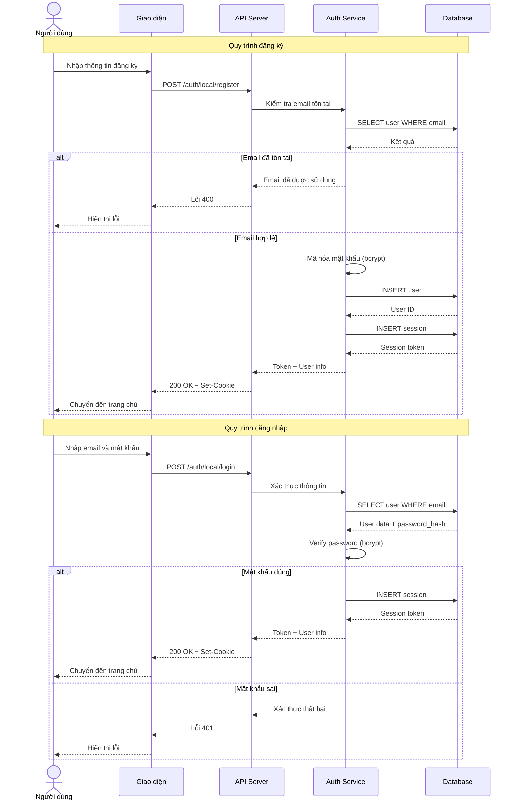
```mermaid
sequenceDiagram
    actor User as Người dùng
    participant UI as Giao diện
    participant API as API Server
    participant Auth as Auth Service
    participant DB as Database

    Note over User,DB: Quy trình đăng ký
    User->>UI: Nhập thông tin đăng ký
    UI->>API: POST /auth/local/register
    API->>Auth: Kiểm tra email tồn tại
    Auth->>DB: SELECT user WHERE email
    DB-->>Auth: Kết quả
    alt Email đã tồn tại
        Auth-->>API: Email đã được sử dụng
        API-->>UI: Lỗi 400
        UI-->>User: Hiển thị lỗi
    else Email hợp lệ
        Auth->>Auth: Mã hóa mật khẩu (bcrypt)
        Auth->>DB: INSERT user
        DB-->>Auth: User ID
        Auth->>DB: INSERT session
        DB-->>Auth: Session token
        Auth-->>API: Token + User info
        API-->>UI: 200 OK + Set-Cookie
        UI-->>User: Chuyển đến trang chủ
    end

    Note over User,DB: Quy trình đăng nhập
    User->>UI: Nhập email và mật khẩu
    UI->>API: POST /auth/local/login
    API->>Auth: Xác thực thông tin
    Auth->>DB: SELECT user WHERE email
    DB-->>Auth: User data + password_hash
    Auth->>Auth: Verify password (bcrypt)
    alt Mật khẩu đúng
        Auth->>DB: INSERT session
        DB-->>Auth: Session token
        Auth-->>API: Token + User info
        API-->>UI: 200 OK + Set-Cookie
        UI-->>User: Chuyển đến trang chủ
    else Mật khẩu sai
        Auth-->>API: Xác thực thất bại
        API-->>UI: Lỗi 401
        UI-->>User: Hiển thị lỗi
    end
```

### 3.2.4.2. Biểu đồ tuần tự - Matchmaking và bắt đầu game

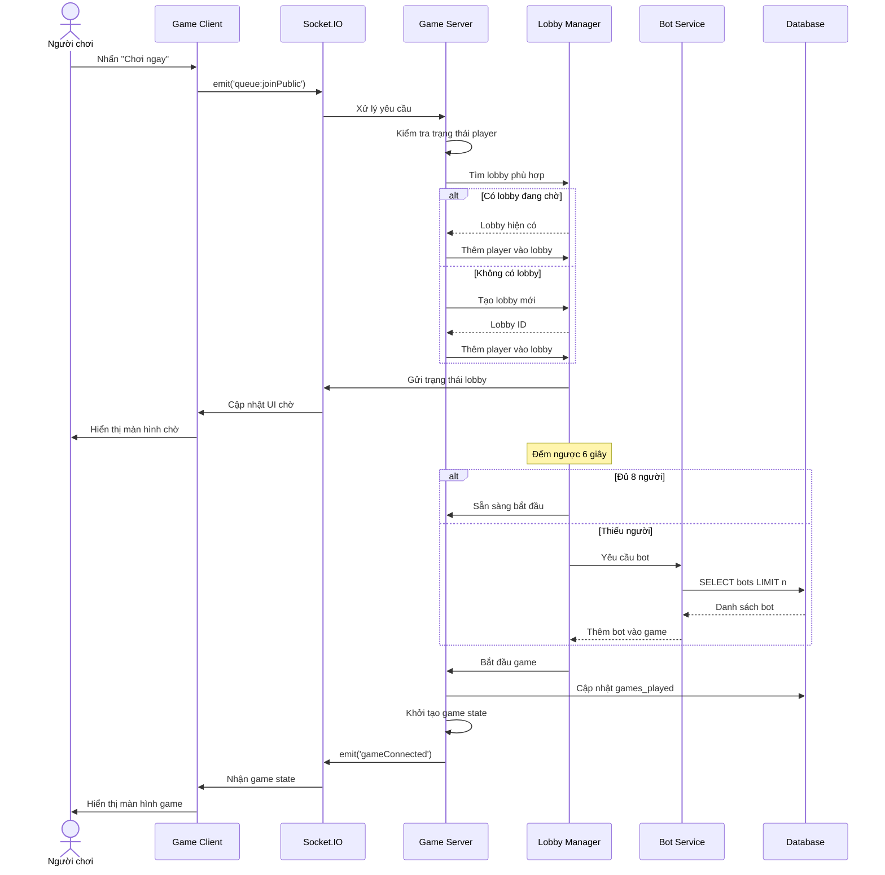
```mermaid
sequenceDiagram
    actor Player as Người chơi
    participant Client as Game Client
    participant Socket as Socket.IO
    participant Server as Game Server
    participant Lobby as Lobby Manager
    participant Bot as Bot Service
    participant DB as Database

    Player->>Client: Nhấn "Chơi ngay"
    Client->>Socket: emit('queue:joinPublic')
    Socket->>Server: Xử lý yêu cầu
    Server->>Server: Kiểm tra trạng thái player
    Server->>Lobby: Tìm lobby phù hợp

    alt Có lobby đang chờ
        Lobby-->>Server: Lobby hiện có
        Server->>Lobby: Thêm player vào lobby
    else Không có lobby
        Server->>Lobby: Tạo lobby mới
        Lobby-->>Server: Lobby ID
        Server->>Lobby: Thêm player vào lobby
    end

    Lobby->>Socket: Gửi trạng thái lobby
    Socket->>Client: Cập nhật UI chờ
    Client->>Player: Hiển thị màn hình chờ

    Note over Lobby: Đếm ngược 6 giây

    alt Đủ 8 người
        Lobby->>Server: Sẵn sàng bắt đầu
    else Thiếu người
        Lobby->>Bot: Yêu cầu bot
        Bot->>DB: SELECT bots LIMIT n
        DB-->>Bot: Danh sách bot
        Bot-->>Lobby: Thêm bot vào game
    end

    Lobby->>Server: Bắt đầu game
    Server->>DB: Cập nhật games_played
    Server->>Server: Khởi tạo game state
    Server->>Socket: emit('gameConnected')
    Socket->>Client: Nhận game state
    Client->>Player: Hiển thị màn hình game
```

### 3.2.4.3. Biểu đồ tuần tự - Mua sinh vật và xếp đội hình

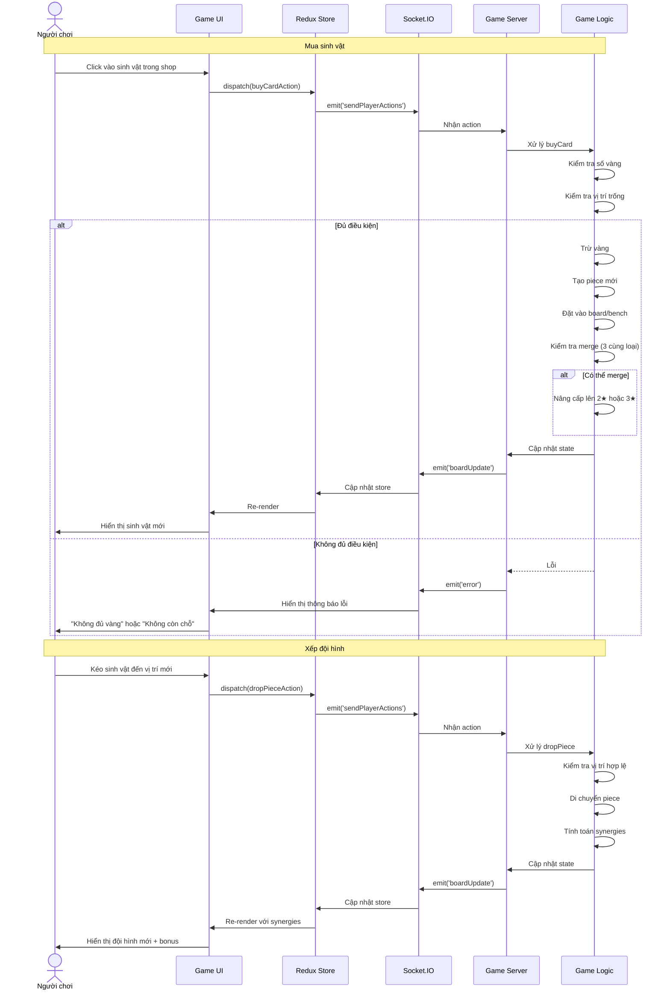
```mermaid
sequenceDiagram
    actor Player as Người chơi
    participant UI as Game UI
    participant Redux as Redux Store
    participant Socket as Socket.IO
    participant Server as Game Server
    participant GameLogic as Game Logic

    Note over Player,GameLogic: Mua sinh vật
    Player->>UI: Click vào sinh vật trong shop
    UI->>Redux: dispatch(buyCardAction)
    Redux->>Socket: emit('sendPlayerActions')
    Socket->>Server: Nhận action
    Server->>GameLogic: Xử lý buyCard
    GameLogic->>GameLogic: Kiểm tra số vàng
    GameLogic->>GameLogic: Kiểm tra vị trí trống

    alt Đủ điều kiện
        GameLogic->>GameLogic: Trừ vàng
        GameLogic->>GameLogic: Tạo piece mới
        GameLogic->>GameLogic: Đặt vào board/bench
        GameLogic->>GameLogic: Kiểm tra merge (3 cùng loại)
        alt Có thể merge
            GameLogic->>GameLogic: Nâng cấp lên 2★ hoặc 3★
        end
        GameLogic->>Server: Cập nhật state
        Server->>Socket: emit('boardUpdate')
        Socket->>Redux: Cập nhật store
        Redux->>UI: Re-render
        UI->>Player: Hiển thị sinh vật mới
    else Không đủ điều kiện
        GameLogic-->>Server: Lỗi
        Server->>Socket: emit('error')
        Socket->>UI: Hiển thị thông báo lỗi
        UI->>Player: "Không đủ vàng" hoặc "Không còn chỗ"
    end

    Note over Player,GameLogic: Xếp đội hình
    Player->>UI: Kéo sinh vật đến vị trí mới
    UI->>Redux: dispatch(dropPieceAction)
    Redux->>Socket: emit('sendPlayerActions')
    Socket->>Server: Nhận action
    Server->>GameLogic: Xử lý dropPiece
    GameLogic->>GameLogic: Kiểm tra vị trí hợp lệ
    GameLogic->>GameLogic: Di chuyển piece
    GameLogic->>GameLogic: Tính toán synergies
    GameLogic->>Server: Cập nhật state
    Server->>Socket: emit('boardUpdate')
    Socket->>Redux: Cập nhật store
    Redux->>UI: Re-render với synergies
    UI->>Player: Hiển thị đội hình mới + bonus
```

### 3.2.4.4. Biểu đồ tuần tự - Chiến đấu tự động

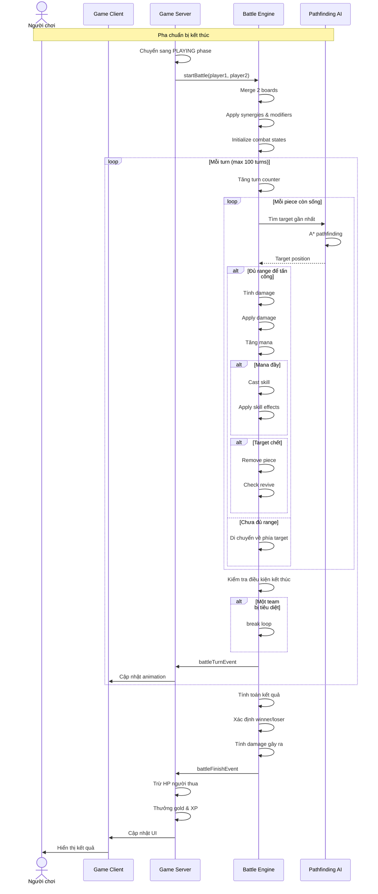
```mermaid
sequenceDiagram
    actor Player as Người chơi
    participant Client as Game Client
    participant Server as Game Server
    participant Battle as Battle Engine
    participant AI as Pathfinding AI

    Note over Player,AI: Pha chuẩn bị kết thúc
    Server->>Server: Chuyển sang PLAYING phase
    Server->>Battle: startBattle(player1, player2)
    Battle->>Battle: Merge 2 boards
    Battle->>Battle: Apply synergies & modifiers
    Battle->>Battle: Initialize combat states

    loop Mỗi turn (max 100 turns)
        Battle->>Battle: Tăng turn counter

        loop Mỗi piece còn sống
            Battle->>AI: Tìm target gần nhất
            AI->>AI: A* pathfinding
            AI-->>Battle: Target position

            alt Đủ range để tấn công
                Battle->>Battle: Tính damage
                Battle->>Battle: Apply damage
                Battle->>Battle: Tăng mana

                alt Mana đầy
                    Battle->>Battle: Cast skill
                    Battle->>Battle: Apply skill effects
                end

                alt Target chết
                    Battle->>Battle: Remove piece
                    Battle->>Battle: Check revive
                end
            else Chưa đủ range
                Battle->>Battle: Di chuyển về phía target
            end
        end

        Battle->>Battle: Kiểm tra điều kiện kết thúc
        alt Một team bị tiêu diệt
            Battle->>Battle: break loop
        end

        Battle->>Server: battleTurnEvent
        Server->>Client: Cập nhật animation
    end

    Battle->>Battle: Tính toán kết quả
    Battle->>Battle: Xác định winner/loser
    Battle->>Battle: Tính damage gây ra
    Battle->>Server: battleFinishEvent
    Server->>Server: Trừ HP người thua
    Server->>Server: Thưởng gold & XP
    Server->>Client: Cập nhật UI
    Client->>Player: Hiển thị kết quả
```

### 3.2.4.5. Biểu đồ tuần tự - Coach AI với RAG

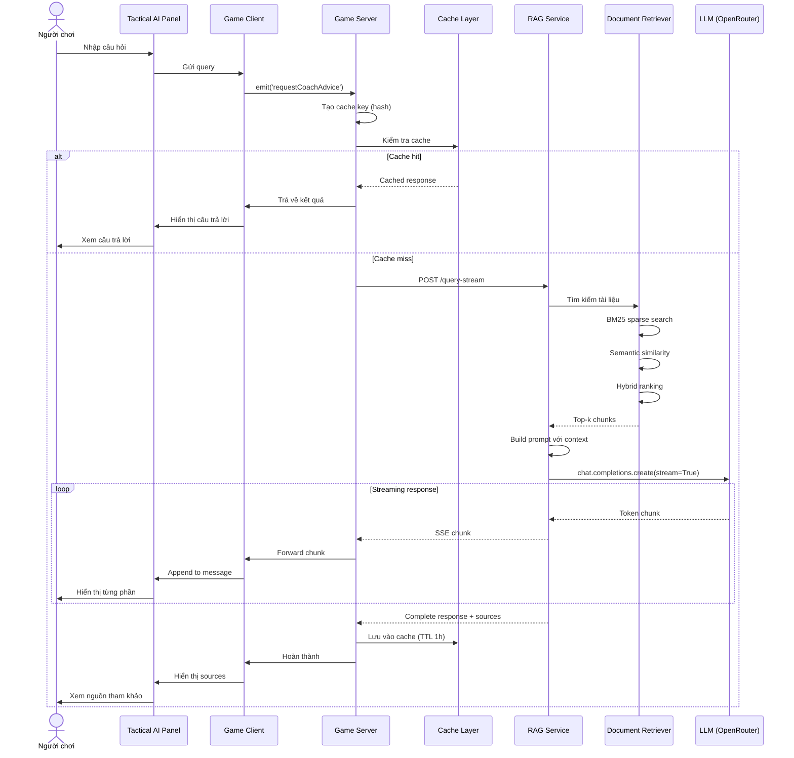
```mermaid
sequenceDiagram
    actor Player as Người chơi
    participant UI as Tactical AI Panel
    participant Client as Game Client
    participant Server as Game Server
    participant Cache as Cache Layer
    participant RAG as RAG Service
    participant Retriever as Document Retriever
    participant LLM as LLM (OpenRouter)

    Player->>UI: Nhập câu hỏi
    UI->>Client: Gửi query
    Client->>Server: emit('requestCoachAdvice')
    Server->>Server: Tạo cache key (hash)
    Server->>Cache: Kiểm tra cache

    alt Cache hit
        Cache-->>Server: Cached response
        Server->>Client: Trả về kết quả
        Client->>UI: Hiển thị câu trả lời
        UI->>Player: Xem câu trả lời
    else Cache miss
        Server->>RAG: POST /query-stream
        RAG->>Retriever: Tìm kiếm tài liệu
        Retriever->>Retriever: BM25 sparse search
        Retriever->>Retriever: Semantic similarity
        Retriever->>Retriever: Hybrid ranking
        Retriever-->>RAG: Top-k chunks

        RAG->>RAG: Build prompt với context
        RAG->>LLM: chat.completions.create(stream=True)

        loop Streaming response
            LLM-->>RAG: Token chunk
            RAG-->>Server: SSE chunk
            Server->>Client: Forward chunk
            Client->>UI: Append to message
            UI->>Player: Hiển thị từng phần
        end

        RAG-->>Server: Complete response + sources
        Server->>Cache: Lưu vào cache (TTL 1h)
        Server->>Client: Hoàn thành
        Client->>UI: Hiển thị sources
        UI->>Player: Xem nguồn tham khảo
    end
```

### 3.2.4.6. Biểu đồ tuần tự - Quản lý bạn bè

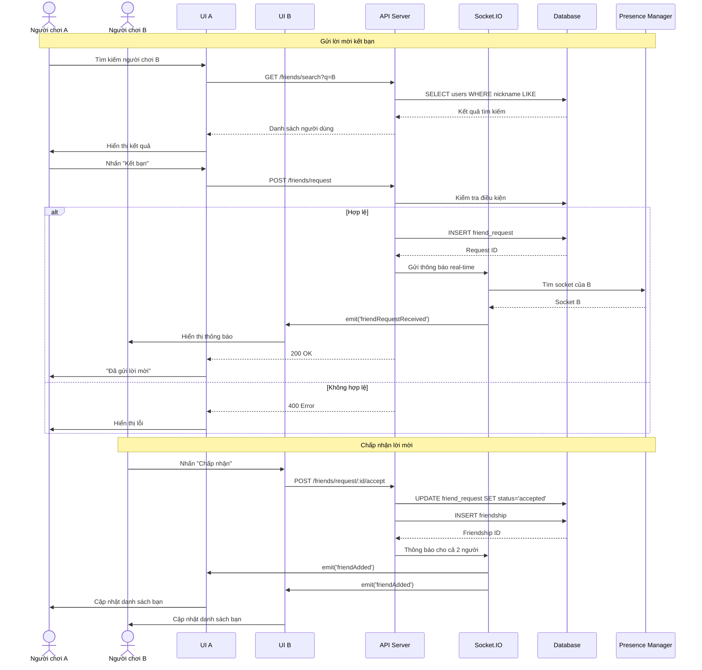
```mermaid
sequenceDiagram
    actor Player1 as Người chơi A
    actor Player2 as Người chơi B
    participant UI1 as UI A
    participant UI2 as UI B
    participant API as API Server
    participant Socket as Socket.IO
    participant DB as Database
    participant Presence as Presence Manager

    Note over Player1,Presence: Gửi lời mời kết bạn
    Player1->>UI1: Tìm kiếm người chơi B
    UI1->>API: GET /friends/search?q=B
    API->>DB: SELECT users WHERE nickname LIKE
    DB-->>API: Kết quả tìm kiếm
    API-->>UI1: Danh sách người dùng
    UI1->>Player1: Hiển thị kết quả

    Player1->>UI1: Nhấn "Kết bạn"
    UI1->>API: POST /friends/request
    API->>DB: Kiểm tra điều kiện
    alt Hợp lệ
        API->>DB: INSERT friend_request
        DB-->>API: Request ID
        API->>Socket: Gửi thông báo real-time
        Socket->>Presence: Tìm socket của B
        Presence-->>Socket: Socket B
        Socket->>UI2: emit('friendRequestReceived')
        UI2->>Player2: Hiển thị thông báo
        API-->>UI1: 200 OK
        UI1->>Player1: "Đã gửi lời mời"
    else Không hợp lệ
        API-->>UI1: 400 Error
        UI1->>Player1: Hiển thị lỗi
    end

    Note over Player2,Presence: Chấp nhận lời mời
    Player2->>UI2: Nhấn "Chấp nhận"
    UI2->>API: POST /friends/request/:id/accept
    API->>DB: UPDATE friend_request SET status='accepted'
    API->>DB: INSERT friendship
    DB-->>API: Friendship ID
    API->>Socket: Thông báo cho cả 2 người
    Socket->>UI1: emit('friendAdded')
    Socket->>UI2: emit('friendAdded')
    UI1->>Player1: Cập nhật danh sách bạn
    UI2->>Player2: Cập nhật danh sách bạn
```

---

## 3.2.5. Biểu đồ hoạt động (Activity Diagram)

### 3.2.5.1. Biểu đồ hoạt động - Quy trình chơi game hoàn chỉnh

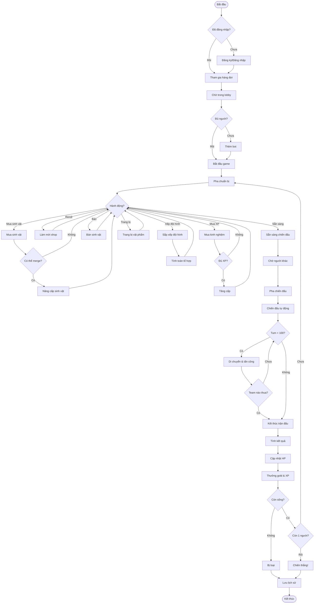
```mermaid
flowchart TD
    Start([Bắt đầu]) --> Login{Đã đăng nhập?}
    Login -->|Chưa| Register[Đăng ký/Đăng nhập]
    Login -->|Rồi| Queue[Tham gia hàng đợi]
    Register --> Queue

    Queue --> WaitLobby[Chờ trong lobby]
    WaitLobby --> CheckPlayers{Đủ người?}
    CheckPlayers -->|Chưa| AddBot[Thêm bot]
    CheckPlayers -->|Rồi| StartGame[Bắt đầu game]
    AddBot --> StartGame

    StartGame --> PrepPhase[Pha chuẩn bị]

    PrepPhase --> ShopActions{Hành động?}
    ShopActions -->|Mua sinh vật| BuyCreature[Mua sinh vật]
    ShopActions -->|Reroll| Reroll[Làm mới shop]
    ShopActions -->|Mua XP| BuyXP[Mua kinh nghiệm]
    ShopActions -->|Bán| Sell[Bán sinh vật]
    ShopActions -->|Xếp đội hình| Arrange[Sắp xếp đội hình]
    ShopActions -->|Trang bị| Equip[Trang bị vật phẩm]
    ShopActions -->|Sẵn sàng| Ready[Sẵn sàng chiến đấu]

    BuyCreature --> CheckMerge{Có thể merge?}
    CheckMerge -->|Có| Merge[Nâng cấp sinh vật]
    CheckMerge -->|Không| ShopActions
    Merge --> ShopActions

    Reroll --> ShopActions
    BuyXP --> CheckLevel{Đủ XP?}
    CheckLevel -->|Có| LevelUp[Tăng cấp]
    CheckLevel -->|Không| ShopActions
    LevelUp --> ShopActions

    Sell --> ShopActions
    Arrange --> CalcSynergy[Tính toán tổ hợp]
    CalcSynergy --> ShopActions
    Equip --> ShopActions

    Ready --> WaitOthers[Chờ người khác]
    WaitOthers --> BattlePhase[Pha chiến đấu]

    BattlePhase --> AutoBattle[Chiến đấu tự động]
    AutoBattle --> BattleLoop{Turn < 100?}
    BattleLoop -->|Có| MovePieces[Di chuyển & tấn công]
    MovePieces --> CheckDeath{Team nào thua?}
    CheckDeath -->|Chưa| BattleLoop
    CheckDeath -->|Có| BattleEnd[Kết thúc trận đấu]
    BattleLoop -->|Không| BattleEnd

    BattleEnd --> CalcResult[Tính kết quả]
    CalcResult --> UpdateHP[Cập nhật HP]
    UpdateHP --> GiveReward[Thưởng gold & XP]
    GiveReward --> CheckAlive{Còn sống?}

    CheckAlive -->|Có| CheckWinner{Còn 1 người?}
    CheckAlive -->|Không| Eliminated[Bị loại]

    CheckWinner -->|Chưa| PrepPhase
    CheckWinner -->|Rồi| Winner[Chiến thắng!]

    Eliminated --> SaveHistory[Lưu lịch sử]
    Winner --> SaveHistory
    SaveHistory --> End([Kết thúc])
```

### 3.2.5.2. Biểu đồ hoạt động - Xử lý lời mời kết bạn

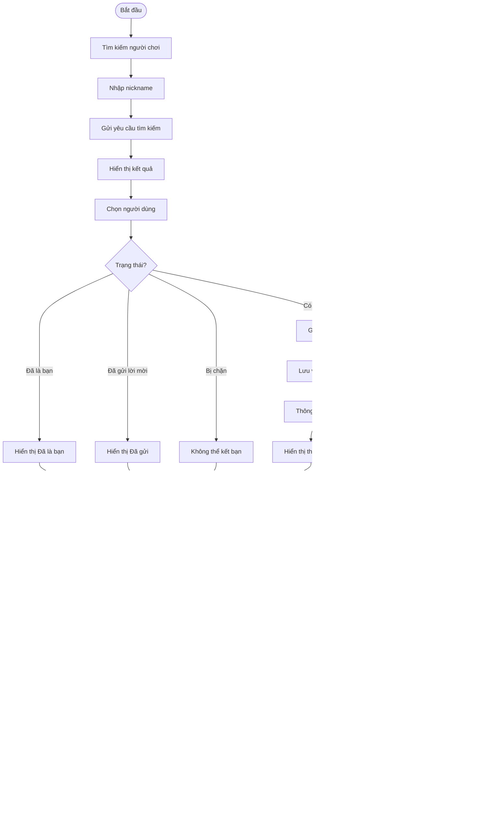
```mermaid
flowchart TD
    Start([Bắt đầu]) --> Search[Tìm kiếm người chơi]
    Search --> InputName[Nhập nickname]
    InputName --> SendSearch[Gửi yêu cầu tìm kiếm]
    SendSearch --> ShowResults[Hiển thị kết quả]

    ShowResults --> SelectUser[Chọn người dùng]
    SelectUser --> CheckStatus{Trạng thái?}

    CheckStatus -->|Đã là bạn| ShowFriend[Hiển thị Đã là bạn]
    CheckStatus -->|Đã gửi lời mời| ShowPending[Hiển thị Đã gửi]
    CheckStatus -->|Bị chặn| ShowBlocked[Không thể kết bạn]
    CheckStatus -->|Có thể kết bạn| SendRequest[Gửi lời mời]

    SendRequest --> SaveDB[Lưu vào database]
    SaveDB --> NotifyTarget[Thông báo real-time]
    NotifyTarget --> ShowSuccess[Hiển thị thành công]
    ShowSuccess --> End1([Kết thúc])

    ShowFriend --> End1
    ShowPending --> End1
    ShowBlocked --> End1

    NotifyTarget --> TargetReceive[Người nhận thấy thông báo]
    TargetReceive --> TargetAction{Hành động?}

    TargetAction -->|Chấp nhận| Accept[Chấp nhận lời mời]
    TargetAction -->|Từ chối| Decline[Từ chối lời mời]
    TargetAction -->|Bỏ qua| Ignore[Bỏ qua]

    Accept --> UpdateStatus1[Cập nhật status='accepted']
    UpdateStatus1 --> CreateFriendship[Tạo friendship]
    CreateFriendship --> NotifyBoth[Thông báo cả 2 người]
    NotifyBoth --> UpdateUI[Cập nhật danh sách bạn]
    UpdateUI --> End2([Kết thúc])

    Decline --> UpdateStatus2[Cập nhật status='declined']
    UpdateStatus2 --> NotifySender[Thông báo người gửi]
    NotifySender --> End2

    Ignore --> End2
```

### 3.2.5.3. Biểu đồ hoạt động - Sử dụng Coach AI

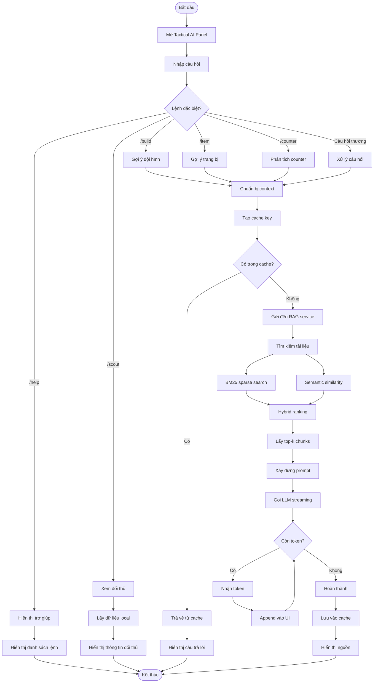
```mermaid
flowchart TD
    Start([Bắt đầu]) --> OpenPanel[Mở Tactical AI Panel]
    OpenPanel --> InputQuery[Nhập câu hỏi]
    InputQuery --> CheckCommand{Lệnh đặc biệt?}

    CheckCommand -->|/build| BuildQuery[Gợi ý đội hình]
    CheckCommand -->|/item| ItemQuery[Gợi ý trang bị]
    CheckCommand -->|/counter| CounterQuery[Phân tích counter]
    CheckCommand -->|/scout| ScoutQuery[Xem đối thủ]
    CheckCommand -->|/help| HelpQuery[Hiển thị trợ giúp]
    CheckCommand -->|Câu hỏi thường| NormalQuery[Xử lý câu hỏi]

    HelpQuery --> ShowHelp[Hiển thị danh sách lệnh]
    ShowHelp --> End([Kết thúc])

    ScoutQuery --> GetLocalData[Lấy dữ liệu local]
    GetLocalData --> ShowScout[Hiển thị thông tin đối thủ]
    ShowScout --> End

    BuildQuery --> PrepareContext1[Chuẩn bị context]
    ItemQuery --> PrepareContext1
    CounterQuery --> PrepareContext1
    NormalQuery --> PrepareContext1

    PrepareContext1 --> CreateHash[Tạo cache key]
    CreateHash --> CheckCache{Có trong cache?}

    CheckCache -->|Có| ReturnCache[Trả về từ cache]
    ReturnCache --> DisplayAnswer[Hiển thị câu trả lời]
    DisplayAnswer --> End

    CheckCache -->|Không| SendRAG[Gửi đến RAG service]
    SendRAG --> SearchDocs[Tìm kiếm tài liệu]
    SearchDocs --> BM25[BM25 sparse search]
    SearchDocs --> Semantic[Semantic similarity]
    BM25 --> Hybrid[Hybrid ranking]
    Semantic --> Hybrid

    Hybrid --> TopK[Lấy top-k chunks]
    TopK --> BuildPrompt[Xây dựng prompt]
    BuildPrompt --> CallLLM[Gọi LLM streaming]

    CallLLM --> StreamLoop{Còn token?}
    StreamLoop -->|Có| ReceiveToken[Nhận token]
    ReceiveToken --> AppendUI[Append vào UI]
    AppendUI --> StreamLoop

    StreamLoop -->|Không| Complete[Hoàn thành]
    Complete --> SaveCache[Lưu vào cache]
    SaveCache --> ShowSources[Hiển thị nguồn]
    ShowSources --> End
```

### 3.2.5.4. Biểu đồ hoạt động - Quản lý người dùng (Admin)

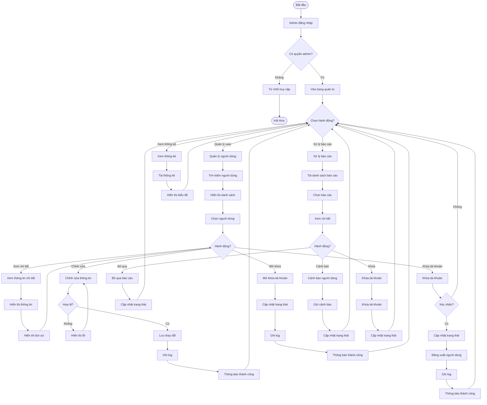
```mermaid
flowchart TD
    Start([Bắt đầu]) --> AdminLogin[Admin đăng nhập]
    AdminLogin --> CheckAuth{Có quyền admin?}

    CheckAuth -->|Không| Denied[Từ chối truy cập]
    Denied --> End([Kết thúc])

    CheckAuth -->|Có| Dashboard[Vào trang quản trị]
    Dashboard --> SelectAction{Chọn hành động?}

    SelectAction -->|Quản lý user| UserMgmt[Quản lý người dùng]
    SelectAction -->|Xem thống kê| ViewStats[Xem thống kê]
    SelectAction -->|Xử lý báo cáo| HandleReport[Xử lý báo cáo]

    UserMgmt --> SearchUser[Tìm kiếm người dùng]
    SearchUser --> ShowUserList[Hiển thị danh sách]
    ShowUserList --> SelectUser[Chọn người dùng]
    SelectUser --> UserAction{Hành động?}

    UserAction -->|Xem chi tiết| ViewDetail[Xem thông tin chi tiết]
    UserAction -->|Chỉnh sửa| EditUser[Chỉnh sửa thông tin]
    UserAction -->|Khóa tài khoản| LockUser[Khóa tài khoản]
    UserAction -->|Mở khóa| UnlockUser[Mở khóa tài khoản]

    ViewDetail --> ShowInfo[Hiển thị thông tin]
    ShowInfo --> ShowHistory[Hiển thị lịch sử]
    ShowHistory --> UserAction

    EditUser --> ValidateEdit{Hợp lệ?}
    ValidateEdit -->|Không| ShowError1[Hiển thị lỗi]
    ShowError1 --> EditUser
    ValidateEdit -->|Có| SaveEdit[Lưu thay đổi]
    SaveEdit --> LogAction1[Ghi log]
    LogAction1 --> Success1[Thông báo thành công]
    Success1 --> SelectAction

    LockUser --> ConfirmLock{Xác nhận?}
    ConfirmLock -->|Không| SelectAction
    ConfirmLock -->|Có| UpdateLock[Cập nhật trạng thái]
    UpdateLock --> ForceLogout[Đăng xuất người dùng]
    ForceLogout --> LogAction2[Ghi log]
    LogAction2 --> Success2[Thông báo thành công]
    Success2 --> SelectAction

    UnlockUser --> UpdateUnlock[Cập nhật trạng thái]
    UpdateUnlock --> LogAction3[Ghi log]
    LogAction3 --> Success3[Thông báo thành công]
    Success3 --> SelectAction

    ViewStats --> LoadStats[Tải thống kê]
    LoadStats --> ShowCharts[Hiển thị biểu đồ]
    ShowCharts --> SelectAction

    HandleReport --> LoadReports[Tải danh sách báo cáo]
    LoadReports --> SelectReport[Chọn báo cáo]
    SelectReport --> ReviewReport[Xem chi tiết]
    ReviewReport --> ReportAction{Hành động?}

    ReportAction -->|Bỏ qua| DismissReport[Bỏ qua báo cáo]
    ReportAction -->|Cảnh báo| WarnUser[Cảnh báo người dùng]
    ReportAction -->|Khóa| BanUser[Khóa tài khoản]

    DismissReport --> UpdateReport1[Cập nhật trạng thái]
    WarnUser --> SendWarning[Gửi cảnh báo]
    SendWarning --> UpdateReport2[Cập nhật trạng thái]
    BanUser --> LockAccount[Khóa tài khoản]
    LockAccount --> UpdateReport3[Cập nhật trạng thái]

    UpdateReport1 --> SelectAction
    UpdateReport2 --> SelectAction
    UpdateReport3 --> SelectAction
```

---

## 3.2.6. Biểu đồ lớp (Class Diagram)

### 3.2.6.1. Biểu đồ lớp - Quản lý người dùng và xác thực

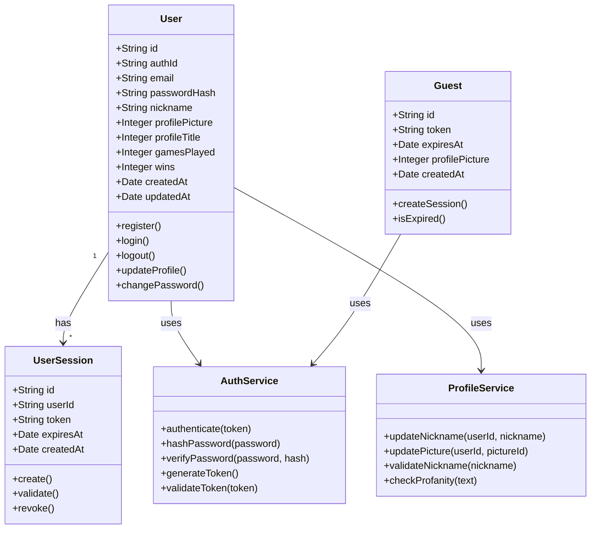
```mermaid
classDiagram
    class User {
        +String id
        +String authId
        +String email
        +String passwordHash
        +String nickname
        +Integer profilePicture
        +Integer profileTitle
        +Integer gamesPlayed
        +Integer wins
        +Date createdAt
        +Date updatedAt
        +register()
        +login()
        +logout()
        +updateProfile()
        +changePassword()
    }

    class Guest {
        +String id
        +String token
        +Date expiresAt
        +Integer profilePicture
        +Date createdAt
        +createSession()
        +isExpired()
    }

    class UserSession {
        +String id
        +String userId
        +String token
        +Date expiresAt
        +Date createdAt
        +create()
        +validate()
        +revoke()
    }

    class AuthService {
        +authenticate(token)
        +hashPassword(password)
        +verifyPassword(password, hash)
        +generateToken()
        +validateToken(token)
    }

    class ProfileService {
        +updateNickname(userId, nickname)
        +updatePicture(userId, pictureId)
        +validateNickname(nickname)
        +checkProfanity(text)
    }

    User "1" --> "*" UserSession : has
    User --> AuthService : uses
    User --> ProfileService : uses
    Guest --> AuthService : uses
```

### 3.2.6.2. Biểu đồ lớp - Game và chiến đấu

```mermaid
classDiagram
    class Game {
        +String id
        +GamemodeSettings settings
        +Array~Player~ players
        +Array~Bot~ bots
        +RoundInfo roundInfo
        +Date startedAt
        +start()
        +nextRound()
        +matchPlayers()
        +checkGameEnd()
        +finish()
    }

    class Player {
        +String id
        +String name
        +Integer level
        +Integer xp
        +Integer money
        +Integer hp
        +Board board
        +Board bench
        +Array~Card~ shop
        +Boolean shopLocked
        +buyCard(index)
        +buyXp()
        +rerollShop()
        +sellPiece(pieceId)
        +dropPiece(pieceId, position)
        +equipItem(pieceId, itemId)
        +readyUp()
    }

    class Piece {
        +String id
        +String ownerId
        +String definitionId
        +Integer stage
        +Integer currentHealth
        +Integer maxHealth
        +Integer currentMana
        +Integer maxMana
        +Array~Trait~ traits
        +Array~Item~ items
        +Boolean facingAway
        +BattleStats lastBattleStats
        +takeDamage(amount)
        +heal(amount)
        +gainMana(amount)
        +castSkill()
        +die()
    }

    class Board {
        +String id
        +Map~String,Piece~ pieces
        +Map~String,Position~ piecePositions
        +Size size
        +Integer pieceLimit
        +addPiece(piece, position)
        +removePiece(pieceId)
        +movePiece(pieceId, newPosition)
        +getFirstEmptySlot()
    }

    class Battle {
        +String id
        +Board homeBoard
        +Board awayBoard
        +Integer turnCount
        +Integer maxTurns
        +start()
        +simulateTurn()
        +checkEndCondition()
        +calculateOutcome()
        +finish()
    }

    class BattleEngine {
        +runBattle(board1, board2)
        +simulateTurn(board)
        +findTarget(piece, board)
        +calculateDamage(attacker, defender)
        +applyDamage(piece, damage)
        +checkDeath(piece)
        +applyStatusEffects(piece)
    }

    class PathfindingAI {
        +findPath(start, end, obstacles)
        +aStar(start, goal)
        +getNeighbors(position)
        +heuristic(pos1, pos2)
    }

    class SynergyCalculator {
        +calculateSynergies(pieces)
        +getTraitCounts(pieces)
        +getActiveSynergies(traitCounts)
        +applyBonuses(pieces, synergies)
    }

    Game "1" --> "*" Player : contains
    Player "1" --> "1" Board : has board
    Player "1" --> "1" Board : has bench
    Board "1" --> "*" Piece : contains
    Game --> Battle : creates
    Battle --> BattleEngine : uses
    BattleEngine --> PathfindingAI : uses
    Player --> SynergyCalculator : uses
```

### 3.2.6.3. Biểu đồ lớp - Tính năng xã hội

```mermaid
classDiagram
    class User {
        +String id
        +String nickname
        +Integer profilePicture
        +getFriends()
        +getFriendRequests()
        +getBlockedUsers()
    }

    class Friendship {
        +String id
        +String userLowId
        +String userHighId
        +Date createdAt
        +create()
        +delete()
    }

    class FriendRequest {
        +String id
        +String senderId
        +String receiverId
        +String status
        +Date createdAt
        +Date updatedAt
        +send()
        +accept()
        +decline()
        +cancel()
    }

    class Block {
        +String id
        +String blockerUserId
        +String blockedUserId
        +Date createdAt
        +create()
        +remove()
    }

    class PrivateRoom {
        +String id
        +String code
        +String hostId
        +Array~Member~ members
        +Integer maxPlayers
        +String status
        +create()
        +join(userId)
        +leave(userId)
        +invite(userId)
        +start()
    }

    class RoomInvite {
        +String id
        +String roomId
        +String inviterId
        +String inviteeId
        +String status
        +Date createdAt
        +send()
        +accept()
        +decline()
    }

    class PresenceManager {
        +Map~String,String~ userStates
        +Map~String,Socket~ userSockets
        +setState(userId, state)
        +getState(userId)
        +addSocket(userId, socket)
        +removeSocket(userId, socket)
        +getSockets(userId)
    }

    class FriendManager {
        +sendRequest(senderId, receiverId)
        +acceptRequest(requestId)
        +declineRequest(requestId)
        +removeFriend(userId, friendId)
        +getFriendsList(userId)
        +emitSnapshot(userId)
    }

    User "1" --> "*" Friendship : participates
    User "1" --> "*" FriendRequest : sends/receives
    User "1" --> "*" Block : blocks/blocked by
    User "1" --> "*" PrivateRoom : creates/joins
    PrivateRoom "1" --> "*" RoomInvite : has
    FriendManager --> PresenceManager : uses
    FriendManager --> User : manages
```

### 3.2.6.4. Biểu đồ lớp - AI và trợ lý thông minh

```mermaid
classDiagram
    class TacticalAI {
        +PositioningAdvisor positioningAdvisor
        +CoachEngine coachEngine
        +PostBattleAnalyzer analyzer
        +getPositioningAdvice(board, enemies)
        +askCoach(query, context)
        +analyzeBattle(replayData)
    }

    class PositioningAdvisor {
        +PPOAgent agent
        +StateEncoder encoder
        +ActionDecoder decoder
        +BattleSimulator simulator
        +getAdvice(playerBoard, enemyBoards)
        +generateFormations(state)
        +testFormation(formation, enemies)
        +pickBestStrategy(results)
    }

    class PPOAgent {
        +Policy policy
        +ValueFunction valueFunction
        +Float learningRate
        +Float gamma
        +act(state)
        +update(experiences)
        +save(path)
        +load(path)
    }

    class StateEncoder {
        +encodeBoard(board)
        +encodePiece(piece)
        +encodeSynergies(pieces)
        +encodeThreats(enemies)
        +encodeMatchup(myBoard, enemyBoard)
    }

    class ActionDecoder {
        +decodeFormation(action)
        +applyArchetype(board, archetype)
        +applyAdjustments(board, adjustments)
    }

    class BattleSimulator {
        +runSimulation(board1, board2)
        +deepClonePiece(piece)
        +calculateWinRate(results)
        +calculateMargin(result)
    }

    class CoachEngine {
        +Retriever retriever
        +LLMClient llmClient
        +CacheLayer cache
        +query(question, context)
        +queryStream(question, context)
        +buildPrompt(question, chunks)
    }

    class Retriever {
        +BM25Index bm25
        +VectorDB vectorDB
        +Embedder embedder
        +search(query, topK)
        +hybridSearch(query, topK)
        +rankResults(bm25Results, semanticResults)
    }

    class PostBattleAnalyzer {
        +IssueDetector detector
        +RecommendationEngine recommender
        +analyze(replayData)
        +detectIssues(replay)
        +generateRecommendations(issues)
        +generateSummary(analysis)
    }

    class RLBot {
        +String mode
        +PPOAgent agent
        +RuleBasedBot fallback
        +Boolean trainingMode
        +chooseAction(gameState)
        +collectExperience(state, action, reward)
        +train()
    }

    TacticalAI --> PositioningAdvisor : uses
    TacticalAI --> CoachEngine : uses
    TacticalAI --> PostBattleAnalyzer : uses
    PositioningAdvisor --> PPOAgent : uses
    PositioningAdvisor --> StateEncoder : uses
    PositioningAdvisor --> ActionDecoder : uses
    PositioningAdvisor --> BattleSimulator : uses
    CoachEngine --> Retriever : uses
    RLBot --> PPOAgent : uses
```

### 3.2.6.5. Biểu đồ lớp - Quản trị hệ thống (Admin)

```mermaid
classDiagram
    class Admin {
        +String id
        +String email
        +String role
        +Array~Permission~ permissions
        +login()
        +hasPermission(permission)
    }

    class UserManagement {
        +searchUsers(query)
        +getUserDetails(userId)
        +updateUser(userId, data)
        +lockUser(userId, reason)
        +unlockUser(userId)
        +getUserActivity(userId)
        +getUserReports(userId)
    }

    class ContentManagement {
        +getCreatures()
        +createCreature(data)
        +updateCreature(id, data)
        +deleteCreature(id)
        +getItems()
        +createItem(data)
        +updateItem(id, data)
        +deleteItem(id)
        +getSkills()
        +updateSkill(id, data)
    }

    class GameConfiguration {
        +getSettings()
        +updateSettings(settings)
        +getBotConfig()
        +updateBotConfig(config)
        +getBalanceConfig()
        +updateBalanceConfig(config)
        +validateConfig(config)
    }

    class ReportManagement {
        +getReports(filters)
        +getReportDetails(reportId)
        +updateReportStatus(reportId, status)
        +dismissReport(reportId)
        +warnUser(userId, reason)
        +banUser(userId, reason, duration)
        +getReportStatistics()
    }

    class SystemMonitoring {
        +getServerStatus()
        +getActiveGames()
        +getActivePlayers()
        +getPerformanceMetrics()
        +getErrorLogs(filters)
        +getDatabaseStats()
        +getCacheStats()
    }

    class Statistics {
        +getTotalUsers()
        +getActiveUsers(period)
        +getTotalMatches()
        +getMatchesPerDay()
        +getAverageMatchDuration()
        +getPopularCreatures()
        +getWinRateByLevel()
        +getRetentionRate()
    }

    class AuditLog {
        +String id
        +String adminId
        +String action
        +String targetType
        +String targetId
        +Object changes
        +Date timestamp
        +log(action, target, changes)
        +getLogsByAdmin(adminId)
        +getLogsByTarget(targetId)
    }

    class EventManagement {
        +Array~Event~ events
        +createEvent(data)
        +updateEvent(id, data)
        +deleteEvent(id)
        +activateEvent(id)
        +deactivateEvent(id)
        +getActiveEvents()
    }

    Admin --> UserManagement : uses
    Admin --> ContentManagement : uses
    Admin --> GameConfiguration : uses
    Admin --> ReportManagement : uses
    Admin --> SystemMonitoring : uses
    Admin --> Statistics : uses
    Admin --> EventManagement : uses
    UserManagement --> AuditLog : logs
    ContentManagement --> AuditLog : logs
    GameConfiguration --> AuditLog : logs
    ReportManagement --> AuditLog : logs
```

### 3.2.6.6. Biểu đồ lớp - Lịch sử và thống kê

```mermaid
classDiagram
    class Match {
        +String id
        +String mode
        +Date startedAt
        +Date endedAt
        +Integer playerCount
        +String winnerUserId
        +Boolean persisted
        +create()
        +finish()
        +getParticipants()
    }

    class MatchParticipant {
        +String id
        +String matchId
        +String userId
        +String guestId
        +String displayName
        +Integer placement
        +Boolean isBot
        +String result
        +Date createdAt
        +create()
    }

    class MatchHistory {
        +getMatchHistory(userId, filters)
        +getMatchDetails(matchId)
        +createMatchSummary(data)
        +getRecentMatches(userId, limit)
        +getMatchStatistics(userId)
    }

    class PlayerStatistics {
        +String userId
        +Integer totalGames
        +Integer wins
        +Integer top4Finishes
        +Float winRate
        +Float averagePlacement
        +Integer currentStreak
        +Integer longestStreak
        +calculate()
        +update(matchResult)
    }

    class Leaderboard {
        +String id
        +String season
        +Date startDate
        +Date endDate
        +getTopPlayers(limit)
        +getPlayerRank(userId)
        +updateRankings()
    }

    class LeaderboardEntry {
        +String userId
        +String nickname
        +Integer rank
        +Integer points
        +Integer wins
        +Integer gamesPlayed
        +Float winRate
    }

    class Achievement {
        +String id
        +String name
        +String description
        +String icon
        +Object criteria
        +Integer points
        +check(playerStats)
    }

    class PlayerAchievement {
        +String userId
        +String achievementId
        +Date unlockedAt
        +unlock()
    }

    Match "1" --> "*" MatchParticipant : has
    MatchHistory --> Match : manages
    PlayerStatistics --> MatchHistory : uses
    Leaderboard "1" --> "*" LeaderboardEntry : contains
    Achievement "1" --> "*" PlayerAchievement : unlocked by
```

### 3.2.6.7. Biểu đồ lớp - Networking và Real-time

```mermaid
classDiagram
    class SocketServer {
        +Server io
        +Map~String,Socket~ connections
        +RedisAdapter adapter
        +initialize()
        +registerHandlers()
        +broadcast(event, data)
        +emitToUser(userId, event, data)
    }

    class AuthenticatedSocket {
        +String id
        +SocketData data
        +authenticate()
        +disconnect()
        +emit(event, data)
        +on(event, handler)
    }

    class SocketData {
        +String id
        +String type
        +String nickname
        +Profile profile
        +String sessionToken
    }

    class GameConnection {
        +String gameId
        +String playerId
        +AuthenticatedSocket socket
        +connect()
        +disconnect()
        +sendAction(action)
        +receiveUpdate(update)
    }

    class ActionStream {
        +Array~Action~ actions
        +Integer sequence
        +add(action)
        +serialize()
        +deserialize(packet)
        +validate()
    }

    class Protocol {
        +Map~String,PacketDefinition~ packets
        +definePacket(name, schema)
        +encode(packet)
        +decode(data)
        +validate(packet)
    }

    class RedisAdapter {
        +RedisClient pubClient
        +RedisClient subClient
        +connect()
        +publish(channel, message)
        +subscribe(channel, handler)
        +disconnect()
    }

    class PresenceService {
        +Map~String,UserPresence~ presences
        +updatePresence(userId, state)
        +getPresence(userId)
        +subscribeToPresence(userId, callback)
        +broadcastPresence(userId)
    }

    class RealtimeSync {
        +syncGameState(gameId, state)
        +syncBoardUpdate(playerId, board)
        +syncPlayerInfo(playerId, info)
        +syncBattleUpdate(gameId, battleData)
    }

    SocketServer "1" --> "*" AuthenticatedSocket : manages
    AuthenticatedSocket --> SocketData : contains
    GameConnection --> AuthenticatedSocket : uses
    GameConnection --> ActionStream : sends/receives
    ActionStream --> Protocol : uses
    SocketServer --> RedisAdapter : uses
    SocketServer --> PresenceService : uses
    SocketServer --> RealtimeSync : uses
```

---

## 3.2.7. Tổng kết thiết kế hệ thống

### 3.2.7.1. Kiến trúc tổng thể

Hệ thống Creature Chess được thiết kế theo kiến trúc phân tầng (Layered Architecture) kết hợp với kiến trúc microservices, bao gồm các tầng chính:

**1. Tầng trình diễn (Presentation Layer)**
- Web Client (React): Giao diện người dùng
- Admin Dashboard: Giao diện quản trị
- Mobile-responsive UI: Hỗ trợ đa thiết bị

**2. Tầng ứng dụng (Application Layer)**
- Game Server (Socket.IO): Xử lý game logic và real-time communication
- API Server (Express): Xử lý REST API cho authentication, social features
- RAG Service (FastAPI): Xử lý AI Coach và trợ lý thông minh

**3. Tầng nghiệp vụ (Business Logic Layer)**
- Game Logic: Xử lý cơ chế game (shop, battle, synergies)
- Battle Engine: Mô phỏng chiến đấu tự động
- AI Engine: RL Bot, Tactical AI, Coach AI
- Social Manager: Quản lý bạn bè, phòng chơi, presence

**4. Tầng dữ liệu (Data Layer)**
- PostgreSQL: Lưu trữ dữ liệu người dùng, lịch sử trận đấu
- Redis: Cache, pub/sub, session storage
- Vector DB: Lưu trữ embeddings cho RAG

### 3.2.7.2. Các mẫu thiết kế được sử dụng

**1. Repository Pattern**
- Tách biệt logic truy cập dữ liệu khỏi business logic
- Sử dụng Prisma ORM làm abstraction layer

**2. Observer Pattern**
- Socket.IO events cho real-time updates
- Redux store subscriptions cho UI updates

**3. Strategy Pattern**
- Bot AI có nhiều strategies: rule-based, RL, hybrid
- Battle simulation có nhiều targeting strategies

**4. Factory Pattern**
- Tạo pieces từ definitions
- Tạo game instances với các settings khác nhau

**5. Command Pattern**
- Player actions được đóng gói thành commands
- Hỗ trợ undo/redo và replay

**6. Singleton Pattern**
- Database connection
- Cache manager
- Presence manager

### 3.2.7.3. Các nguyên tắc thiết kế

**1. Separation of Concerns (SoC)**
- Tách biệt rõ ràng giữa UI, business logic, và data access
- Mỗi module có trách nhiệm riêng biệt

**2. Don't Repeat Yourself (DRY)**
- Sử dụng shared modules cho logic chung
- Tái sử dụng components và utilities

**3. Single Responsibility Principle (SRP)**
- Mỗi class/module chỉ có một lý do để thay đổi
- Ví dụ: AuthService chỉ xử lý authentication, không xử lý game logic

**4. Open/Closed Principle (OCP)**
- Mở cho mở rộng, đóng cho sửa đổi
- Ví dụ: Có thể thêm bot strategies mới mà không sửa code cũ

**5. Dependency Inversion Principle (DIP)**
- Phụ thuộc vào abstractions, không phụ thuộc vào implementations
- Sử dụng interfaces và dependency injection

### 3.2.7.4. Khả năng mở rộng (Scalability)

**1. Horizontal Scaling**
- Game servers có thể scale ra nhiều instances
- Redis adapter cho Socket.IO hỗ trợ multi-server
- Load balancer phân phối traffic

**2. Vertical Scaling**
- Tối ưu hóa performance của từng service
- Caching để giảm database load
- Connection pooling

**3. Database Scaling**
- Read replicas cho queries
- Sharding theo user ID nếu cần
- Indexing tối ưu

**4. Caching Strategy**
- Redis cache cho session, presence
- In-memory cache cho game state
- CDN cho static assets

### 3.2.7.5. Bảo mật (Security)

**1. Authentication & Authorization**
- JWT tokens cho API authentication
- Session tokens với expiration
- Role-based access control cho admin

**2. Data Protection**
- Bcrypt hashing cho passwords
- HTTPS cho tất cả communications
- Input validation và sanitization

**3. Rate Limiting**
- Giới hạn số requests per user
- Chống spam và DDoS

**4. Security Best Practices**
- Không lưu sensitive data trong logs
- Environment variables cho secrets
- Regular security audits

### 3.2.7.6. Hiệu năng (Performance)

**1. Real-time Performance**
- Socket.IO với MessagePack serialization
- Action batching để giảm số messages
- Delta updates thay vì full state sync

**2. Database Performance**
- Indexes trên các trường thường query
- Connection pooling
- Prepared statements

**3. AI Performance**
- RL inference < 50ms
- Battle simulation tối ưu
- Parallel processing cho multiple scenarios

**4. Frontend Performance**
- Code splitting
- Lazy loading components
- Memoization với React.memo
- Virtual scrolling cho long lists

### 3.2.7.7. Khả năng bảo trì (Maintainability)

**1. Code Organization**
- Monorepo với Yarn workspaces
- Modules tách biệt rõ ràng
- Consistent naming conventions

**2. Documentation**
- Code comments cho logic phức tạp
- API documentation
- Architecture documentation

**3. Testing**
- Unit tests cho business logic
- Integration tests cho APIs
- E2E tests cho critical flows

**4. Monitoring & Logging**
- Structured logging với Winston
- Prometheus metrics
- Error tracking
- Performance monitoring

### 3.2.7.8. Tính sẵn sàng (Availability)

**1. Error Handling**
- Graceful degradation
- Fallback mechanisms
- Retry logic với exponential backoff

**2. Health Checks**
- Server health endpoints
- Database connection checks
- Service dependency checks

**3. Backup & Recovery**
- Database backups
- State persistence
- Disaster recovery plan

**4. High Availability**
- Multiple server instances
- Load balancing
- Failover mechanisms

---

## 3.2.8. Sơ đồ kiến trúc tổng thể

```mermaid
graph TB
    subgraph "Client Layer"
        WebClient[Web Game Client<br/>React + Redux]
        AdminUI[Admin Dashboard<br/>React]
    end

    subgraph "Load Balancer"
        LB[Nginx / Load Balancer]
    end

    subgraph "Application Layer"
        GameServer[Game Server<br/>Socket.IO + Node.js]
        APIServer[API Server<br/>Express + Node.js]
        RAGService[RAG Service<br/>FastAPI + Python]
    end

    subgraph "Business Logic Layer"
        GameLogic[Game Logic<br/>Battle, Shop, Synergies]
        AIEngine[AI Engine<br/>RL Bot, Tactical AI]
        SocialMgr[Social Manager<br/>Friends, Rooms, Presence]
        AuthService[Auth Service<br/>JWT, Sessions]
    end

    subgraph "Data Layer"
        PostgreSQL[(PostgreSQL<br/>User, Match History)]
        Redis[(Redis<br/>Cache, Pub/Sub, Sessions)]
        VectorDB[(Vector DB<br/>RAG Embeddings)]
    end

    subgraph "External Services"
        Auth0[Auth0<br/>OAuth Provider]
        OpenRouter[OpenRouter<br/>LLM API]
        Prometheus[Prometheus<br/>Metrics]
    end

    WebClient -->|HTTPS| LB
    AdminUI -->|HTTPS| LB

    LB -->|WebSocket| GameServer
    LB -->|REST API| APIServer

    GameServer --> GameLogic
    GameServer --> AIEngine
    GameServer --> SocialMgr
    GameServer --> Redis

    APIServer --> AuthService
    APIServer --> SocialMgr
    APIServer --> PostgreSQL
    APIServer --> Redis

    RAGService --> VectorDB
    RAGService --> OpenRouter

    AIEngine --> RAGService

    AuthService --> Auth0
    AuthService --> PostgreSQL

    GameServer --> Prometheus
    APIServer --> Prometheus

    style WebClient fill:#e1f5ff
    style AdminUI fill:#e1f5ff
    style GameServer fill:#fff3e0
    style APIServer fill:#fff3e0
    style RAGService fill:#fff3e0
    style PostgreSQL fill:#f3e5f5
    style Redis fill:#f3e5f5
    style VectorDB fill:#f3e5f5
```

## 3.2.9. Sơ đồ luồng dữ liệu (Data Flow Diagram)

### 3.2.9.1. DFD Level 0 - Context Diagram

```mermaid
flowchart TB
    Player((Người chơi))
    Guest((Khách))
    Admin((Quản trị viên))

    System[Hệ thống<br/>Creature Chess]

    Auth0[Auth0<br/>OAuth]
    LLM[OpenRouter<br/>LLM API]

    Player -->|Đăng nhập, chơi game, chat| System
    Guest -->|Chơi game| System
    Admin -->|Quản lý hệ thống| System

    System -->|Thông tin game, kết quả| Player
    System -->|Thông tin game| Guest
    System -->|Thống kê, báo cáo| Admin

    System <-->|Xác thực OAuth| Auth0
    System <-->|Truy vấn AI| LLM

    style System fill:#4CAF50,color:#fff
```

### 3.2.9.2. DFD Level 1 - Các quy trình chính

```mermaid
flowchart TB
    Player((Người chơi))
    Guest((Khách))
    Admin((Quản trị viên))

    subgraph "Hệ thống Creature Chess"
        P1[1.0<br/>Quản lý<br/>người dùng]
        P2[2.0<br/>Matchmaking<br/>& Game]
        P3[3.0<br/>Tính năng<br/>xã hội]
        P4[4.0<br/>AI & Trợ lý<br/>thông minh]
        P5[5.0<br/>Quản trị<br/>hệ thống]

        D1[(Users DB)]
        D2[(Matches DB)]
        D3[(Social DB)]
        D4[(Cache)]
    end

    Player -->|Đăng ký/Đăng nhập| P1
    Guest -->|Tạo session| P1
    P1 -->|Thông tin user| Player
    P1 <-->|CRUD| D1

    Player -->|Tham gia game| P2
    Guest -->|Tham gia game| P2
    P2 -->|Game state, kết quả| Player
    P2 -->|Game state| Guest
    P2 <-->|Lưu lịch sử| D2
    P2 <-->|Cache state| D4

    Player -->|Kết bạn, tạo phòng| P3
    P3 -->|Danh sách bạn, phòng| Player
    P3 <-->|CRUD| D3
    P3 <-->|Cache presence| D4

    Player -->|Hỏi AI, xin gợi ý| P4
    P4 -->|Câu trả lời, gợi ý| Player
    P4 <-->|Cache responses| D4

    Admin -->|Quản lý, cấu hình| P5
    P5 -->|Thống kê, báo cáo| Admin
    P5 <-->|CRUD| D1
    P5 <-->|CRUD| D2
    P5 <-->|CRUD| D3

    style P1 fill:#2196F3,color:#fff
    style P2 fill:#4CAF50,color:#fff
    style P3 fill:#FF9800,color:#fff
    style P4 fill:#9C27B0,color:#fff
    style P5 fill:#F44336,color:#fff
```

### 3.2.9.3. DFD Level 2 - Chi tiết quy trình Game

```mermaid
flowchart TB
    Player((Người chơi))

    subgraph "2.0 Matchmaking & Game"
        P21[2.1<br/>Matchmaking]
        P22[2.2<br/>Pha chuẩn bị]
        P23[2.3<br/>Pha chiến đấu]
        P24[2.4<br/>Tính kết quả]

        D21[(Game State)]
        D22[(Player State)]
        D23[(Battle Log)]
    end

    Player -->|Tham gia queue| P21
    P21 -->|Tạo lobby| D21
    P21 -->|Bắt đầu game| P22

    Player -->|Mua, xếp đội hình| P22
    P22 <-->|Cập nhật| D22
    P22 -->|Sẵn sàng| P23

    P23 -->|Mô phỏng chiến đấu| D23
    P23 -->|Kết quả trận| P24

    P24 -->|Cập nhật HP, gold| D22
    P24 -->|Kiểm tra game end| D21
    P24 -->|Tiếp tục| P22
    P24 -->|Kết thúc| Player

    style P21 fill:#81C784
    style P22 fill:#64B5F6
    style P23 fill:#FFB74D
    style P24 fill:#E57373
```

## 3.2.10. Bảng ánh xạ chức năng - Use Case - Module

| **STT** | **Chức năng** | **Use Case** | **Module/Service** | **Độ ưu tiên** |
|---------|---------------|--------------|-------------------|----------------|
| 1 | Đăng ký tài khoản | UC-001 | API Server, Auth Service | Cao |
| 2 | Đăng nhập | UC-002 | API Server, Auth Service | Cao |
| 3 | Tham gia hàng đợi | UC-003 | Game Server, Lobby Manager | Cao |
| 4 | Mua sinh vật | UC-004 | Game Server, Game Logic | Cao |
| 5 | Xếp đội hình | UC-005 | Game Server, Board Manager | Cao |
| 6 | Gửi lời mời kết bạn | UC-006 | API Server, Friend Manager | Trung bình |
| 7 | Xem lịch sử trận đấu | UC-007 | API Server, Match History | Trung bình |
| 8 | Hỏi Coach AI | UC-008 | RAG Service, Coach Engine | Trung bình |
| 9 | Quản lý người dùng | UC-009 | API Server, Admin Service | Cao |
| 10 | Báo cáo người chơi | UC-010 | API Server, Report Manager | Trung bình |
| 11 | Làm mới cửa hàng | UC-011 | Game Server, Shop Manager | Cao |
| 12 | Mua kinh nghiệm | UC-012 | Game Server, Game Logic | Cao |
| 13 | Trang bị vật phẩm | UC-013 | Game Server, Item Manager | Cao |
| 14 | Chiến đấu tự động | UC-014 | Game Server, Battle Engine | Cao |
| 15 | Nhận gợi ý xếp quân | UC-015 | Tactical AI, Positioning Advisor | Trung bình |
| 16 | Mua/Nâng cấp gói AI Coach | UC-016 | API Server, Payment Service | Thấp |
| 17 | Xử lý báo cáo người chơi | UC-017 | API Server, Admin Service, Report Manager | Cao |
| 18 | Giám sát server | UC-018 | Monitoring Service, Prometheus, Admin Dashboard | Cao |
| 19 | Tạo phòng riêng tư | - | Game Server, Room Manager | Trung bình |
| 20 | Chế tạo vật phẩm | - | Game Server, Crafting System | Trung bình |
| 21 | Chat nhanh | - | Game Server, Chat Manager | Thấp |
| 22 | Xem trận đấu đối thủ | - | Game Server, Spectator | Thấp |
| 23 | Phân tích sau trận | - | Tactical AI, Post-Battle Analyzer | Thấp |

## 3.2.11. Kết luận

Phần phân tích và thiết kế hệ thống đã trình bày chi tiết về:

### 3.2.11.1. Các thành tựu đạt được

**1. Phân tích chức năng toàn diện**
- Xác định được 10 nhóm chức năng chính của hệ thống
- Bao gồm cả các tính năng cốt lõi và tính năng mở rộng
- Đặc biệt chú trọng đến tính năng AI và quản trị hệ thống

**2. Mô hình hóa Use Case đầy đủ**
- Xác định 4 tác nhân chính: Người chơi, Khách, Quản trị viên, Hệ thống AI
- Thiết kế 10 biểu đồ Use Case chi tiết cho từng nhóm chức năng
- Đặc tả chi tiết 10 Use Case quan trọng nhất với luồng chính và luồng thay thế

**3. Thiết kế biểu đồ tuần tự chi tiết**
- 6 biểu đồ tuần tự mô tả các luồng xử lý quan trọng
- Thể hiện rõ tương tác giữa các thành phần
- Bao gồm cả xử lý thành công và xử lý lỗi

**4. Biểu đồ hoạt động trực quan**
- 4 biểu đồ hoạt động mô tả quy trình nghiệp vụ
- Thể hiện rõ các điểm quyết định và luồng xử lý
- Dễ hiểu cho cả người không chuyên về kỹ thuật

**5. Thiết kế lớp hợp lý**
- 7 biểu đồ lớp chi tiết cho các module chính
- Thể hiện rõ mối quan hệ giữa các lớp
- Áp dụng các nguyên tắc SOLID và design patterns

### 3.2.11.2. Điểm mạnh của thiết kế

**1. Tính mô-đun cao**
- Các module được tách biệt rõ ràng
- Dễ dàng bảo trì và mở rộng
- Có thể phát triển song song

**2. Khả năng mở rộng tốt**
- Hỗ trợ horizontal và vertical scaling
- Kiến trúc microservices cho các service độc lập
- Sử dụng Redis adapter cho multi-server

**3. Hiệu năng cao**
- Real-time communication với Socket.IO
- Caching strategy hiệu quả
- Tối ưu hóa database queries

**4. Bảo mật tốt**
- Authentication và authorization đầy đủ
- Mã hóa dữ liệu nhạy cảm
- Rate limiting và input validation

**5. Tích hợp AI tiên tiến**
- RL Bot với PPO algorithm
- RAG-based Coach AI
- Tactical AI với battle simulation

### 3.2.11.3. Khả năng áp dụng thực tế

Thiết kế hệ thống này có thể được áp dụng trực tiếp vào thực tế với các ưu điểm:

- **Rõ ràng và chi tiết**: Các biểu đồ và đặc tả đủ chi tiết để developer có thể implement
- **Chuẩn hóa**: Sử dụng các ký hiệu UML chuẩn, dễ hiểu và dễ maintain
- **Linh hoạt**: Có thể điều chỉnh và mở rộng theo yêu cầu thực tế
- **Khả thi**: Đã được validate với codebase hiện có

### 3.2.11.4. Hướng phát triển tiếp theo

Dựa trên thiết kế này, hệ thống có thể phát triển thêm:

- **Mobile App**: Mở rộng sang nền tảng iOS và Android
- **Tournament System**: Hệ thống giải đấu tự động
- **Replay System**: Xem lại và phân tích trận đấu
- **Advanced Analytics**: Dashboard phân tích chi tiết hơn
- **Social Features**: Thêm guild, clan, chat voice
- **Monetization**: In-app purchases, battle pass, cosmetics

---

**Tài liệu này cung cấp nền tảng vững chắc cho việc phát triển và bảo trì hệ thống Creature Chess, đảm bảo tính nhất quán và chất lượng trong quá trình triển khai.**

## 3.2.3.1. Tổng kết đặc tả Use Case

Hệ thống Creature Chess đã được phân tích và đặc tả chi tiết qua **18 Use Case** chính, bao gồm:

### Nhóm Use Case theo chức năng:

**1. Quản lý người dùng (3 use cases)**
- UC-001: Đăng ký tài khoản
- UC-002: Đăng nhập
- UC-006: Gửi lời mời kết bạn

**2. Matchmaking và Game Flow (2 use cases)**
- UC-003: Tham gia hàng đợi công khai
- UC-014: Chiến đấu tự động

**3. Gameplay cốt lõi (6 use cases)**
- UC-004: Mua sinh vật
- UC-005: Xếp đội hình
- UC-011: Làm mới cửa hàng
- UC-012: Mua kinh nghiệm
- UC-013: Trang bị vật phẩm
- UC-007: Xem lịch sử trận đấu

**4. AI và trợ lý thông minh (2 use cases)**
- UC-008: Hỏi Coach AI
- UC-015: Nhận gợi ý xếp quân

**5. Quản trị và bảo mật (4 use cases)**
- UC-009: Quản lý người dùng (Admin)
- UC-010: Báo cáo người chơi
- UC-017: Xử lý báo cáo người chơi (Admin)
- UC-018: Giám sát server (Admin)

**6. Monetization (1 use case)**
- UC-016: Mua/Nâng cấp gói AI Coach

### Thống kê độ ưu tiên:

| Độ ưu tiên | Số lượng | Use Cases |
|------------|----------|-----------|
| **Cao** | 12 | UC-001, UC-002, UC-003, UC-004, UC-005, UC-009, UC-011, UC-012, UC-013, UC-014, UC-017, UC-018 |
| **Trung bình** | 5 | UC-006, UC-007, UC-008, UC-010, UC-015 |
| **Thấp** | 1 | UC-016 |

### Thống kê tần suất sử dụng:

| Tần suất | Số lượng | Mô tả |
|----------|----------|-------|
| **Rất cao** | 5 | Các chức năng được sử dụng nhiều lần mỗi vòng chơi |
| **Cao** | 6 | Các chức năng được sử dụng mỗi vòng hoặc mỗi game, hoặc admin check thường xuyên |
| **Trung bình** | 6 | Các chức năng được sử dụng thỉnh thoảng |
| **Thấp** | 1 | Các chức năng được sử dụng hiếm khi |

### Đặc điểm nổi bật:

1. **Tính đầy đủ**: Bao phủ toàn bộ các chức năng chính từ cơ bản đến nâng cao
2. **Tính chi tiết**: Mỗi use case có đầy đủ luồng chính, luồng thay thế, ngoại lệ
3. **Tính thực tế**: Dựa trên codebase thực tế, không phải lý thuyết suông
4. **Tính mở rộng**: Bao gồm cả tính năng AI nâng cao và monetization
5. **Tính bảo mật**: Có use case về quản trị, báo cáo vi phạm và giám sát hệ thống
6. **Tính vận hành**: Bao gồm các use case quan trọng cho việc vận hành và bảo trì hệ thống
