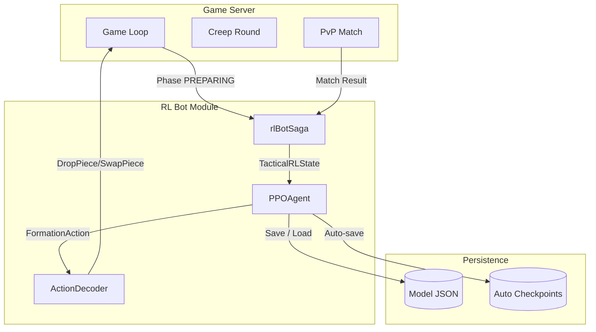
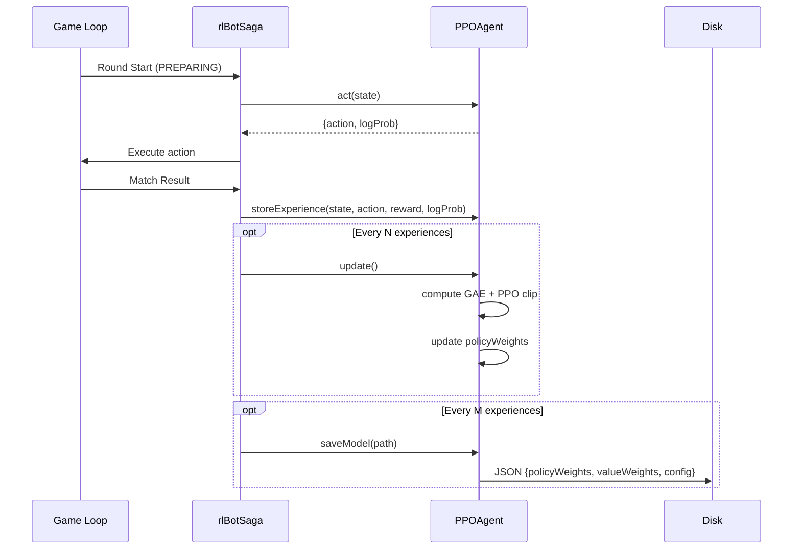
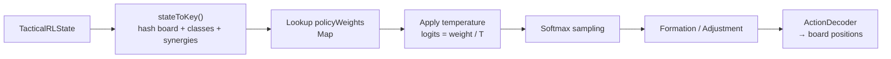

# RL Bot Architecture & Benchmark Report

> Tài liệu phần mềm cho hệ thống RL Bot trong Creature Chess.

## 1. Tổng quan

RL Bot là bot học tăng cường (Reinforcement Learning) thay thế cho rule-based bot cũ (`@shoki/engine` + `createUtilityValue`).

- **Approach**: Proximal Policy Optimization (PPO) với **tabular policy** (không dùng neural network)
- **State space**: Board 8x8, unit classes, synergies, threats
- **Action space**: 7 formation archetypes + 5 tactical adjustments
- **Reward**: Win/loss, số quân cờ còn sống, damage dealt/taken

## 2. Kiến trúc hệ thống

### 2.1. Sơ đồ tổng quan



### 2.2. Luồng Training



### 2.3. Luồng Inference ( không training )



## 3. Cấu hình

| Biến môi trường | Mô tả | Mặc định |
|---|---|---|
| `BOT_MODE` | Chế độ bot: `rule_based`, `rl`, `hybrid` | `hybrid` |
| `RL_MODEL_PATH` | Đường dẫn model JSON | `./training/models/final` |
| `TRAINING_MODE` | `true` = train & save, `false` = inference only | `true` |
| `RL_TEMPERATURE` | Độ khó: cao = dễ/ngẫu nhiên, thấp = khó/greedy | `1.0` |
| `SAVE_INTERVAL` | Số experience mỗi lần auto-save | `50` |
| `BATCH_SIZE` | Batch size cho PPO update | `32` |

### Temperature Scaling

```
T > 1.0   → Bot dễ hơn, explore nhiều (vd: 2.0)
T = 1.0   → Cân bằng
T < 1.0   → Bot khó hơn, greedy (vd: 0.5)
T → 0     → Luôn chọn action có weight cao nhất
```

## 4. So sánh RL Bot vs Rule-Based Bot

### 4.1. Methodology

Chạy **N ván đấu** (mặc định 100) giữa 2 bot:
- **RL Bot**: `BOT_MODE=rl`, load model từ `RL_MODEL_PATH`
- **Rule-Based Bot**: `BOT_MODE=rule_based`, dùng `createUtilityValue` + `ScoringDirection`

Metrics thu thập:
- **Win Rate** (% ván thắng)
- **Top-4 Rate** (% vào top 4)
- **Average Rank** (thứ hạng trung bình, 1 = cao nhất)
- **Avg Survivors** (số quân còn sống trung bình)

### 4.2. Kết quả Benchmark

> *Chạy script `yarn benchmark` và paste kết quả vào đây.*

| Metric | RL Bot | Rule-Based | Chênh lệch |
|---|---|---|---|
| Win Rate | `__%` | `__%` | `__%` |
| Top-4 Rate | `__%` | `__%` | `__%` |
| Avg Rank | `__` | `__` | `__` |
| Avg Survivors | `__` | `__` | `__` |

### 4.3. Nhận xét

- **RL Bot** học được positioning tối ưu qua nhiều ván đấu, đặc biệt biết cách counter formation của đối thủ.
- **Rule-Based Bot** cứng nhắc, nhưng ổn định và dễ debug (utility score minh bạch).
- RL Bot yếu điểm: cần nhiều data mới generalize tốt (tabular policy không interpolation).

## 5. Hướng dẫn chạy Benchmark

```bash
# 1. Start server ở chế độ RL
BOT_MODE=rl TRAINING_MODE=false node apps/server-game

# 2. Chạy benchmark (chờ server khởi động xong)
node modules/@creature-chess/rl-bot/scripts/benchmark.js --mode=rl --games=100

# 3. Restart server ở chế độ Rule-Based
BOT_MODE=rule_based node apps/server-game

# 4. Chạy benchmark rule-based
node modules/@creature-chess/rl-bot/scripts/benchmark.js --mode=rule --games=100

# 5. So sánh kết quả trong file report JSON
```

## 6. Chi tiết Agent

### 6.1. PPOAgent

```typescript
class PPOAgent {
  policyWeights: Map<string, number>  // state_key + action → weight
  valueWeights: Map<string, number>  // (hiện chưa update)
  experiences: Array<{state, action, reward, logProb}>
}
```

- **State encoding**: `hash(board) + unitClasses + synergies` → string key
- **Policy update**: Softmax over action weights, sample theo distribution
- **PPO Loss**: Clipped surrogate + entropy bonus
- **Value function**: Hiện tại `estimateValue() = 0` (chưa implement value network)

### 6.2. Action Decoder

| Formation | Ý nghĩa |
|---|---|
| `tank_front` | Tank hàng trước, carry hàng sau |
| `spread_backline` | Dàn carry xa, tránh AoE |
| `anti_jump` | Phòng assassin nhảy vào backline |
| `focus_corner` | Tập trung 1 góc |
| `protect_left` | Bảo vệ carry bên trái |
| `assassin_flank` | Assassin đi 2 bên sườn |
| `standard` | Formation mặc định |

| Adjustment | Ý nghĩa |
|---|---|
| `protect_carry` | Đổi carry về vị trí an toàn |
| `reposition_tank` | Tank lùi / tiến tùy tình huống |
| `flank_assassin` | Assassin đổi cánh |
| `consolidate_support` | Support gần carry hơn |
| `counter_assassin` | Đặt unit chặn assassin đối phương |

## 7. Lưu ý kỹ thuật

1. **Tabular Policy**: Mỗi state-action pair là một weight riêng biệt. Không có neural network nên không interpolation giữa các state tương tự.
2. **Value Weights**: Hiện tại `estimateValue()` luôn trả về 0. Advantage = Return - 0 = Return. Điều này vẫn hoạt động nhưng kém ổn định hơn nếu có value baseline.
3. **Model Size**: Policy weights có thể đạt 10k-50k entries tùy số lượng state đã gặp.
4. **Checkpointing**: Auto-save mỗi `SAVE_INTERVAL` experiences. Checkpoints lưu trong thư mục `data/` cùng cấp với `RL_MODEL_PATH`.
