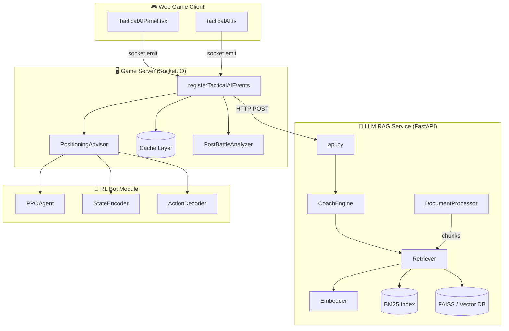
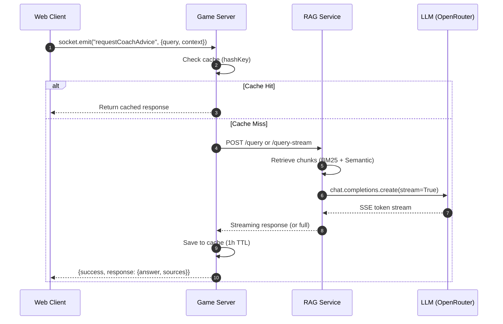
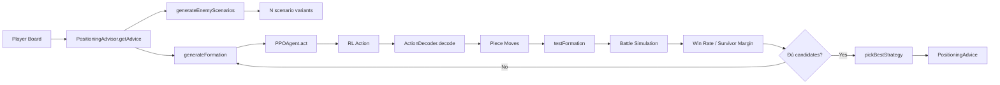
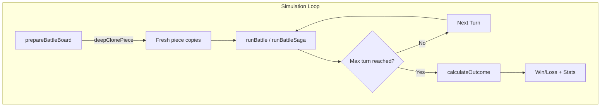
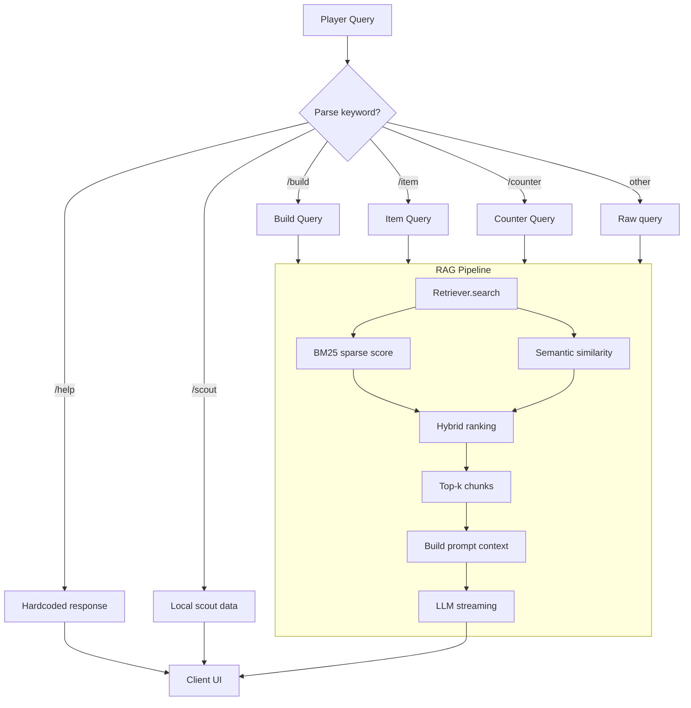
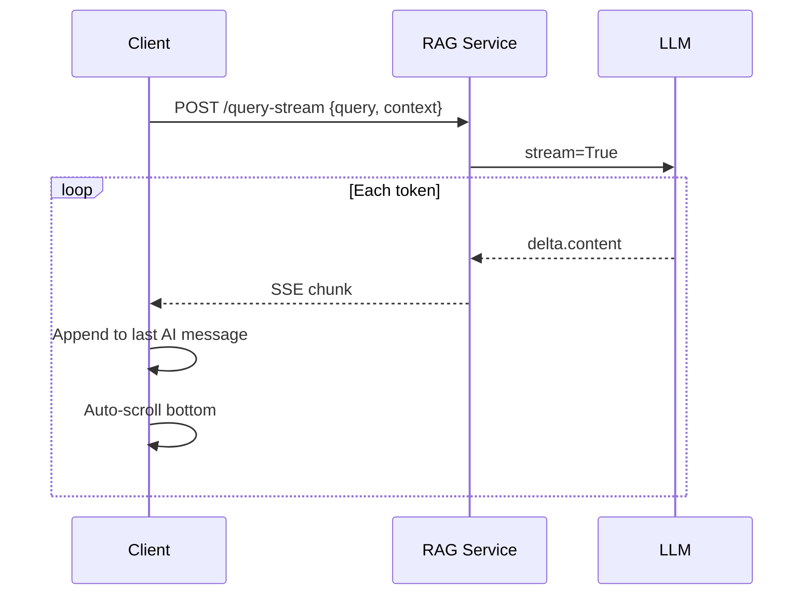
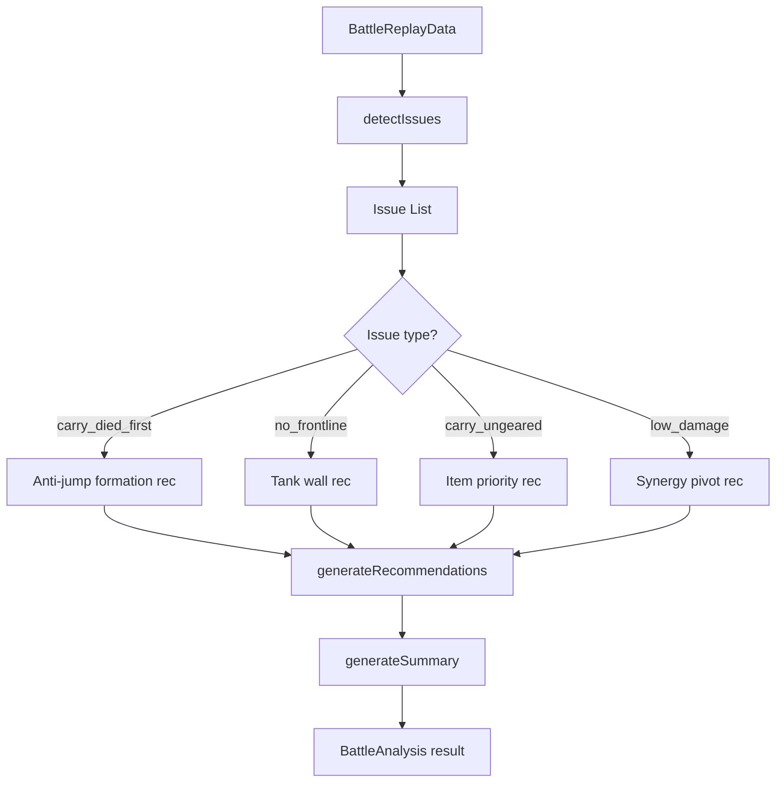
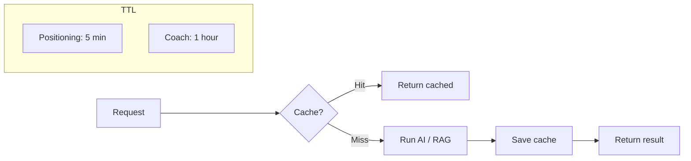
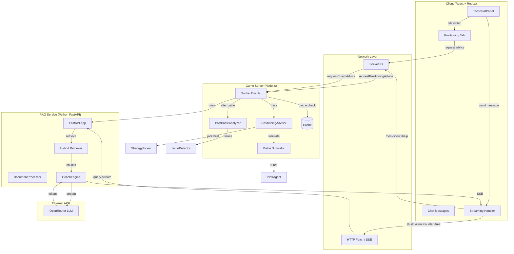

# Tactical AI Documentation

Tactical AI là hệ thống AI Coach & Advisor tích hợp trong Creature Chess, cung cấp cho người chơi các gợi ý chiến thuật real-time trong quá trình chơi.

## 1. Tổng quan

Hệ thống gồm 3 tính năng chính:

| Tính năng | Mô tả | Trigger |
|-----------|-------|---------|
| **Positioning Advisor** | Gợi ý xếp quân dựa trên PPO RL Agent + battle simulation | Tab "Xếp Quân" hoặc `/pos` |
| **Coach AI (RAG)** | Chatbot trả lời câu hỏi gameplay qua RAG + LLM | Tab "Hỏi Coach" hoặc keyword |
| **Post-Battle Analysis** | Phân tích trận đấu vừa xong, phát hiện lỗi | Tự động sau mỗi trận |

## 2. Kiến trúc hệ thống



## 3. Luồng dữ liệu Client → Server → AI



## 4. Positioning Advisor Flow



### 4.1. Battle Simulation (Offline)



> **Lưu ý quan trọng**: Mỗi lần chạy simulation đều `deepClonePiece` để tránh mutate state cũ, đảm bảo kết quả độc lập.

## 5. Coach AI / RAG Flow



### 5.1. Streaming Coach Response



## 5.2. Build Auto-Play

Auto-play bắt đầu từ câu trả lời `/build`. Client lưu `plan` đi kèm AI message và gửi socket event:

```ts
startBuildAutoPlay({
  plan,
  level: 1 | 2 | 3 | 4,
  preset: "balanced" | "stabilize" | "economy"
})
```

Server normalize lại plan, validate preset và giữ controller theo player entity để reconnect vẫn nhận được trạng thái qua `buildAutoPlayStatus`.

Luồng mỗi round:

1. Chỉ chạy trong `PREPARING` PvP; combat, ready phase và PvE không dispatch action.
2. Level 4 chạy `itemPlan` trước: recover holder → craft → equip → hold component lên `holderPiece`.
3. Chạy action bot thật từ `getActions(state, personality, settings)`, cộng bias build bằng `vision` nhưng không thêm gold reserve riêng.
4. Triển khai roster theo sức mạnh tức thời: ưu tiên 3 sao, 2 sao, build/core, synergy và cost.
5. Sau khi hết action thường, gọi `PositioningAdvisor` với đối thủ PvP chính, auto chọn mode `max` theo `preservationScore`.
6. Áp dụng toàn bộ tactical move hợp lệ (delay 100–200ms/move), rồi level 4 mới `ready`.

Preset tĩnh (user chọn lúc bật auto) có thể bị override runtime bởi **Tempo Awareness**:
- Lobby mất máu nhanh → `effectivePreset = stabilize`
- Lobby đánh chậm → `effectivePreset = economy`
- Trung bình → giữ preset user chọn

`buildAutoPlayStatus` trả thêm `effectivePreset` và `lobbyTempo` để UI hiển thị badge nhịp độ.

**Item Holder:** RAG có thể chỉ định `holderPiece` + `action: "temporary_holder"` trong `itemPlan`. Agent giữ component trên unit transition cho đến khi carry xuất hiện, rồi bán holder (item về inventory) → craft/equip lên carry.

**Dynamic APM:** delay suy nghĩ/mua bài 400–800ms; xếp cờ tactical 100–200ms/tick.

Preset:

| Preset | ambition | composure | vision | Ý nghĩa |
|---|---:|---:|---:|---|
| `balanced` | 100 | 100 | 100 | Bot tiêu chuẩn |
| `stabilize` | 120 | 40 | 80 | Ưu tiên giữ máu, mua và triển khai tempo |
| `economy` | 60 | 160 | 120 | Ít nóng vội, giữ nhịp economy |

Luật an toàn:

- Không bán core unit.
- Không bán unit 2 sao/3 sao hoặc unit đang cầm đồ, trừ **designated item holder** khi carry đã có và cần recover component.
- Level 1 chỉ tactical positioning.
- Level 2 thêm mua unit và bench/board roster.
- Level 3 thêm XP/reroll theo bot thật.
- Level 4 thêm bán rác an toàn, generic craft/equip item và tự ready sau tactical.

## 6. Post-Battle Analysis Flow



## 7. Các thành phần chính

### 7.1. Server-side (`@creature-chess/tactical-ai`)

| File | Vai trò |
|------|---------|
| `integration/game-server-plugin.ts` | Đăng ký socket events, proxy RAG calls, caching |
| `positioning-advisor/advisor.ts` | PPO RL Agent, generate & test formations |
| `positioning-advisor/simulation/battle-runner.ts` | Deep clone + offline battle simulation |
| `positioning-advisor/simulation/win-rate-calculator.ts` | Tính win rate qua nhiều scenario |
| `positioning-advisor/strategy-picker.ts` | Chọn formation tốt nhất dựa trên win rate & variance |
| `post-battle-analyzer/analyzer.ts` | Phân tích replay, tạo summary & recommendations |
| `post-battle-analyzer/issue-detector.ts` | Phát hiện lỗi positioning / item / synergy |
| `build-auto-player/controller.ts` | Auto-play loop, tempo snapshot, dynamic delays |
| `build-auto-player/policy.ts` | Action priority, preset personality, sell safety |
| `build-auto-player/item-plan-executor.ts` | Item holder / craft / equip / recover chain |
| `build-auto-player/tempo-heuristic.ts` | Lobby HP bleed → effective preset |
| `build-auto-player/action-delays.ts` | Random delay ranges per action kind |

### 7.2. Client-side (`apps/web-game`)

| File | Vai trò |
|------|---------|
| `components/tactical-ai/TacticalAIPanel.tsx` | UI panel: tabs, chat, keyword parser, streaming handler |
| `components/tactical-ai/tactical-ai.module.css` | Styling: scrollbar, message bubbles, pre-wrap |
| `services/tacticalAI.ts` | Socket emitters + streaming fetch (`requestCoachAdviceStream`) |

### 7.3. RAG Backend (`llm-rag/kreuzberg_rag`)

| File | Vai trò |
|------|---------|
| `api.py` | FastAPI endpoints: `/query`, `/query-stream`, `/build-advice`, `/item-advice`, `/counter-advice` |
| `coach_engine.py` | `query()` và `query_stream()`, OpenAI client với system prompt |
| `retriever.py` | Hybrid BM25 + semantic retrieval, guard empty corpus |
| `embedder.py` | SentenceTransformer embeddings, dimension detection |
| `document_processor.py` | `extract_file_sync` (Kreuzberg API), chunking config |

## 8. Cache & Performance



| Request Type | TTL | Key |
|-------------|-----|-----|
| Positioning Advice | 5 phút | `pos` + board hash |
| Coach Advice | 1 giờ | `coach` + query + context hash |
| Build/Counter/Item | 1 giờ | Proxy qua Coach query |

## 9. Keyword Commands (Chat)

| Lệnh | Chức năng | Streaming |
|------|-----------|-----------|
| `/pos`, `/xếp` | Chuyển tab Xếp Quân + gọi Positioning Advisor | ❌ (internal) |
| `/build`, `/team` | Gợi ý đội hình theo traits & pieces | ✅ |
| `/item`, `/đồ` | Gợi ý item cho quân đang chọn | ✅ |
| `/counter`, `/khắc` | Phân tích counter đối thủ | ✅ |
| `/scout`, `/đối` | Hiển thị thông tin đối thủ (local data) | ❌ |
| `/help`, `/?` | Danh sách lệnh (hardcoded) | ❌ |
| *(free text)* | Hỏi tự do, RAG + LLM trả lời | ✅ |

## 10. Environment Variables

| Variable | Default | Mô tả |
|----------|---------|-------|
| `RAG_SERVICE_URL` | `http://localhost:8003` | URL đến FastAPI RAG service |
| `RAG_SERVICE_PORT` | `8003` | Port chạy FastAPI |
| `OPENROUTER_API_KEY` | — | API key cho LLM |
| `OPENROUTER_BASE_URL` | `http://localhost:5001/v1` | Base URL OpenRouter / proxy |
| `COACH_MODEL` | `deepseek-v4-flash-nothinking` | Model LLM |

## 10.1. Build Auto-Play

Sau khi `/build` trả về plan, client hiện nút `Thực thi build`. Runtime nằm ở
game server, gắn với player entity để tiếp tục sau reconnect, và chỉ hành động
trong phase `PREPARING`.

| Mức | Quyền |
|-----|-------|
| 1 | Chỉ xếp tactical bằng RL cho unit đang trên board |
| 2 | Thêm mua unit và đưa unit từ bench lên board |
| 3 | Thêm reroll và mua XP theo roll strategy |
| 4 | Thêm bán rác an toàn, ghép/gắn item và tự ready |

Server normalize lại plan từ client. Level 4 chạy đầy đủ `itemPlan`:
`temporary_holder` / `hold` (giữ component trên `holderPiece`), `craft_now`, `equip_now`,
và recover holder khi carry đã có. Không bán core unit, unit 2/3 sao hoặc unit cầm đồ
ngoại trừ designated holder trong recovery flow.

Tempo awareness tự điều preset runtime; dynamic APM phân biệt shop (400–800ms) và tactical (100–200ms).

Socket events: `startBuildAutoPlay`, `stopBuildAutoPlay`,
`requestBuildAutoPlayState`, `buildAutoPlayStatus` (kèm `effectivePreset`, `lobbyTempo`).

## 11. Sơ đồ tổng quan đầy đủ


